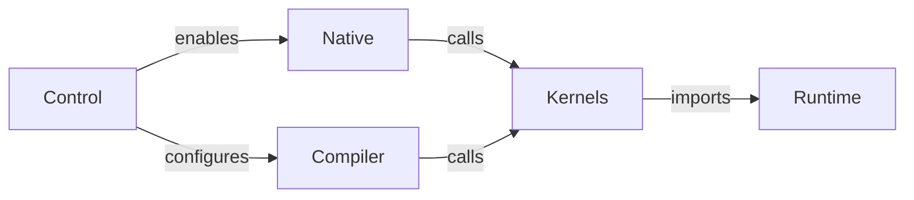
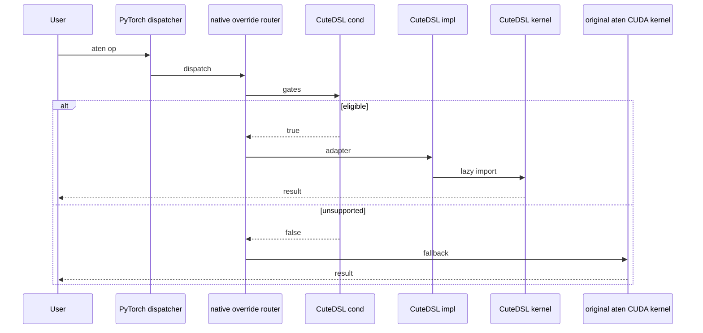
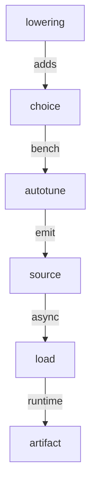

# PyTorch CuteDSL Integration Report

Status: reference report  
Purpose: document how PyTorch integrates CuteDSL today and what FlyDSL can reuse.

## Executive Findings

PyTorch's CuteDSL integration is not a single feature. It is a combination of four mechanisms:

| Mechanism | What CuteDSL uses it for | FlyDSL relevance |
|---|---|---|
| Native DSL registry | Make `cutedsl` discoverable and controllable without importing the runtime. | Directly reusable. |
| Dispatcher override router | Replace selected aten CUDA calls when `cond` matches, otherwise fall back. | Directly reusable for ROCm native ops. |
| Inductor template backend | Add CuteDSL template choices during `torch.compile`. | Reusable later, but not first. |
| Optional dependency testing | Install runtime only on selected CI jobs and skip elsewhere. | Directly reusable. |

The main upstream lesson:

> CuteDSL was accepted where it behaved like an optional acceleration layer: no default dependency, no import-time runtime load, strict gates, and aten fallback for unsupported cases.

## Evidence Index

Use this index when cross-checking the RFC against upstream PyTorch code and review history.

| Claim | Evidence |
|---|---|
| DSL runtimes are registered without importing the runtime package. | [`torch/_native/cutedsl_utils.py`][pytorch-cutedsl-utils], [`torch/_native/dsl_registry.py`][pytorch-dsl-registry] |
| User-facing controls are shared across DSLs. | [`torch/backends/python_native/__init__.py`][pytorch-python-native], [pytorch/pytorch#178381][pr-178381] |
| Native overrides use a `cond` / `impl` split with aten fallback. | [`torch/_native/registry.py`][pytorch-native-registry], [`torch/_native/ops/topk/cutedsl_impl.py`][pytorch-topk-cutedsl], [pytorch/pytorch#176280][pr-176280] |
| Optional dependency installs are limited to selected CI jobs. | [`.ci/pytorch/common_utils.sh`][pytorch-ci-common-utils], [`test/python_native/test_cutedsl_smoketest.py`][pytorch-cutedsl-smoke] |
| Inductor template support is a separate compiler integration surface. | [`torch/_inductor/codegen/cutedsl/`][pytorch-inductor-cutedsl], [`torch/_inductor/async_compile.py`][pytorch-async-compile], [pytorch/pytorch#160108][pr-160108] |
| External kernel ownership is preferred over large in-tree kernel dumps. | [pytorch/pytorch#177553][pr-177553], [`torch/_vendor/quack/`][pytorch-quack] discussion history |

## Reading Guide

For a reviewer who wants to connect this report to concrete code, the fastest path is:

| Step | Read | What to look for |
|---:|---|---|
| 1 | PyTorch: [`torch/_native/README.md`][pytorch-native-readme] | The core contract: `cond` / `impl`, no runtime import during registration, fallback through the router, FakeTensor-safe predicates, and OpInfo expectations. |
| 2 | PyTorch: [`torch/_native/cutedsl_utils.py`][pytorch-cutedsl-utils] | How an optional DSL runtime is discovered through package metadata/spec checks without importing the runtime. |
| 3 | PyTorch: [`torch/_native/ops/topk/cutedsl_impl.py`][pytorch-topk-cutedsl] | A compact native adapter pattern: cheap eligibility check, lazy kernel import, and schema-compatible wrapper. |
| 4 | PyTorch: [`torch/backends/python_native/__init__.py`][pytorch-python-native] | How users enable, disable, inspect, or reorder Python-native DSL overrides. |
| 5 | PyTorch: [`aten/src/ATen/native/native_functions.yaml`][pytorch-native-functions] | The RMSNorm schemas: `rms_norm`, `_fused_rms_norm`, and `_fused_rms_norm_backward`. |
| 6 | PyTorch: [`torch/_inductor/codegen/cutedsl/`][pytorch-inductor-cutedsl] | The compiler-side template shape that FlyDSL should mirror later, not in the first PR. |
| 7 | FlyDSL: `docs/kernel_authoring_guide.md`, `examples/01-vectorAdd.py` | How FlyDSL exposes `@flyc.kernel`, `@flyc.jit`, tensor arguments, streams, and launch configuration. |
| 8 | FlyDSL: `tests/kernels/test_rmsnorm.py` | Existing RMSNorm correctness, dtype, shape, and benchmark scaffolding for the proposed MVP. |

The most important PyTorch README rule can be reduced to this adapter skeleton:

```python
def _cond(*args, **kwargs) -> bool:
    # Cheap dtype / shape / layout / backend checks only.
    return True


def _impl(*args, **kwargs):
    from .dsl_kernel_module import kernel  # lazy import

    return kernel(*args, **kwargs)


def register_to_dispatch():
    op_symbol = "rms_norm"
    dispatch_key = "CUDA"  # PyTorch also uses this key for HIP/ROCm tensors.

    dsl_utils.register_op_override(
        "aten",
        op_symbol,
        dispatch_key,
        cond=_cond,
        impl=_impl,
    )
```

FlyDSL should copy this shape, not the CUDA-specific details around CUTLASS/CuteDSL.

## Code Map

### Native / Eager Files

| Area | File | Role |
|---|---|---|
| DSL availability | [`torch/_native/cutedsl_utils.py`][pytorch-cutedsl-utils] | Checks CUDA/HIP status, optional package presence, known-good versions, and registers `cutedsl`. |
| DSL registry | [`torch/_native/dsl_registry.py`][pytorch-dsl-registry] | Stores registered DSL modules and exposes availability/version queries. |
| Override router | [`torch/_native/registry.py`][pytorch-native-registry] | Stores per-op override graphs and installs dispatcher routers. |
| User controls | [`torch/backends/python_native/__init__.py`][pytorch-python-native] | Exposes `torch.backends.python_native.cutedsl.enabled`, `available_dsls`, and operation controls. |
| Native docs | [`torch/_native/README.md`][pytorch-native-readme] | Defines import-safety, fallback, FakeTensor, and testing expectations. |
| TopK adapter | [`torch/_native/ops/topk/cutedsl_impl.py`][pytorch-topk-cutedsl] | Example of strict shape/dtype predicate plus lazy kernel import. |
| ScatterAdd adapter | [`torch/_native/ops/scatter_add/cutedsl_impl.py`][pytorch-scatter-cutedsl] | Example of architecture-specific CUDA adapter. |
| QuACK wrappers | [`torch/_vendor/quack/`][pytorch-quack] | External CuteDSL kernel library subset and runtime workarounds. |

### Inductor Files

| Area | File | Role |
|---|---|---|
| Template object | [`torch/_inductor/codegen/cutedsl/cutedsl_template.py`][pytorch-cutedsl-template] | Creates template choices and benchmark requests. |
| Kernel renderer | [`torch/_inductor/codegen/cutedsl/cutedsl_kernel.py`][pytorch-cutedsl-kernel] | Renders Python/Jinja source and callable wrappers. |
| Scheduler | [`torch/_inductor/codegen/cutedsl/cutedsl_scheduling.py`][pytorch-cutedsl-scheduling] | Hooks rendered source into Inductor scheduling. |
| Async compile | [`torch/_inductor/async_compile.py`][pytorch-async-compile] | Provides `async_compile.cutedsl()`. |
| Runtime cache | [`torch/_inductor/runtime/cutedsl_cache.py`][pytorch-cutedsl-cache] | Persists compiled artifacts when possible. |
| Example templates | [`torch/_inductor/kernel/mm_grouped.py`][pytorch-mm-grouped], [`torch/_inductor/kernel/flex/`][pytorch-flex-kernel] | Real uses of CuteDSL templates. |
| Config | [`torch/_inductor/config.py`][pytorch-inductor-config] | Adds `CUTEDSL` as a selectable backend option. |

## Integration Architecture

Use this as the compact mental model:



The key point is that the same DSL identity, `cutedsl`, is shared by user controls, native overrides, tests, and compiler paths.

How to read the diagram:

| Node | Concrete CuteDSL surface | What the arrow means |
|---|---|---|
| Control | `dsl_registry`, `python_native`, `cutedsl_utils.py` | PyTorch knows the DSL name and can enable/disable it without importing the runtime. |
| Native | `torch/_native/registry.py`, op adapters | Eager calls may route to CuteDSL when a cheap predicate matches. |
| Compiler | `torch/_inductor/codegen/cutedsl/*` | `torch.compile` may generate a CuteDSL template path separately from eager routing. |
| Kernels | QuACK / CuteDSL kernel wrappers | Native and compiler paths both eventually call external kernel code. |
| Runtime | `nvidia-cutlass-dsl`, TVM FFI, cache helpers | Runtime import/compile happens late, not during `import torch`. |

What this diagram does not mean: native overrides and Inductor templates are not the same implementation. They share the DSL identity and dependency policy, but they are separate review surfaces.

## Native / Eager Path

### Runtime Flow



Runtime flow interpretation:

| Step | Code responsibility | FlyDSL lesson |
|---|---|---|
| `Dispatcher -> Router` | PyTorch installs a router for the target aten op and backend key. | FlyDSL should use the same generic router instead of a custom dispatch path. |
| `Router -> Cond` | The adapter checks dtype, shape, layout, backend, deterministic mode, and architecture cheaply. | FlyDSL predicates should avoid expensive runtime or device queries. |
| `Router -> Impl` | The implementation runs only after the predicate matches. | FlyDSL can import its runtime here, not during registration. |
| Fallback | The router calls the original aten implementation when no predicate matches. | Unsupported ROCm cases must return `False`, not raise. |

### Native Contract

| Contract | CuteDSL behavior | Why it matters |
|---|---|---|
| Optional runtime | Requires `nvidia-cutlass-dsl` and `apache-tvm-ffi`, but PyTorch works without them. | No default install impact. |
| Import-safe registration | `cutedsl_utils.py` checks package metadata/specs without importing `cutlass`. | Avoids import-time runtime side effects. |
| Backend gate | CUDA-only, returns unavailable on HIP/ROCm builds. | Avoids runtime errors on unsupported backends. |
| Version gate | Known-good versions are whitelisted. | Protects PyTorch from unstable DSL APIs. |
| Lazy kernel import | Kernel modules are imported only inside `impl`. | Keeps `import torch` cheap and fork-safe. |
| Predicate fallback | Unsupported cases return `False` and use aten. | Preserves default behavior. |
| User controls | `torch.backends.python_native.cutedsl.enabled = False`. | Allows debugging and rollback. |

### TopK Adapter Pattern

[`torch/_native/ops/topk/cutedsl_impl.py`][pytorch-topk-cutedsl] is a good pattern for FlyDSL to copy conceptually:

| Piece | Pattern |
|---|---|
| `_eligible(...)` | Checks dtype, CUDA tensor, shape, layout, deterministic mode, and performance gates. |
| `_cond(...)` | Wraps `_eligible` with the aten schema-compatible signature. |
| `_impl(...)` | Lazily imports `cutedsl_kernels` and runs the selected kernel. |
| `register_to_dispatch()` | Calls `cutedsl_utils.register_op_override(...)`. |

The important pattern is not TopK itself. It is the split between **cheap eligibility** and **lazy runtime import**.

### RMSNorm Evidence

RMSNorm is a better first FlyDSL native candidate than a generic GEMM or compiler template because PyTorch already has a narrow schema and existing DSL-facing test precedent.

| Evidence | Why it matters for FlyDSL |
|---|---|
| [`aten/src/ATen/native/native_functions.yaml`][pytorch-native-functions] defines `rms_norm`, `_fused_rms_norm`, and `_fused_rms_norm_backward`. | The first PR can choose an existing aten surface instead of proposing a new public operator. |
| [`torch/testing/_internal/common_methods_invocations.py`][pytorch-common-methods] has `sample_inputs_rms_norm_cutedsl`. | PyTorch already has a pattern for DSL-specific RMSNorm OpInfo inputs. |
| FlyDSL has `tests/kernels/test_rmsnorm.py`. | The FlyDSL side already has correctness and benchmark scaffolding to turn into a support matrix. |
| RMSNorm has a small output contract compared with GEMM/MoE templates. | Native/eager integration can validate optional runtime behavior before taking on Inductor autotune and scheduling. |

## Inductor Template Path

Inductor integration is more involved than native overrides because it participates in code generation and backend selection.

### Compiler Flow



Compiler flow interpretation:

| Node | CuteDSL component | Meaning for FlyDSL |
|---|---|---|
| Lowering | Inductor lowering and template registration | Add a FlyDSL candidate only for a specific lowering, not a generic graph backend. |
| Choice | `CuteDSLTemplate` / `ChoiceCaller` | Model FlyDSL as one candidate among existing Inductor choices. |
| Autotune | `select_algorithm` benchmark requests | Delay autotune until the first template has correctness and cache tests. |
| Source | `CuteDSLTemplateKernel` | Emit a small launcher that calls a stable external DSL API. |
| Load | `async_compile.cutedsl()` / PyCodeCache | Compile/load generated Python through Inductor's existing async path. |
| Artifact | CuteDSL runtime cache | Keep backend-specific compile artifacts outside PyTorch ownership as much as possible. |

The compiler path has more moving parts than native dispatch because it participates in code generation, caching, and algorithm selection. This is why the FlyDSL RFC keeps Inductor support as a later stage.

### Component Responsibilities

| Component | Responsibility |
|---|---|
| `CuteDSLTemplate` | Owns template source and creates a `ChoiceCaller`. |
| `CuteDSLTemplateKernel` | Renders source and defines the entry point expected by Inductor. |
| `CuteDSLScheduling` | Integrates with Inductor scheduling and emits `async_compile.cutedsl(...)`. |
| `async_compile.cutedsl()` | Writes Python source through PyCodeCache and loads the compiled module. |
| `CuteDSLKernelWrapper` | Presents a runtime callable interface to generated Inductor code. |
| `cutedsl_cache.py` | Bridges subprocess compilation and artifact reuse where possible. |

### Limitations Observed

| Limitation | Impact |
|---|---|
| No general horizontal/vertical fusion | Template path is not a general fusion backend yet. |
| File-based compilation | Generated source must be written and loaded as Python files. |
| Backend-specific cache semantics | Cache behavior is tied to CuteDSL/CUTLASS runtime capabilities. |
| Autotune maturity varies by template | Should be enabled narrowly and tested per kernel family. |

## Build, CI, and Tests

### Validation Flow


Validation flow interpretation:

| Stage | What it proves | Why FlyDSL should copy it |
|---|---|---|
| Install | Optional runtime can be installed only where supported. | Avoids adding FlyDSL to default PyTorch dependencies. |
| Smoke | A minimal DSL kernel compiles and launches. | Separates package viability from op integration. |
| Correctness | A concrete op matches aten/reference on supported cases. | Proves fallback-safe acceleration before broad coverage. |
| OpInfo | DSL samples join PyTorch's common operator test machinery. | Gives maintainers familiar coverage and skip behavior. |
| Disable | User controls can turn the DSL off. | Provides a debugging and rollback mechanism. |

### Test Surface

| Test area | CuteDSL example |
|---|---|
| Runtime smoke | [`test/python_native/test_cutedsl_smoketest.py`][pytorch-cutedsl-smoke] |
| DSL registry | [`test/python_native/test_dsl_registry.py`][pytorch-dsl-registry-test] |
| Native op correctness | [`test/python_native/test_topk_cutedsl.py`][pytorch-topk-cutedsl-test], scatter/norm tests |
| Inductor template | [`test/inductor/test_cutedsl_template.py`][pytorch-cutedsl-template-test] |
| Backend-specific integration | grouped GEMM, flex attention, flex GEMM tests |
| Skip helper | `skipIfNoCuteDSL`, `TEST_CUTEDSL` |
| OpInfo | `dsl_ops_by_dsl["cutedsl"]` entries |

### Dependency Policy

| Dependency | CuteDSL policy |
|---|---|
| `nvidia-cutlass-dsl` | Optional PyPI dependency, pinned in CI. |
| `apache-tvm-ffi` | Optional runtime dependency, installed with CuteDSL in CI. |
| Python version | Cutlass DSL CI install is gated by supported Python versions. |
| CUDA/HIP | CuteDSL is unavailable on HIP/ROCm builds. |

## PR Lessons

| PR / issue | Lesson for FlyDSL |
|---|---|
| `pytorch/pytorch#160108` | Inductor template support can land, but should be isolated from native runtime registration. |
| `pytorch/pytorch#176280` | `torch._native` is the accepted framework for optional native DSL overrides. |
| `pytorch/pytorch#178381` | New DSLs should use the generic DSL registry. |
| `pytorch/pytorch#178327` | Override ordering and user disable controls matter when multiple DSLs target the same op. |
| `pytorch/pytorch#177553` | Maintainers prefer importing/submoduling external kernels over dumping large kernel code into PyTorch. |
| `pytorch/pytorch#156670` | Naming and cache boundaries need to be explicit to avoid confusing multiple backends. |

## FlyDSL Reuse Matrix

| CuteDSL pattern | Reuse for FlyDSL? | Recommendation |
|---|---:|---|
| DSL registry entry | Yes | Add `torch/_native/flydsl_utils.py`. |
| `python_native` controls | Yes | Rely on dynamic DSL controller; avoid FlyDSL-specific user API. |
| Native `cond` / `impl` override | Yes | Use for the first ROCm op. |
| Lazy runtime import | Yes | Required because FlyDSL loads MLIR/runtime libraries. |
| Version whitelist | Yes | Start strict, relax after API stability. |
| Optional CI install | Yes | Add `install_flydsl()` only on selected ROCm jobs. |
| Inductor template model | Later | Mirror CuteDSL once native path is stable. |
| CuteDSL cache implementation | No | FlyDSL should use its own cache and bridge to Inductor later if needed. |
| CUDA backend gates | No | Replace with HIP/ROCm and `gfx` gates. |
| Vendored QuACK model | Avoid initially | Prefer FlyDSL-owned package APIs over vendoring kernels. |

## What FlyDSL Should Not Copy

| CuteDSL detail | Why FlyDSL should avoid copying it |
|---|---|
| CUDA-only availability checks | FlyDSL needs HIP/ROCm checks and `gfx` allowlists, not CUDA architecture assumptions. |
| CuteDSL/CUTLASS cache behavior | FlyDSL already has its own compiler/cache lifecycle; PyTorch should bridge to it only where Inductor requires. |
| QuACK-style vendoring as the first step | Vendoring kernels increases PyTorch ownership and review burden; start with stable FlyDSL package APIs. |
| Broad Inductor backend exposure before templates exist | `FLYDSL` should not appear as a meaningful selectable backend until at least one tested template lands. |
| Copying op predicates mechanically | Eligibility should be rewritten around FlyDSL's supported dtypes, shapes, layouts, streams, and ROCm targets. |
| Treating native and Inductor paths as one PR | Native overrides validate runtime safety; Inductor validates compiler integration and should land later. |

## Recommended FlyDSL Staging

| Stage | Scope | Why |
|---:|---|---|
| 1 | Register `flydsl` as an optional DSL | Lowest-risk proof that PyTorch can know about FlyDSL safely. |
| 2 | Add FlyDSL smoke test and ROCm CI install | Proves package/runtime viability. |
| 3 | Add RMSNorm as the first native ROCm op adapter | Proves fallback-safe acceleration with a narrow, testable surface. |
| 4 | Add OpInfo and user-control coverage | Aligns with existing native DSL test discipline. |
| 5 | Prototype Inductor template | Only after package, cache, and kernel APIs are stable. |

## Bottom Line

CuteDSL provides a proven PyTorch integration shape, but FlyDSL should not copy CUDA-specific details. The reusable part is the **optional DSL architecture**:

- one DSL registry entry;
- user controls through `torch.backends.python_native`;
- strict native predicates and aten fallback;
- optional runtime installation in CI;
- Inductor templates as a later compiler integration.

This is the structure the FlyDSL RFC should reference, while keeping the RFC itself focused on the proposed FlyDSL design.

[pytorch-native-readme]: https://github.com/pytorch/pytorch/blob/main/torch/_native/README.md
[pytorch-cutedsl-utils]: https://github.com/pytorch/pytorch/blob/main/torch/_native/cutedsl_utils.py
[pytorch-dsl-registry]: https://github.com/pytorch/pytorch/blob/main/torch/_native/dsl_registry.py
[pytorch-native-registry]: https://github.com/pytorch/pytorch/blob/main/torch/_native/registry.py
[pytorch-python-native]: https://github.com/pytorch/pytorch/blob/main/torch/backends/python_native/__init__.py
[pytorch-ci-common-utils]: https://github.com/pytorch/pytorch/blob/main/.ci/pytorch/common_utils.sh
[pytorch-cutedsl-smoke]: https://github.com/pytorch/pytorch/blob/main/test/python_native/test_cutedsl_smoketest.py
[pytorch-dsl-registry-test]: https://github.com/pytorch/pytorch/blob/main/test/python_native/test_dsl_registry.py
[pytorch-topk-cutedsl-test]: https://github.com/pytorch/pytorch/blob/main/test/python_native/test_topk_cutedsl.py
[pytorch-cutedsl-template-test]: https://github.com/pytorch/pytorch/blob/main/test/inductor/test_cutedsl_template.py
[pytorch-native-functions]: https://github.com/pytorch/pytorch/blob/main/aten/src/ATen/native/native_functions.yaml
[pytorch-common-methods]: https://github.com/pytorch/pytorch/blob/main/torch/testing/_internal/common_methods_invocations.py
[pytorch-topk-cutedsl]: https://github.com/pytorch/pytorch/blob/main/torch/_native/ops/topk/cutedsl_impl.py
[pytorch-scatter-cutedsl]: https://github.com/pytorch/pytorch/blob/main/torch/_native/ops/scatter_add/cutedsl_impl.py
[pytorch-quack]: https://github.com/pytorch/pytorch/tree/main/torch/_vendor/quack
[pytorch-inductor-cutedsl]: https://github.com/pytorch/pytorch/tree/main/torch/_inductor/codegen/cutedsl
[pytorch-cutedsl-template]: https://github.com/pytorch/pytorch/blob/main/torch/_inductor/codegen/cutedsl/cutedsl_template.py
[pytorch-cutedsl-kernel]: https://github.com/pytorch/pytorch/blob/main/torch/_inductor/codegen/cutedsl/cutedsl_kernel.py
[pytorch-cutedsl-scheduling]: https://github.com/pytorch/pytorch/blob/main/torch/_inductor/codegen/cutedsl/cutedsl_scheduling.py
[pytorch-async-compile]: https://github.com/pytorch/pytorch/blob/main/torch/_inductor/async_compile.py
[pytorch-cutedsl-cache]: https://github.com/pytorch/pytorch/blob/main/torch/_inductor/runtime/cutedsl_cache.py
[pytorch-mm-grouped]: https://github.com/pytorch/pytorch/blob/main/torch/_inductor/kernel/mm_grouped.py
[pytorch-flex-kernel]: https://github.com/pytorch/pytorch/tree/main/torch/_inductor/kernel/flex
[pytorch-inductor-config]: https://github.com/pytorch/pytorch/blob/main/torch/_inductor/config.py
[pr-160108]: https://github.com/pytorch/pytorch/pull/160108
[pr-176280]: https://github.com/pytorch/pytorch/pull/176280
[pr-177553]: https://github.com/pytorch/pytorch/pull/177553
[pr-178381]: https://github.com/pytorch/pytorch/pull/178381
