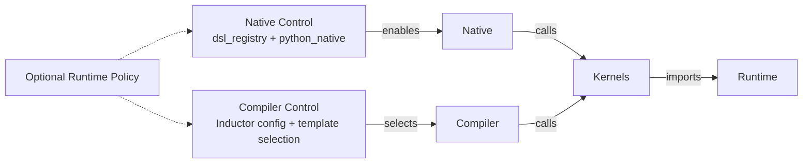
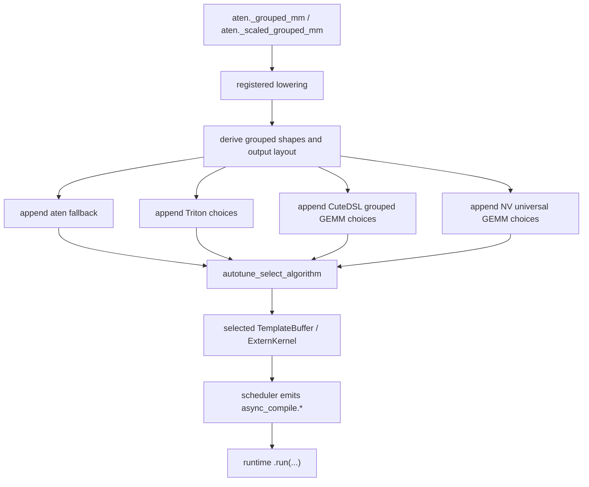
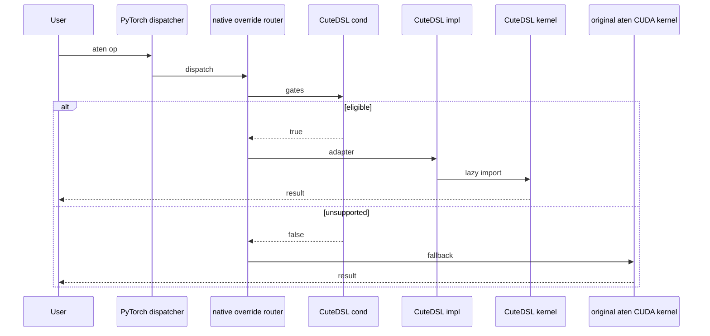
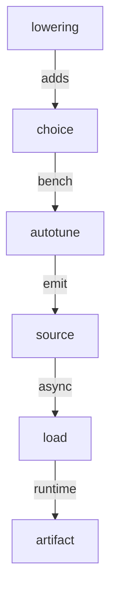

# PyTorch CuteDSL Integration Report

Status: reference report  
Purpose: document how PyTorch integrates CuteDSL today and what FlyDSL can reuse.

## Executive Findings

PyTorch's CuteDSL integration is not a single feature. It is a combination of four mechanisms:

| Mechanism | What CuteDSL uses it for | FlyDSL relevance |
|---|---|---|
| Native DSL registry | Make `cutedsl` discoverable and controllable without importing the runtime. | Directly reusable. |
| Dispatcher override router | Replace selected aten CUDA calls when `cond` matches, otherwise fall back. | Directly reusable for ROCm native ops. |
| Inductor template backend | Add CuteDSL template choices during `torch.compile`. | Reusable later, but not first. |
| Optional dependency testing | Install runtime only on selected CI jobs and skip elsewhere. | Directly reusable. |

The main upstream lesson:

> CuteDSL was accepted where it behaved like an optional acceleration layer: no default dependency, no import-time runtime load, strict gates, and aten fallback for unsupported cases.

## Evidence Index

Use this index when cross-checking the RFC against upstream PyTorch code and review history.

| Claim | Evidence |
|---|---|
| DSL runtimes are registered without importing the runtime package. | [`torch/_native/cutedsl_utils.py`][pytorch-cutedsl-utils], [`torch/_native/dsl_registry.py`][pytorch-dsl-registry] |
| User-facing controls are shared across DSLs. | [`torch/backends/python_native/__init__.py`][pytorch-python-native], [pytorch/pytorch#178381][pr-178381] |
| Native overrides use a `cond` / `impl` split with aten fallback. | [`torch/_native/registry.py`][pytorch-native-registry], [`torch/_native/ops/topk/cutedsl_impl.py`][pytorch-topk-cutedsl], [pytorch/pytorch#176280][pr-176280] |
| Optional dependency installs are limited to selected CI jobs. | [`.ci/pytorch/common_utils.sh`][pytorch-ci-common-utils], [`test/python_native/test_cutedsl_smoketest.py`][pytorch-cutedsl-smoke] |
| Inductor template support is a separate compiler integration surface. | [`torch/_inductor/codegen/cutedsl/`][pytorch-inductor-cutedsl], [`torch/_inductor/async_compile.py`][pytorch-async-compile], [pytorch/pytorch#160108][pr-160108] |
| External kernel ownership is preferred over large in-tree kernel dumps. | [pytorch/pytorch#177553][pr-177553], [`torch/_vendor/quack/`][pytorch-quack] discussion history |

## Reading Guide

For a reviewer who wants to connect this report to concrete code, the fastest path is:

| Step | Read | What to look for |
|---:|---|---|
| 1 | PyTorch: [`torch/_native/README.md`][pytorch-native-readme] | The core contract: `cond` / `impl`, no runtime import during registration, fallback through the router, FakeTensor-safe predicates, and OpInfo expectations. |
| 2 | PyTorch: [`torch/_native/cutedsl_utils.py`][pytorch-cutedsl-utils] | How an optional DSL runtime is discovered through package metadata/spec checks without importing the runtime. |
| 3 | PyTorch: [`torch/_native/ops/topk/cutedsl_impl.py`][pytorch-topk-cutedsl] | A compact native adapter pattern: cheap eligibility check, lazy kernel import, and schema-compatible wrapper. |
| 4 | PyTorch: [`torch/backends/python_native/__init__.py`][pytorch-python-native] | How users enable, disable, inspect, or reorder Python-native DSL overrides. |
| 5 | PyTorch: [`aten/src/ATen/native/native_functions.yaml`][pytorch-native-functions] | The RMSNorm schemas: `rms_norm`, `_fused_rms_norm`, and `_fused_rms_norm_backward`. |
| 6 | PyTorch: [`torch/_inductor/codegen/cutedsl/`][pytorch-inductor-cutedsl] | The compiler-side template shape that FlyDSL should mirror later, not in the first PR. |
| 7 | FlyDSL: `docs/kernel_authoring_guide.md`, `examples/01-vectorAdd.py` | How FlyDSL exposes `@flyc.kernel`, `@flyc.jit`, tensor arguments, streams, and launch configuration. |
| 8 | FlyDSL: `tests/kernels/test_rmsnorm.py` | Existing RMSNorm correctness, dtype, shape, and benchmark scaffolding for the proposed MVP. |

The most important PyTorch README rule can be reduced to this adapter skeleton:

```python
def _cond(*args, **kwargs) -> bool:
    # Cheap dtype / shape / layout / backend checks only.
    return True


def _impl(*args, **kwargs):
    from .dsl_kernel_module import kernel  # lazy import

    return kernel(*args, **kwargs)


def register_to_dispatch():
    op_symbol = "rms_norm"
    dispatch_key = "CUDA"  # PyTorch also uses this key for HIP/ROCm tensors.

    dsl_utils.register_op_override(
        "aten",
        op_symbol,
        dispatch_key,
        cond=_cond,
        impl=_impl,
    )
```

FlyDSL should copy this shape, not the CUDA-specific details around CUTLASS/CuteDSL.

## Integration Chronology

CuteDSL's upstream path did not start with native/eager overrides. The compiler template path came first because the earliest PyTorch use cases were `torch.compile` templates such as grouped GEMM and flex attention. Native/eager overrides were added later through the generic `torch._native` DSL framework.

| Stage | Surface | What landed | Lesson for FlyDSL |
|---:|---|---|---|
| 1 | Inductor | `torch/_inductor/codegen/cutedsl/`, scheduling, `async_compile.cutedsl()` | A DSL can enter PyTorch through compiler templates when the first use case is graph/compiler selected. |
| 2 | Control/native framework | `torch._native` DSL registry and `python_native` controls | Optional DSLs need a shared control plane before broad native coverage. |
| 3 | Native/eager ops | Per-op `cond` / `impl` adapters such as TopK and ScatterAdd | Eager support is acceptable only with strict predicates and aten fallback. |
| 4 | Compile-cache hardening | QuACK eager `.o` cache and Inductor `cutedsl_cache.py` | JIT compile cost must be amortized and observable before expanding coverage. |

This history does not imply FlyDSL must start with Inductor. It means the first integration path should match the first stable FlyDSL surface. Today FlyDSL has a usable eager JIT/runtime API and RMSNorm tests, but no Inductor-shaped codegen/scheduling interface.

## Code Map

### Native / Eager Files

| Area | File | Role |
|---|---|---|
| DSL availability | [`torch/_native/cutedsl_utils.py`][pytorch-cutedsl-utils] | Checks CUDA/HIP status, optional package presence, known-good versions, and registers `cutedsl`. |
| DSL registry | [`torch/_native/dsl_registry.py`][pytorch-dsl-registry] | Stores registered DSL modules and exposes availability/version queries. |
| Override router | [`torch/_native/registry.py`][pytorch-native-registry] | Stores per-op override graphs and installs dispatcher routers. |
| User controls | [`torch/backends/python_native/__init__.py`][pytorch-python-native] | Exposes `torch.backends.python_native.cutedsl.enabled`, `available_dsls`, and operation controls. |
| Native docs | [`torch/_native/README.md`][pytorch-native-readme] | Defines import-safety, fallback, FakeTensor, and testing expectations. |
| TopK adapter | [`torch/_native/ops/topk/cutedsl_impl.py`][pytorch-topk-cutedsl] | Example of strict shape/dtype predicate plus lazy kernel import. |
| ScatterAdd adapter | [`torch/_native/ops/scatter_add/cutedsl_impl.py`][pytorch-scatter-cutedsl] | Example of architecture-specific CUDA adapter. |
| QuACK wrappers | [`torch/_vendor/quack/`][pytorch-quack] | External CuteDSL kernel library subset and runtime workarounds. |

### Inductor Files

| Area | File | Role |
|---|---|---|
| Template object | [`torch/_inductor/codegen/cutedsl/cutedsl_template.py`][pytorch-cutedsl-template] | Creates template choices and benchmark requests. |
| Kernel renderer | [`torch/_inductor/codegen/cutedsl/cutedsl_kernel.py`][pytorch-cutedsl-kernel] | Renders Python/Jinja source and callable wrappers. |
| Scheduler | [`torch/_inductor/codegen/cutedsl/cutedsl_scheduling.py`][pytorch-cutedsl-scheduling] | Hooks rendered source into Inductor scheduling. |
| Async compile | [`torch/_inductor/async_compile.py`][pytorch-async-compile] | Provides `async_compile.cutedsl()`. |
| Runtime cache | [`torch/_inductor/runtime/cutedsl_cache.py`][pytorch-cutedsl-cache] | Persists compiled artifacts when possible. |
| Example templates | [`torch/_inductor/kernel/mm_grouped.py`][pytorch-mm-grouped], [`torch/_inductor/kernel/flex/`][pytorch-flex-kernel] | Real uses of CuteDSL templates. |
| Config | [`torch/_inductor/config.py`][pytorch-inductor-config] | Adds `CUTEDSL` as a selectable backend option. |

## Integration Architecture

Use this as the compact mental model:



The key point is that native overrides and Inductor templates are separate
implementation surfaces. They may share a DSL name, optional dependency policy,
and tests, but `python_native.cutedsl` is not the compiler template selector.

How to read the diagram:

| Node | Concrete CuteDSL surface | What the arrow means |
|---|---|---|
| Native Control | `dsl_registry`, `python_native`, `cutedsl_utils.py` | PyTorch knows the DSL name and can enable/disable native overrides without importing the runtime. |
| Native | `torch/_native/registry.py`, op adapters | Eager calls may route to CuteDSL when a cheap predicate matches. |
| Compiler Control | Inductor config, lowering, template selection | `torch.compile` chooses CuteDSL templates through compiler-side logic, separately from eager routing. |
| Compiler | `torch/_inductor/codegen/cutedsl/*` | Emits and loads CuteDSL template source for selected compiler choices. |
| Optional Runtime Policy | package/version/availability checks | Native and compiler paths can share optional-runtime policy without sharing one control plane. |
| Kernels | QuACK / CuteDSL kernel wrappers | Native and compiler paths both eventually call external kernel code. |
| Runtime | `nvidia-cutlass-dsl`, TVM FFI, cache helpers | Runtime import/compile happens late, not during `import torch`. |

What this diagram does not mean: enabling or disabling native CuteDSL overrides
through `torch.backends.python_native.cutedsl` automatically enables or disables
Inductor CuteDSL templates. Compiler choices need their own Inductor-side gates.

## Code-Level Walkthrough

This section reduces the relevant PyTorch code to the parts that matter for FlyDSL. The snippets are intentionally shortened; they are meant to explain the integration shape, not to copy every guard or helper.

### 1. Control Plane: Register a DSL Without Importing It

`torch/_native/cutedsl_utils.py` proves that a DSL can be known to PyTorch without importing the external runtime package during `import torch`:

```python
@functools.cache
def _check_runtime_available() -> tuple[bool, Version | None]:
    # CPU-only and ROCm builds should not import CUTLASS/CuTeDSL.
    if not _cuda.is_built():
        return (False, None)

    import torch
    if torch.version.hip is not None:
        return (False, None)

    reason = _unavailable_reason([
        ("nvidia_cutlass_dsl", "cutlass"),
        ("apache_tvm_ffi", "tvm_ffi"),
    ])
    if reason is not None:
        return False, None
    return True, _available_version("nvidia_cutlass_dsl")
```

The important detail is `_unavailable_reason(...)`: it checks import metadata/specs for optional packages, not the CuTeDSL runtime itself. FlyDSL should mirror the shape but invert the backend gate: unavailable on non-ROCm builds, import-safe on ROCm builds until an eligible op actually runs.

The registration wrapper then refuses to install overrides when the runtime is missing, disabled, or outside a known-good version set:

```python
def register_op_override(...):
    available, version = _check_runtime_available()
    if (not available) or check_native_jit_disabled():
        return
    if not _version_is_ok():
        return

    _register_op_override_impl("cutedsl", ..., cond, impl)
```

This is the pattern FlyDSL should copy for `torch/_native/flydsl_utils.py`: keep PyTorch's default import path quiet, and make availability a runtime capability, not a hard dependency.

The rest of `cutedsl_utils.py` is the DSL control-plane API that `python_native`
expects every DSL utility module to implement:

| Function / statement | Called by | Purpose |
|---|---|---|
| `dsl_registry.register_dsl("cutedsl", sys.modules[__name__])` | Runs when `torch._native.cutedsl_utils` is imported by `torch._native.__init__`. | Registers the DSL identity so `torch.backends.python_native` can list, query, and expose `python_native.cutedsl`. This does not register any aten op. |
| `runtime_available()` | `dsl_registry.is_dsl_available()` and `python_native.available_dsls`. | Reports whether the optional runtime can be used without importing the runtime package during `import torch`. |
| `runtime_version()` | `dsl_registry.get_dsl_version()` and diagnostics. | Reports the optional package version used for version gating and debugging. |
| `register_op_override(...)` | Per-op adapters such as `topk/cutedsl_impl.py`. | Registers one concrete aten override only if the optional runtime is available, native JIT is enabled, and the DSL version is known-good. |
| `deregister_op_overrides()` | `torch.backends.python_native.cutedsl.disable()`. | Disables all overrides owned by this DSL name, giving users a rollback/debug control. |

This separation is important. `register_dsl(...)` makes the DSL *discoverable*;
`register_op_override(...)` makes a specific aten op *routable* through the
native override registry; `deregister_op_overrides()` lets the generic
`python_native` controller turn those routes off again. FlyDSL should use the
same shape with `flydsl_utils.py`: register the `flydsl` identity at import
time, keep runtime/package checks import-safe, and let each op adapter call
`flydsl_utils.register_op_override(...)` only for the ops it owns.

### 2. Native Router: `cond` First, Then Fallback

`torch/_native/registry.py` turns each `(op, dispatch_key)` into a small routing graph. The key behavior is first-match-wins; if no predicate matches, the captured aten kernel is called:

```python
def _dispatch(args, kwargs, swallow_cond_exceptions: bool):
    for cond, impl_name in cond_impl:
        try:
            matched = cond(*args, **kwargs)
        except Exception:
            if not swallow_cond_exceptions:
                raise
            continue
        if matched:
            return getattr(torch.ops._native, impl_name)(*args, **kwargs)
    return _NO_MATCH


def eager_router(keyset, *args, _fallback=fallback_kernel, **kwargs):
    result = _dispatch(args, kwargs, swallow_cond_exceptions=False)
    if result is _NO_MATCH:
        return _fallback.call_boxed(keyset, *args, **kwargs)
    return result
```

This explains why FlyDSL predicates must be cheap and conservative. Returning `False` is the normal unsupported-case behavior; raising should indicate an adapter bug.

The same registry also creates a compile/export router that returns `NotImplemented` on no match, rather than globally patching Inductor decompositions:

```python
def compile_router(*args, **kwargs):
    result = _dispatch(args, kwargs, swallow_cond_exceptions=True)
    if result is _NO_MATCH:
        return NotImplemented
    return result
```

For FlyDSL, this means native/eager integration should not be treated as an implicit Inductor backend. Compiler use remains opt-in and separately tested.

### 3. Native Adapter: Strict Predicate, Lazy Kernel Import

`torch/_native/ops/topk/cutedsl_impl.py` is the clearest concrete adapter. The predicate narrows the shape and performance envelope before any kernel import:

```python
def _eligible(self, k, dim, largest, sorted_) -> bool:
    if not self.is_cuda or self.dtype != torch.float32:
        return False
    if any_cow(self):
        return False
    if not largest or not sorted_:
        return False
    if not last_dim_row_major_ok(self, dim):
        return False
    if _kernel_for(k, self.shape[-1]) is None:
        return False

    rows = math.prod(self.shape[:-1])
    if rows < _min_rows_for_full_wave(self.device.index or 0):
        return False
    return True
```

Only after the predicate succeeds does the adapter import the kernel module:

```python
def _run(self, k):
    from .cutedsl_kernels import topk_radix, topk_register

    kernel = _kernel_for(k, flatten_last_dim(self).shape[-1])
    if kernel == "register":
        return topk_register(...)
    return topk_radix(...)
```

The FlyDSL RMSNorm adapter should use the same split: PyTorch owns the cheap schema-compatible eligibility check; FlyDSL owns the kernel wrapper and compile/cache behavior behind the lazy import.

### 4. Eager JIT Cache: Cold Compile Is Amortized

The QuACK cache used by CuteDSL eager kernels is a compact reference for managing JIT cost. `torch/_vendor/quack/cache/jit.py` wraps a compile function with memory and disk cache tiers:

```python
def jit_cache(fn):
    cache = {}

    def wrapper(*args, **kwargs):
        cache_key = args + tuple(sorted(kwargs.items())) if kwargs else args

        if cache_key in cache:
            return cache[cache_key]

        sha = _key_to_hash((fn.__qualname__,) + cache_key)
        o_path = get_cache_path() / _compute_source_fingerprint() / f"{sha}.o"

        if o_path.exists():
            loaded = cute.runtime.load_module(str(o_path), enable_tvm_ffi=True)
            cache[cache_key] = loaded[EXPORT_FUNC_NAME]
            return cache[cache_key]

        compiled_fn = fn(*args, **kwargs)  # calls cute.compile(...)
        compiled_fn.export_to_c(object_file_path=str(o_path), function_name="func")
        cache[cache_key] = compiled_fn
        return compiled_fn
```

The actual implementation also uses per-key file locks and compile-only mode, but the flow above is the key idea: first eligible call may compile, warm calls should load from memory or disk. FlyDSL should not copy QuACK's CUTLASS-specific cache, but it should expose the same observable contract through FlyDSL-owned wrappers.

### 5. Inductor Path: Emit Source, Then Let Async Compile Load It

The Inductor path is shaped very differently from native dispatch. `CuteDSLScheduling.define_kernel(...)` renders source and emits an `async_compile.cutedsl(...)` call into the generated wrapper:

```python
def define_kernel(self, src_code_str, node_schedule, precompile_metadata=None):
    kernel_hash = hashlib.sha256(src_code_str.encode("utf-8")).hexdigest()[:8]
    kernel_name = f"cutedsl_{kernel_hash}"
    src_code_str = src_code_str.replace(str(Placeholder.KERNEL_NAME), kernel_name)

    compile_wrapper = IndentedBuffer()
    compile_wrapper.writeline(f"async_compile.cutedsl({kernel_name!r}, r'''")
    compile_wrapper.splice(src_code_str, strip=True)
    compile_wrapper.writeline("''')")

    wrapper.define_kernel(kernel_name, compile_wrapper.getvalue(), metadata_comment)
    return kernel_name
```

`async_compile.cutedsl(...)` then writes that Python source through `PyCodeCache`, loads the generated module, and wraps the named entry point:

```python
def cutedsl(self, kernel_name: str, source_code: str, precompile_metadata=None):
    from torch._inductor.codegen.cutedsl.cutedsl_kernel import (
        CuteDSLKernelWrapper,
        MAIN_SUFFIX,
    )

    if self.use_process_pool():
        task = self.process_pool().submit(
            _worker_compile_pycodecache_kernel,
            kernel_name,
            source_code,
            MAIN_SUFFIX,
            extra_env,
            precompile_metadata,
        )
        return LambdaFuture(get_result, future=task)

    key, path = torch._inductor.codecache.PyCodeCache.write(source_code)
    mod = torch._inductor.codecache.PyCodeCache.load_by_key_path(key, path)
    main = getattr(mod, f"{kernel_name}_{MAIN_SUFFIX}")
    return CuteDSLKernelWrapper(main, kernel_path=path)
```

This is why an Inductor-first FlyDSL path would require more than a callable kernel. It needs template selection, source rendering, a generated entry point, async compile/load behavior, cache keys, and tests for both subprocess and non-subprocess compilation.

### 6. CuteDSL Grouped GEMM: End-to-End Implementation Logic

The most concrete GEMM example today is grouped GEMM, wired through
[`torch/_inductor/kernel/mm_grouped.py`][pytorch-mm-grouped]. The file is not
the kernel implementation itself. It is the Inductor lowering that gathers
candidate implementations, gates them, and asks autotune to choose one.

The high-level path is:



`mm_grouped.py` has two public lowering entry points:

| Entry | Aten op | Shared implementation |
|---|---|---|
| `tuned_grouped_mm(...)` | `aten._grouped_mm.default` | Calls `_tuned_grouped_mm_common(...)`. |
| `tuned_scaled_grouped_mm(...)` | `aten._scaled_grouped_mm.default` | Calls `_tuned_grouped_mm_common(...)` with scale inputs and bf16 default output dtype. |

Inside `_tuned_grouped_mm_common(...)`, the important steps are:

| Step | Code shape | Purpose |
|---|---|---|
| Realize and shape inputs | `grouped_mm_args(...)` | Accepts 2D or 3D grouped operands, checks rank, derives output shape/stride, and creates a `FixedLayout` when one is not supplied. |
| Add aten fallback | `ExternKernelChoice(...).bind(...)` | Keeps a safe implementation available whenever template backends are disabled or unsupported. |
| Decode grouped layout | Branches over `len(mat_a.get_size())` and `len(mat_b.get_size())` | Computes `g`, `m`, `n`, `k`, plus `a_is_2d` and `b_is_2d`, so every backend sees the same logical grouped GEMM problem. |
| Add Triton choices | `kernel_template.maybe_append_choice(...)` | Adds multiple Triton tile configurations after `early_config_prune(...)` removes impossible or wasteful configs. |
| Add CuteDSL choices | `cutedsl_grouped_mm_template.maybe_append_choice(...)` | Adds CuteDSL template candidates only when the strict CuteDSL gate passes. |
| Add NV universal GEMM | `add_nv_universal_grouped_gemm_choices(...)` | Adds another NVIDIA-specific template family for supported 2D-by-3D grouped cases. |
| Select algorithm | `autotune_select_algorithm(...)` | Benchmarks available choices and returns the selected IR node. |

The CuteDSL-specific object is created once at module import time:

```python
cutedsl_grouped_mm_template = CuteDSLTemplate(
    name="grouped_gemm_cutedsl",
    source=load_kernel_template("cutedsl_mm_grouped"),
)
```

That line connects the lowering to
`torch/_inductor/kernel/templates/cutedsl_mm_grouped.py.jinja`. The Jinja file
contains the generated Python source shape, while the heavier grouped GEMM
implementation lives in vendored CuteDSL/CUTLASS-facing code. In other words,
`mm_grouped.py` selects and parameterizes a template; it does not directly
implement the GEMM math.

The CuteDSL candidate is deliberately narrow. `use_blackwell_cutedsl_grouped_mm(...)`
checks that the runtime is available, the configured GEMM backend list includes
`CUTEDSL`, the device and dtype match the supported Blackwell bf16 grouped GEMM
case, shapes are static enough, layouts are compatible, and unsupported bias or
scale-result cases are absent. Only then does the lowering loop over
`get_groupgemm_configs()` and append CuteDSL choices:

```python
if use_blackwell_cutedsl_grouped_mm(...):
    for config in get_groupgemm_configs():
        cutedsl_grouped_mm_template.maybe_append_choice(
            choices,
            input_nodes=input_nodes,
            layout=layout,
            ACC_DTYPE="cutlass.Float32",
            **asdict(config),
        )
```

Once a CuteDSL choice is selected, the later Inductor stages are the generic
template stages described above:

| Stage | CuteDSL component | What happens |
|---|---|---|
| Choice creation | `CuteDSLTemplate.maybe_append_choice(...)` | Renders enough metadata to create a `CuteDSLTemplateCaller` and benchmark request. |
| Source rendering | `CuteDSLTemplateKernel.render(...)` | Expands the Jinja template into Python source with a `{kernel_name}_main(...)` entry point. |
| IR node | `CuteDSLTemplateCaller.output_node(...)` | Produces a `CuteDSLTemplateBuffer` so scheduling can recognize the template backend. |
| Scheduling | `CuteDSLScheduling.codegen_template(...)` | Emits `async_compile.cutedsl(kernel_name, source, ...)` into the generated wrapper. |
| Load | `async_compile.cutedsl(...)` | Writes source through `PyCodeCache`, imports the module, finds `{kernel_name}_main`, and wraps it in `CuteDSLKernelWrapper`. |
| Runtime call | `CuteDSLKernelWrapper.run(...)` | The generated Inductor wrapper calls `.run(...)` with tensors, scalar args, and stream. |

For FlyDSL, the key lesson is that a GEMM Inductor demo should not start by
copying grouped GEMM wholesale. Grouped GEMM has many production gates, autotune
configs, offset-generation helpers, and Blackwell/CUTLASS assumptions. A FlyDSL
prototype should copy the shape of the integration, not the exact op: add one
candidate to one lowering, emit a small generated Python launcher, load it
through `async_compile.flydsl()`, and keep backend exposure narrow until the
first template has tests.

## Native / Eager Path

### Runtime Flow



Runtime flow interpretation:

| Step | Code responsibility | FlyDSL lesson |
|---|---|---|
| `Dispatcher -> Router` | PyTorch installs a router for the target aten op and backend key. | FlyDSL should use the same generic router instead of a custom dispatch path. |
| `Router -> Cond` | The adapter checks dtype, shape, layout, backend, deterministic mode, and architecture cheaply. | FlyDSL predicates should avoid expensive runtime or device queries. |
| `Router -> Impl` | The implementation runs only after the predicate matches. | FlyDSL can import its runtime here, not during registration. |
| Fallback | The router calls the original aten implementation when no predicate matches. | Unsupported ROCm cases must return `False`, not raise. |

### Native Contract

| Contract | CuteDSL behavior | Why it matters |
|---|---|---|
| Optional runtime | Requires `nvidia-cutlass-dsl` and `apache-tvm-ffi`, but PyTorch works without them. | No default install impact. |
| Import-safe registration | `cutedsl_utils.py` checks package metadata/specs without importing `cutlass`. | Avoids import-time runtime side effects. |
| Backend gate | CUDA-only, returns unavailable on HIP/ROCm builds. | Avoids runtime errors on unsupported backends. |
| Version gate | Known-good versions are whitelisted. | Protects PyTorch from unstable DSL APIs. |
| Lazy kernel import | Kernel modules are imported only inside `impl`. | Keeps `import torch` cheap and fork-safe. |
| Predicate fallback | Unsupported cases return `False` and use aten. | Preserves default behavior. |
| User controls | `torch.backends.python_native.cutedsl.enabled = False`. | Allows debugging and rollback. |

### TopK Adapter Pattern

[`torch/_native/ops/topk/cutedsl_impl.py`][pytorch-topk-cutedsl] is a good pattern for FlyDSL to copy conceptually. The code-level walkthrough above shows the actual predicate/import split; this table summarizes the reusable shape:

| Piece | Pattern |
|---|---|
| `_eligible(...)` | Checks dtype, CUDA tensor, shape, layout, deterministic mode, and performance gates. |
| `_cond(...)` | Wraps `_eligible` with the aten schema-compatible signature. |
| `_impl(...)` | Lazily imports `cutedsl_kernels` and runs the selected kernel. |
| `register_to_dispatch()` | Calls `cutedsl_utils.register_op_override(...)`. |

The important pattern is not TopK itself. It is the split between **cheap eligibility** and **lazy runtime import**.

### Eager Compile Cost Management

CuteDSL eager mode can still JIT compile on a cold specialization, but it avoids paying that cost repeatedly. The `jit_cache` code path above maps to the following reusable requirements:

| Mechanism | CuteDSL / QuACK behavior | FlyDSL implication |
|---|---|---|
| Narrow predicate | TopK checks dtype, layout, K/N support, deterministic mode, and row-count performance gates. | FlyDSL RMSNorm should only accept benchmarked `(N, dtype, layout, gfx)` combinations. |
| Lazy import | Kernel modules are imported inside `impl`, not during registration. | FlyDSL runtime and compiler imports should happen only after `cond` matches. |
| In-process cache | `@jit_cache` stores compiled callables in a Python dictionary. | FlyDSL wrapper should keep `CompiledFunction` handles per specialization. |
| Persistent cache | QuACK exports compiled kernels as `.o` files and reloads them through TVM FFI; comments report roughly `~1 ms` load versus `~500 ms` regeneration. | FlyDSL should rely on its own disk cache and report cold compile versus warm cache separately. |
| Compile-only warming | QuACK has `compile_only_mode()` with fake tensors to populate cache without launching. | FlyDSL should expose an equivalent warmup/precompile path for CI and production. |
| Concurrency control | QuACK uses per-key file locks so multiple workers do not all compile the same cold key. | FlyDSL cache should be safe for test and multi-process workloads. |

The key upstream point is that eager JIT is not forbidden, but unbounded eager JIT is unacceptable. A PyTorch native override should only trigger compilation for a small, documented support matrix with stable cache keys and clear fallback behavior.

### RMSNorm Evidence

RMSNorm is a better first FlyDSL native candidate than a generic GEMM or compiler template because PyTorch already has a narrow schema and existing DSL-facing test precedent.

| Evidence | Why it matters for FlyDSL |
|---|---|
| [`aten/src/ATen/native/native_functions.yaml`][pytorch-native-functions] defines `rms_norm`, `_fused_rms_norm`, and `_fused_rms_norm_backward`. | The first PR can choose an existing aten surface instead of proposing a new public operator. |
| [`torch/testing/_internal/common_methods_invocations.py`][pytorch-common-methods] has `sample_inputs_rms_norm_cutedsl`. | PyTorch already has a pattern for DSL-specific RMSNorm OpInfo inputs. |
| FlyDSL has `tests/kernels/test_rmsnorm.py`. | The FlyDSL side already has correctness and benchmark scaffolding to turn into a support matrix. |
| RMSNorm has a small output contract compared with GEMM/MoE templates. | Native/eager integration can validate optional runtime behavior before taking on Inductor autotune and scheduling. |

## Inductor Template Path

Inductor integration is more involved than native overrides because it participates in code generation and backend selection.

### Compiler Flow



Compiler flow interpretation:

| Node | CuteDSL component | Meaning for FlyDSL |
|---|---|---|
| Lowering | Inductor lowering and template registration | Add a FlyDSL candidate only for a specific lowering, not a generic graph backend. |
| Choice | `CuteDSLTemplate` / `ChoiceCaller` | Model FlyDSL as one candidate among existing Inductor choices. |
| Autotune | `select_algorithm` benchmark requests | Delay autotune until the first template has correctness and cache tests. |
| Source | `CuteDSLTemplateKernel` | Emit a small launcher that calls a stable external DSL API. |
| Load | `async_compile.cutedsl()` / PyCodeCache | Compile/load generated Python through Inductor's existing async path. |
| Artifact | CuteDSL runtime cache | Keep backend-specific compile artifacts outside PyTorch ownership as much as possible. |

The compiler path has more moving parts than native dispatch because it participates in code generation, caching, and algorithm selection. This is why the FlyDSL RFC keeps Inductor support as a later stage.

### Component Responsibilities

| Component | Responsibility |
|---|---|
| `CuteDSLTemplate` | Owns template source and creates a `ChoiceCaller`. |
| `CuteDSLTemplateKernel` | Renders source and defines the entry point expected by Inductor. |
| `CuteDSLScheduling` | Integrates with Inductor scheduling and emits `async_compile.cutedsl(...)`. |
| `async_compile.cutedsl()` | Writes Python source through PyCodeCache and loads the compiled module. |
| `CuteDSLKernelWrapper` | Presents a runtime callable interface to generated Inductor code. |
| `cutedsl_cache.py` | Bridges subprocess compilation and artifact reuse where possible. |

### Limitations Observed

| Limitation | Impact |
|---|---|
| No general horizontal/vertical fusion | Template path is not a general fusion backend yet. |
| File-based compilation | Generated source must be written and loaded as Python files. |
| Backend-specific cache semantics | Cache behavior is tied to CuteDSL/CUTLASS runtime capabilities. |
| Autotune maturity varies by template | Should be enabled narrowly and tested per kernel family. |

## Build, CI, and Tests

### Validation Flow


Validation flow interpretation:

| Stage | What it proves | Why FlyDSL should copy it |
|---|---|---|
| Install | Optional runtime can be installed only where supported. | Avoids adding FlyDSL to default PyTorch dependencies. |
| Smoke | A minimal DSL kernel compiles and launches. | Separates package viability from op integration. |
| Correctness | A concrete op matches aten/reference on supported cases. | Proves fallback-safe acceleration before broad coverage. |
| OpInfo | DSL samples join PyTorch's common operator test machinery. | Gives maintainers familiar coverage and skip behavior. |
| Disable | User controls can turn the DSL off. | Provides a debugging and rollback mechanism. |

### Test Surface

| Test area | CuteDSL example |
|---|---|
| Runtime smoke | [`test/python_native/test_cutedsl_smoketest.py`][pytorch-cutedsl-smoke] |
| DSL registry | [`test/python_native/test_dsl_registry.py`][pytorch-dsl-registry-test] |
| Native op correctness | [`test/python_native/test_topk_cutedsl.py`][pytorch-topk-cutedsl-test], scatter/norm tests |
| Inductor template | [`test/inductor/test_cutedsl_template.py`][pytorch-cutedsl-template-test] |
| Backend-specific integration | grouped GEMM, flex attention, flex GEMM tests |
| Skip helper | `skipIfNoCuteDSL`, `TEST_CUTEDSL` |
| OpInfo | `dsl_ops_by_dsl["cutedsl"]` entries |

### Dependency Policy

| Dependency | CuteDSL policy |
|---|---|
| `nvidia-cutlass-dsl` | Optional PyPI dependency, pinned in CI. |
| `apache-tvm-ffi` | Optional runtime dependency, installed with CuteDSL in CI. |
| Python version | Cutlass DSL CI install is gated by supported Python versions. |
| CUDA/HIP | CuteDSL is unavailable on HIP/ROCm builds. |

## PR Lessons

| PR / issue | Lesson for FlyDSL |
|---|---|
| `pytorch/pytorch#160108` | Inductor template support can land, but should be isolated from native runtime registration. |
| `pytorch/pytorch#176280` | `torch._native` is the accepted framework for optional native DSL overrides. |
| `pytorch/pytorch#178381` | New DSLs should use the generic DSL registry. |
| `pytorch/pytorch#178327` | Override ordering and user disable controls matter when multiple DSLs target the same op. |
| `pytorch/pytorch#177553` | Maintainers prefer importing/submoduling external kernels over dumping large kernel code into PyTorch. |
| `pytorch/pytorch#156670` | Naming and cache boundaries need to be explicit to avoid confusing multiple backends. |

## FlyDSL Reuse Matrix

| CuteDSL pattern | Reuse for FlyDSL? | Recommendation |
|---|---:|---|
| DSL registry entry | Yes | Add `torch/_native/flydsl_utils.py`. |
| `python_native` controls | Yes | Rely on dynamic DSL controller; avoid FlyDSL-specific user API. |
| Native `cond` / `impl` override | Yes | Use for the first ROCm op. |
| Lazy runtime import | Yes | Required because FlyDSL loads MLIR/runtime libraries. |
| Version whitelist | Yes | Start strict, relax after API stability. |
| Eager JIT cache | Yes | FlyDSL should provide a package-owned memory/disk cache wrapper before enabling a native override. |
| Optional CI install | Yes | Add `install_flydsl()` only on selected ROCm jobs. |
| Inductor template model | Later | Mirror CuteDSL once native path is stable. |
| CuteDSL cache implementation | No | FlyDSL should use its own cache and bridge to Inductor later if needed. |
| CUDA backend gates | No | Replace with HIP/ROCm and `gfx` gates. |
| Vendored QuACK model | Avoid initially | Prefer FlyDSL-owned package APIs over vendoring kernels. |

## What FlyDSL Should Not Copy

| CuteDSL detail | Why FlyDSL should avoid copying it |
|---|---|
| CUDA-only availability checks | FlyDSL needs HIP/ROCm checks and `gfx` allowlists, not CUDA architecture assumptions. |
| CuteDSL/CUTLASS cache behavior | FlyDSL already has its own compiler/cache lifecycle; PyTorch should bridge to it only where Inductor requires. |
| QuACK-style vendoring as the first step | Vendoring kernels increases PyTorch ownership and review burden; start with stable FlyDSL package APIs. |
| Broad Inductor backend exposure before templates exist | `FLYDSL` should not appear as a meaningful selectable backend until at least one tested template lands. |
| Copying op predicates mechanically | Eligibility should be rewritten around FlyDSL's supported dtypes, shapes, layouts, streams, and ROCm targets. |
| Treating native and Inductor paths as one PR | Native overrides validate runtime safety; Inductor validates compiler integration and should land later. |
| Assuming Inductor-first is mandatory | CuteDSL started with Inductor because its first use cases were compiler templates; FlyDSL should start where its current API is strongest. |

## Recommended FlyDSL Staging

| Stage | Scope | Why |
|---:|---|---|
| 1 | Register `flydsl` as an optional DSL | Lowest-risk proof that PyTorch can know about FlyDSL safely. |
| 2 | Add FlyDSL smoke test and ROCm CI install | Proves package/runtime viability. |
| 3 | Add RMSNorm as the first native ROCm op adapter | Proves fallback-safe acceleration with a narrow, testable surface. |
| 4 | Add OpInfo and user-control coverage | Aligns with existing native DSL test discipline. |
| 5 | Prototype Inductor template | Only after package, cache, and kernel APIs are stable. |

## Bottom Line

CuteDSL provides a proven PyTorch integration shape, but FlyDSL should not copy CUDA-specific details. The reusable part is the **optional DSL architecture**:

- one DSL registry entry;
- user controls through `torch.backends.python_native`;
- strict native predicates and aten fallback;
- optional runtime installation in CI;
- Inductor templates as a later compiler integration.

This is the structure the FlyDSL RFC should reference, while keeping the RFC itself focused on the proposed FlyDSL design.

[pytorch-native-readme]: https://github.com/pytorch/pytorch/blob/main/torch/_native/README.md
[pytorch-cutedsl-utils]: https://github.com/pytorch/pytorch/blob/main/torch/_native/cutedsl_utils.py
[pytorch-dsl-registry]: https://github.com/pytorch/pytorch/blob/main/torch/_native/dsl_registry.py
[pytorch-native-registry]: https://github.com/pytorch/pytorch/blob/main/torch/_native/registry.py
[pytorch-python-native]: https://github.com/pytorch/pytorch/blob/main/torch/backends/python_native/__init__.py
[pytorch-ci-common-utils]: https://github.com/pytorch/pytorch/blob/main/.ci/pytorch/common_utils.sh
[pytorch-cutedsl-smoke]: https://github.com/pytorch/pytorch/blob/main/test/python_native/test_cutedsl_smoketest.py
[pytorch-dsl-registry-test]: https://github.com/pytorch/pytorch/blob/main/test/python_native/test_dsl_registry.py
[pytorch-topk-cutedsl-test]: https://github.com/pytorch/pytorch/blob/main/test/python_native/test_topk_cutedsl.py
[pytorch-cutedsl-template-test]: https://github.com/pytorch/pytorch/blob/main/test/inductor/test_cutedsl_template.py
[pytorch-native-functions]: https://github.com/pytorch/pytorch/blob/main/aten/src/ATen/native/native_functions.yaml
[pytorch-common-methods]: https://github.com/pytorch/pytorch/blob/main/torch/testing/_internal/common_methods_invocations.py
[pytorch-topk-cutedsl]: https://github.com/pytorch/pytorch/blob/main/torch/_native/ops/topk/cutedsl_impl.py
[pytorch-scatter-cutedsl]: https://github.com/pytorch/pytorch/blob/main/torch/_native/ops/scatter_add/cutedsl_impl.py
[pytorch-quack]: https://github.com/pytorch/pytorch/tree/main/torch/_vendor/quack
[pytorch-inductor-cutedsl]: https://github.com/pytorch/pytorch/tree/main/torch/_inductor/codegen/cutedsl
[pytorch-cutedsl-template]: https://github.com/pytorch/pytorch/blob/main/torch/_inductor/codegen/cutedsl/cutedsl_template.py
[pytorch-cutedsl-kernel]: https://github.com/pytorch/pytorch/blob/main/torch/_inductor/codegen/cutedsl/cutedsl_kernel.py
[pytorch-cutedsl-scheduling]: https://github.com/pytorch/pytorch/blob/main/torch/_inductor/codegen/cutedsl/cutedsl_scheduling.py
[pytorch-async-compile]: https://github.com/pytorch/pytorch/blob/main/torch/_inductor/async_compile.py
[pytorch-cutedsl-cache]: https://github.com/pytorch/pytorch/blob/main/torch/_inductor/runtime/cutedsl_cache.py
[pytorch-mm-grouped]: https://github.com/pytorch/pytorch/blob/main/torch/_inductor/kernel/mm_grouped.py
[pytorch-flex-kernel]: https://github.com/pytorch/pytorch/tree/main/torch/_inductor/kernel/flex
[pytorch-inductor-config]: https://github.com/pytorch/pytorch/blob/main/torch/_inductor/config.py
[pr-160108]: https://github.com/pytorch/pytorch/pull/160108
[pr-176280]: https://github.com/pytorch/pytorch/pull/176280
[pr-177553]: https://github.com/pytorch/pytorch/pull/177553
[pr-178381]: https://github.com/pytorch/pytorch/pull/178381
