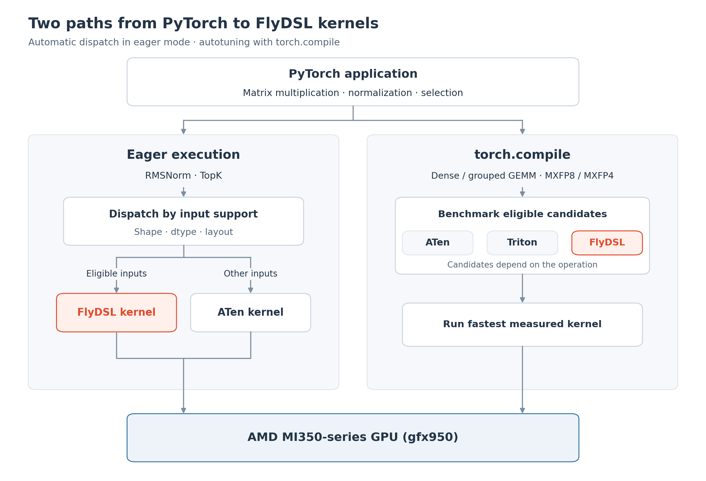
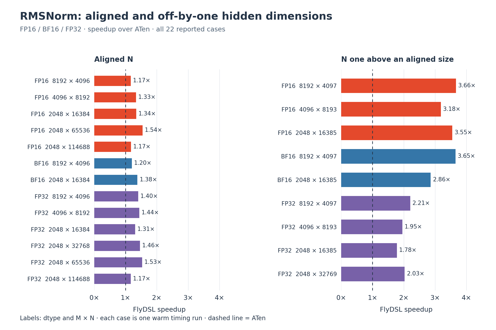
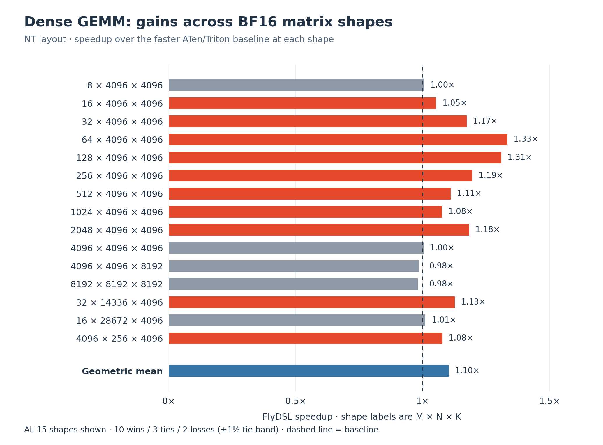
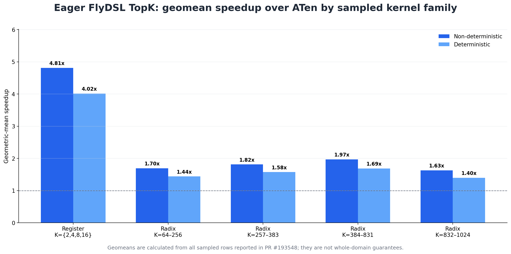
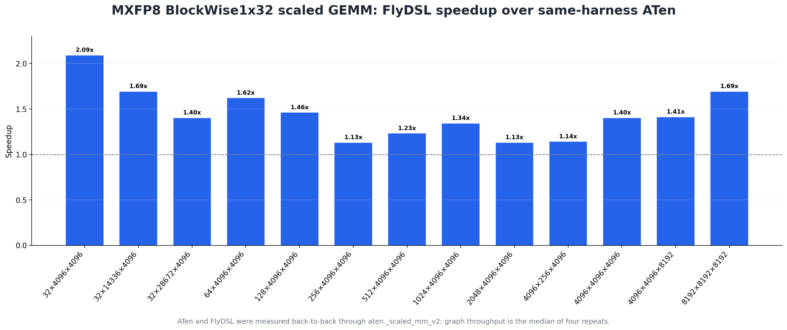

# Accelerating PyTorch on AMD MI350-Series GPUs with FlyDSL

*FlyDSL is now available as an optional PyTorch backend for targeted eager operators
and TorchInductor GEMM autotuning on `gfx950` GPUs.*

## Introduction

PyTorch now supports [FlyDSL](https://github.com/ROCm/FlyDSL) as an optional kernel
backend for AMD MI350-series GPUs. The integration works in the two execution modes
PyTorch users rely on:

1. **Eager mode**, where selected operators transparently dispatch to tuned FlyDSL
   kernels.
2. **`torch.compile`**, where TorchInductor benchmarks FlyDSL templates alongside
   existing backends and selects the fastest eligible implementation.

Users keep the same PyTorch APIs. FlyDSL is loaded only when it is installed and an
operator matches an explicitly tested support region. Unsupported eager calls continue
through ATen, while TorchInductor simply omits ineligible FlyDSL candidates or selects
another backend when it benchmarks faster.

The initial integration focuses on RMSNorm, TopK, dense and grouped GEMM, and
MXFP8/MXFP4 scaled GEMM on AMD `gfx950` GPUs. On MI355X, these kernels show clear
gains over existing PyTorch choices for their targeted shape regions. The Performance
Results section summarizes warm, kernel-level measurements; first-call compilation
and autotuning are excluded.

## Why FlyDSL?

FlyDSL—Flexible Layout Python DSL—is a Python DSL and MLIR stack for authoring
high-performance GPU kernels with explicit layouts and tiling. Kernel authors can
describe tensor shapes, strides, coordinate mappings, thread/value partitions, tiled
copies, LDS (AMD GPU shared memory) usage, and matrix fused multiply-add (MFMA)
instructions in Python while retaining control over the hardware execution hierarchy.

FlyDSL traces a Python kernel into the Fly MLIR dialect, lowers through GPU/ROCDL and
LLVM AMDGPU, and emits an HSACO GPU code object. This combines Python-level
productivity with the architecture control needed to tune data movement, wave layout,
shared-memory staging, and matrix-core scheduling on AMD GPUs.

## One Backend, Two Integration Paths

Eager dispatch and TorchInductor autotuning solve different problems, so they remain
independent control planes. They share FlyDSL's optional compiler/runtime and HIP
tensor/stream ABI, but keep separate routing, configuration, and caches.



*Figure 1. Eager dispatch and TorchInductor autotuning independently use the optional
FlyDSL compiler/runtime.*

### Eager Execution

The eager path extends PyTorch's `torch._native` DSL mechanism. A lightweight
predicate first checks the device, dtype, shape, layout, and performance region. Only
then does PyTorch lazily import, compile, cache, and launch the FlyDSL kernel on the
current ROCm stream.

FlyDSL eager overrides can be inspected or disabled through
`torch.backends.python_native.flydsl`. This control does not affect TorchInductor.

### TorchInductor

During lowering, TorchInductor appends FlyDSL choices only for supported problems. It
generates and prunes template configurations, compiles valid choices, benchmarks them
with existing backends, and caches the winner.

This makes low-level kernel parameters—tile dimensions, pipeline stages, wave layout,
output swizzles, and interleaving—part of PyTorch's normal shape-aware autotuning
process instead of forcing one configuration across every workload.

### Optional by Construction

FlyDSL remains an optional dependency. `import torch` does not import FlyDSL or
initialize the ROCm runtime, and the integration retains existing PyTorch choices for
CPU/CUDA builds, ROCm installations without FlyDSL, non-`gfx950` devices, unsupported
operator inputs, and TorchInductor candidates that lose autotuning.

Eager and compiler controls also remain independent. Disabling
`torch.backends.python_native.flydsl` restores eager ATen dispatch without changing
TorchInductor. Removing `FLYDSL` from the GEMM backend list disables compiler
templates without changing eager overrides.

The integration is covered by tests for optional dependency detection, import
laziness, eager controls, cache keys, operator accuracy, generated wrappers,
configuration filtering, autotuning, deterministic TopK ties, and focused `gfx950`
end-to-end compilation and execution.

## Performance Results

We first use RMSNorm and dense GEMM to explain the eager and TorchInductor paths in
detail. The final subsection summarizes TopK, grouped GEMM, and scaled GEMM. Detailed
examples use per-shape speedups; summary charts use geometric means where the source
benchmarks are organized by kernel family or suite. Each figure states its aggregation,
and values should be compared within that figure rather than across figures.

### Eager: RMSNorm

[RMSNorm](https://github.com/pytorch/pytorch/pull/191447) is the first detailed
example of the eager integration. The FlyDSL kernel implements the fused forward path
and returns both the normalized output and the FP32 reciprocal standard deviation
required by the operator contract. Backward continues through the existing PyTorch
implementation.

N-dimensional inputs are logically flattened to `(M, N)`. The current `gfx950`
performance gate supports contiguous FP16, BF16, or FP32 input and weight tensors,
one normalized dimension, matching dtype/device, non-negative `eps`, and these
measured shape regions:

| Normalized dimension `N` | Minimum row count `M` |
|---|---:|
| `4096 <= N < 8192` | `8192` |
| `8192 <= N < 16384` | `4096` |
| `16384 <= N <= 114688` | `2048` |

The kernel combines reduction, normalization, scaling, and output generation while
using architecture-specific reductions and vectorized loads. It also handles hidden
dimensions that are not naturally aligned to ATen's preferred vector width. This is
especially effective when `N` is one element larger than an aligned size, such as
`4097`, `8193`, or `16385`.



*Figure 2. Warm eager RMSNorm speedup over ATen after 10 warmup and 50 timed
iterations. Shape labels are `M × N`; values above 1.0 favor FlyDSL.*

Aligned dimensions improve by 1.16x–1.54x. For hidden dimensions one element larger
than an aligned size—for example, `4097` instead of `4096`—the measured speedup
reaches 3.66x.

### TorchInductor: Dense GEMM Autotuning

The first detailed TorchInductor target is
[dense GEMM](https://github.com/pytorch/pytorch/pull/190903): static 2D
`aten.mm(A, B.T)` on `gfx950`, where row-major `A[M, K]` is multiplied by
`B[N, K].T` to produce `C[M, N]`.

Eligibility currently requires:

- FP16 or BF16 inputs and matching output;
- a static, non-empty 2D shape;
- the supported NT layout and vector-load alignment;
- `N` and `K` multiples of 32;
- an AMD `gfx950` GPU;
- GEMM max-autotuning with `FLYDSL` enabled as a candidate backend.

The wrapper adapts PyTorch's right-hand-side transpose view to FlyDSL's `[N, K]`
contract while preserving supported row strides and storage offsets. Before
benchmarking, the lowering filters configurations that cannot support the concrete
shape.

At the kernel level, workgroups stage `A` and `B` tiles through LDS, reuse those tiles
across waves, and issue MFMA operations into register-blocked accumulators. Tile
dimensions, pipeline depth, wave layout, `GROUP_M` swizzling, and half-tile
interleaving are template parameters selected by autotuning.

Compiled dispatchers are cached by their compile-time configuration while tensor
layouts remain runtime inputs. FlyDSL's persistent artifacts live under
TorchInductor's cache root by default, unless `FLYDSL_RUNTIME_CACHE_DIR` is explicitly
configured.

Across 15 BF16 NT GEMM shapes, FlyDSL achieves a 1.19x geomean over Triton, 1.15x
over ATen, and 1.10x over the faster baseline at each shape.



*Figure 3. BF16 dense NT GEMM speedup over the faster ATen/Triton baseline at each
shape. Ratios within ±1% count as ties.*

Results are the median of four accuracy-checked graph-replay runs. FlyDSL and Triton
use the `EXHAUSTIVE` search space; ATen uses its default configuration.

### Additional Operator Results

#### Eager: TopK

[TopK](https://github.com/pytorch/pytorch/pull/193548) uses a register kernel for
small fixed `K` values and radix-select kernels for larger continuous ranges. The
initial override supports contiguous FP32 `gfx950` inputs, reduction over the last
dimension, `largest=True`, `sorted=True`, and at least 256 rows on MI355X. Functional
and `out=` variants are both supported, and deterministic mode preserves ATen's tie
ordering. The register path covers `K={2,4,8,16}` for tuned power-of-two dimensions;
radix-select covers tuned shape bands from `K=64` through `K=1024`.



*Figure 4. TopK geometric-mean speedup over ATen; whiskers show the sampled range.*

The register family reaches 4.81x and 4.02x geometric-mean speedups in
non-deterministic and deterministic modes. Radix-select ranges from 1.40x to 1.97x
geometrically across its tuned `K` bands.

#### TorchInductor: Grouped GEMM

The [`torch.nn.functional.grouped_mm`](https://github.com/pytorch/pytorch/pull/191475)
template supports ragged 2D `A` and grouped `B[G, K, N]`. Its current gate requires
FP16/BF16, static `N` and `K` divisible by 32, and eligible alignment and strides.
The persistent kernel is designed for MoE-style workloads with uneven or empty groups.


*Figure 5. Geometric-mean grouped GEMM speedup within each reported suite.*

On the standard 14-shape suite, FlyDSL reaches a 1.21x geomean over Triton and a
2.12x geomean over ATen, and is the best measured backend in 11 of 14 cases. It is
also the best backend in all five ragged-`M` cases.

#### TorchInductor: MXFP8 and MXFP4 Scaled GEMM

The [scaled GEMM integration](https://github.com/pytorch/pytorch/pull/193527) adds
MXFP8 and MXFP4 BlockWise1x32 kernel families. MXFP8 uses E4M3 inputs, E8M0 block
scales, FP32 accumulation, and FP16/BF16 output.



*Figure 6. Per-shape MXFP8 speedup over ATen. Both backends are measured
back-to-back through `aten._scaled_mm_v2` with the same graph-replay harness.*

Across 13 shapes, FlyDSL reaches a 1.42x geomean over ATen. A separately measured
Composable Kernel reference, using a standalone C++ harness, shows a 1.15x geomean
advantage for FlyDSL.

## How to Try It

Use the [PyTorch installation selector](https://pytorch.org/get-started/locally/) to
install a ROCm nightly or release that includes FlyDSL support, then install the tested
optional runtime:

```bash
python -m pip install "flydsl==0.3.1"
```

ROCm builds continue to use PyTorch's `"cuda"` device string.

### Eager RMSNorm

Eligible eager operations dispatch automatically:

```python
import torch
import torch.nn.functional as F
import torch.backends.python_native as pn

assert torch.version.hip is not None
arch = torch.cuda.get_device_properties(0).gcnArchName.split(":", 1)[0]
assert arch == "gfx950"
print("FlyDSL available:", "flydsl" in pn.available_dsls)

x = torch.randn(8192, 4096, device="cuda", dtype=torch.bfloat16)
weight = torch.randn(4096, device="cuda", dtype=torch.bfloat16)

y = F.rms_norm(x, (4096,), weight, eps=1e-5)

with pn.flydsl.disabled():
    y_aten = F.rms_norm(x, (4096,), weight, eps=1e-5)

torch.testing.assert_close(y, y_aten)
```

The controller also supports `enable()`, `disable()`, an `enabled` property, and a
`disabled()` context manager.

### TorchInductor GEMM

Enable FlyDSL as a GEMM autotuning candidate:

```bash
TORCHINDUCTOR_MAX_AUTOTUNE_GEMM=1 \
TORCHINDUCTOR_MAX_AUTOTUNE_GEMM_BACKENDS="ATEN,TRITON,FLYDSL" \
FLYDSL_ENABLE_AUTOTUNING=1 \
python my_script.py
```

`my_script.py` can use the normal `torch.compile` API:

```python
import torch

A = torch.randn(128, 4096, device="cuda", dtype=torch.bfloat16)
B = torch.randn(14336, 4096, device="cuda", dtype=torch.bfloat16)

@torch.compile(mode="max-autotune-no-cudagraphs")
def f(a, b):
    return a @ b.T

out = f(A, B)  # The first call compiles and benchmarks eligible choices.
```

For the largest search space, additionally set:

```bash
TORCHINDUCTOR_MAX_AUTOTUNE_GEMM_SEARCH_SPACE=EXHAUSTIVE
```

`EXHAUSTIVE` can compile many configurations and substantially increase first-run
autotuning time. The curated default search is the practical starting point.

## What's Next

The initial integration establishes the framework for a concrete expansion roadmap:

- **More FP16/BF16 GEMM layouts and parallelism on `gfx950`.** Extend the initial NT
  path with Split-K and NN/TN/TT layouts.
- **Broader scaled-matmul coverage.** Add `PTPC/block_scale` `scaled_mm` support in
  TorchInductor, followed by MXFP8 `scaled_mm` backward. `PTPC/block_scale` support
  is planned as a lower-priority follow-up.
- **Training support for grouped and normalization workloads.** Add grouped MM
  backward, scaled grouped MM forward/backward, and RMSNorm backward.
- **Attention.** Add FlyDSL FlexAttention forward and backward templates.
- **Lower deployment cost.** Continue work on heuristic-guided search, parallel
  precompilation, persistent-cache measurement, and AOT-compatible packaging.

## Conclusion

FlyDSL gives PyTorch a Python-authored path to architecture-specific ROCm kernels
without replacing existing GPU backends or making the compiler a required dependency.
The first eager and TorchInductor integrations show that targeted kernels can deliver
meaningful gains while preserving PyTorch APIs, fallback behavior, and backend
selection.

We plan to grow coverage only where correctness, maintainability, and measured
performance justify it. Feedback and new workload ideas are welcome in the
[PyTorch RFC](https://github.com/pytorch/pytorch/issues/190875) and
[PyTorch issue tracker](https://github.com/pytorch/pytorch/issues/new/choose).
