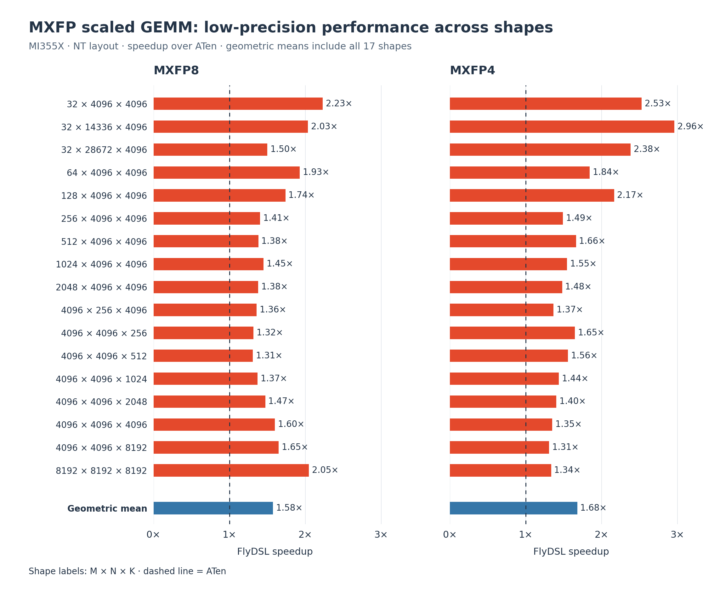
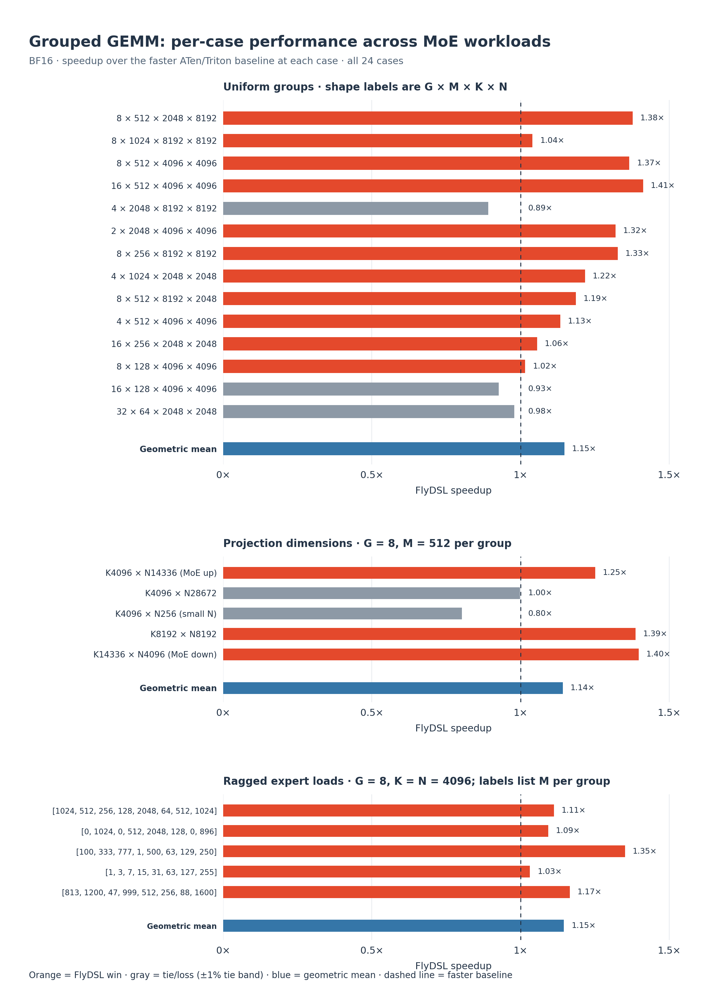

# Accelerating PyTorch on AMD MI350-Series GPUs with FlyDSL

PyTorch users on AMD MI350-series GPUs can now accelerate common transformer
hotspots without writing custom kernels: dense projection and feed-forward GEMMs,
MXFP8/MXFP4 quantized linear layers, grouped GEMMs for mixture-of-experts (MoE),
RMSNorm, and TopK selection. [FlyDSL](https://github.com/ROCm/FlyDSL) is
available as an optional PyTorch backend through existing operator APIs.

Across the reported kernel-level operator suites, FlyDSL provides a **1.10x
geometric-mean speedup for dense GEMM over the faster ATen/Triton baseline**,
**1.58x and 1.68x over ATen for MXFP8 and MXFP4**, **1.21x over Triton for
grouped GEMM**, and **4.82x for small-K TopK over ATen** with deterministic
algorithms disabled. These gains are most relevant when the supported operations
account for a significant share of model runtime.

Users enable FlyDSL with `torch.compile` and GEMM autotuning for dense, grouped,
and MXFP GEMMs; eligible eager RMSNorm and TopK calls dispatch automatically.
Unsupported inputs retain existing PyTorch implementations. End-to-end gains
depend on model coverage and workload configuration; a dedicated section below
is reserved for those results.

## How FlyDSL Fits into PyTorch

The integration makes FlyDSL kernels accessible through two execution paths.
In **eager mode**, eligible RMSNorm and TopK calls use FlyDSL automatically when
the optional runtime is installed and enabled. PyTorch checks the inputs and
retains its ATen implementation for unsupported cases.

With **`torch.compile`**, FlyDSL joins the set of implementations that
TorchInductor can benchmark for dense, grouped, and MXFP scaled GEMM. When
FlyDSL and GEMM autotuning are enabled, Inductor compares eligible candidates
and selects the fastest measured implementation for each workload. Dense and
grouped GEMM can choose among ATen, Triton, and FlyDSL; the MXFP scaled GEMM path
compares FlyDSL with ATen.


*Figure 1. FlyDSL in PyTorch, with the optional package installed and FlyDSL
enabled for GEMM autotuning. Eager execution dispatches by input support;
TorchInductor selects by measured performance, with candidates depending on the
operation. Both paths use PyTorch operator APIs.*

## Supported Features

Current support targets AMD MI350-series GPUs with the `gfx950` architecture.
The following features are available in PyTorch:

| Operation | Execution mode | Data types | Supported scope |
| --- | --- | --- | --- |
| Dense GEMM | `torch.compile` | FP16, BF16 | Static 2D `torch.mm`; NN, NT, TN, and TT input layouts |
| MXFP scaled GEMM | `torch.compile` | MXFP8, MXFP4 | Static 2D `F.scaled_mm`; NN, NT, TN, and TT input layouts; block scales; FP16/BF16 output |
| Grouped GEMM | `torch.compile` | FP16, BF16 | Static-shape `F.grouped_mm` with ragged 2D activations and contiguous 3D weights; uneven and empty groups |
| RMSNorm | Eager | FP16, BF16, FP32 | Forward with contiguous input and explicit weight; one normalized dimension; tuned shape regions |
| TopK | Eager | FP32 | Contiguous input; last-dimension selection with `largest=True` and `sorted=True`; functional and `out=` variants in tuned shape regions |

Dense GEMM's [four-layout support](https://github.com/pytorch/pytorch/pull/194981)
accepts row-major and column-major inputs, including eligible transpose views.
In the layout names, the first letter describes A and the second describes B;
`N` and `T` denote non-transposed and transposed input layouts.
Grouped GEMM supports different row counts per group, allowing experts to process
uneven token assignments. Its current input-layout requirements are separate
from dense GEMM's four-layout coverage. RMSNorm backward continues through
PyTorch's existing implementation.

MXFP scaled GEMM accepts FP8 E4M3 or packed FP4 E2M1 operands, with one E8M0
scale per 32 values along the reduction dimension (`BlockWise1x32`). Applications
supply the quantized operands and contiguous, unswizzled scale tensors. Both
formats use FP32 accumulation and return FP16 or BF16; the current path requires
`K` to be a multiple of 128. It supports an optional one-dimensional bias whose
length is `N` and whose dtype matches the output; fast accumulation is not
supported.

Each operation has shape and alignment requirements. The detailed
[dense GEMM](https://github.com/pytorch/pytorch/pull/194981),
[MXFP scaled GEMM](https://github.com/pytorch/pytorch/pull/196719),
[grouped GEMM](https://github.com/pytorch/pytorch/pull/194032),
[RMSNorm](https://github.com/pytorch/pytorch/pull/191447), and
[TopK](https://github.com/pytorch/pytorch/pull/193548) support descriptions define
those boundaries. Unsupported eager calls retain ATen behavior; compiled GEMMs
can use the other enabled backends.

## Kernel-Level Performance

The following operator-level benchmarks compare execution on AMD `gfx950` GPUs.
The dense, MXFP, RMSNorm, and TopK sources identify MI355X; the grouped GEMM
source identifies `gfx950`. The suites use separate measurement setups: dense
GEMM uses graph replay, MXFP reports source throughput, grouped GEMM reports
steady-state throughput, and RMSNorm and TopK use GPU-event timing. Compilation,
first-call autotuning, and end-to-end latency are excluded; MXFP also starts from
already quantized operands. A speedup above 1.0 means FlyDSL is faster than the
named baseline, and geometric means weight sampled cases equally. Available
methodology, measurement sources, CSV data, and plotting code are in the
[benchmark notes](_static/flydsl-pytorch-backend/README.md).

### Dense GEMM: Linear-Layer Workloads

Dense matrix multiplication is a building block of transformer projection and
feed-forward layers. Its dimensions vary substantially with the number of tokens
being processed, making performance across a range of shapes relevant to model
developers.

For large GEMMs, the kernel uses a `256 × 256` output tile computed by an
eight-wave workgroup (Wave64, 512 threads total)—two waves along M and four
along N. Its half-tile interleaved (HTI) schedule keeps four output quadrants in
registers while interleaving two K tiles of global-to-LDS loads with MFMA
computation. Smaller shapes can autotune among narrower full-tile and HTI
configurations.

Across 15 BF16 NT shapes, FlyDSL delivers a **1.10x geometric-mean speedup over
the faster ATen/Triton baseline at each shape**. Gains are strongest in smaller
and medium-sized problems: `M × N × K = 64 × 4096 × 4096`, for example, improves
by **1.33x**.


*Figure 2. BF16 NT GEMM on MI355X, relative to the faster ATen/Triton baseline at
each shape. All 15 cases are shown: 10 wins, three ties, and two losses using a
±1% tie band.*

A later regression check of the current all-layout kernel over the same shapes
reported a **1.12x aggregate speedup** over the faster original baseline. Figure 2
retains the earlier per-shape measurements because the later check published
aggregate results only.

The two largest square-output problems in this suite slightly favor ATen. Keeping
multiple backends enabled lets PyTorch make that choice for each workload.
These results characterize NT GEMM; NN, TN, and TT are also supported, with their
performance depending on the workload.

### MXFP Scaled GEMM: Extending to Low-Precision Workloads

Microscaled formats combine low-precision values with a shared scale for each
small block of elements. They reduce operand storage while allowing matrix
multiplication to accumulate in FP32. FlyDSL's MXFP8 and MXFP4 support makes
these kernels available to quantized workloads through `torch.compile`.

The scaled-GEMM kernel feeds packed MXFP8/MXFP4 operands and E8M0 block scales
directly into CDNA4 scaled MFMA instructions, avoiding full-precision operand
materialization. Scales are staged through LDS alongside A and B; the HTI path
prefetches scale chunks spanning four K tiles through two rotating buffers while
specializing the same pipeline for each format.

On MI355X, the updated 17-shape NT suite shows a **1.58x geometric-mean
speedup for MXFP8 over ATen** and a **1.68x speedup for MXFP4 over ATen**.



*Figure 3. NT scaled GEMM on MI355X. Each panel shows all 17 cases and their
geometric mean relative to ATen.*

FlyDSL exceeds ATen throughput in every reported case for both formats.
MXFP8 speedups range from **1.31x to 2.23x**, with the largest gain at
`32 × 4096 × 4096`. MXFP4 ranges from **1.31x to 2.96x**, peaking at
`32 × 14336 × 4096`. The integrated MXFP autotuning path chooses between ATen
and FlyDSL for each eligible workload. The measurements cover NT layout.

### Grouped GEMM: Uneven Work Across Experts

In mixture-of-experts models, experts can receive very different numbers of
tokens. Grouped GEMM processes these matrix multiplications together while
accommodating uneven—and sometimes empty—groups.

Instead of launching one kernel per expert, a persistent grid assigns every
workgroup a strided sequence of tiles across the cumulative group offsets,
naturally skipping empty groups. An 8-XCD-aware swizzle, with an N-major
fallback, keeps concurrent workgroups on reusable B tiles; HTI configurations
remain available to autotuning.

The 24 reported cases are divided by the workload dimension being tested. In a
uniform shape `G × M × K × N`, `G` is the number of experts, `M` is the token
count per expert, and `K` and `N` are the reduction and output dimensions:

- **Uniform groups (14 cases):** all experts use the same `M`, while
  `G`, `M`, `K`, and `N` vary across common grouped-GEMM shapes.
- **Projection dimensions (five cases):** `G = 8` and `M = 512` are fixed while
  `K` and `N` cover MoE up/down projections and a small-`N` case.
- **Ragged expert loads (five cases):** `G = 8` and `K = N = 4096` are fixed,
  while each label lists the eight per-expert `M` values, including empty and
  highly imbalanced experts.

For uniform groups, FlyDSL reaches **1.21x geometric-mean speedup over Triton**
and **2.12x over ATen**, and is the fastest backend in **11 of 14 cases**. The
projection-dimension cases average **1.23x over Triton** and **1.73x over ATen**;
the ragged cases average **1.15x** and **1.73x**, respectively, and FlyDSL wins
all five.



*Figure 4. All 24 BF16 grouped-GEMM cases on gfx950, split into three panels.
Each bar compares FlyDSL with the faster ATen/Triton result for that case; each
panel ends with its geometric mean.*

The per-case view makes the shape sensitivity explicit: the projection sweep
contains a small-`N` case where Triton is faster and a wide-`N` case tied with
ATen, while all five ragged expert-load cases favor FlyDSL.

### RMSNorm: Gains Across Hidden Dimensions

RMSNorm normalizes and scales activations, a repeated step in many transformer
models. FlyDSL accelerates the forward operation while retaining the normal
PyTorch API and backward behavior.

The kernel assigns one CTA to each row, uses 128-bit vector loads, and keeps the
loaded input in registers. FP32 sum-of-squares first reduces within each Wave64
using shuffle operations, then combines wave partials through a small LDS buffer;
the resident values are reused to apply `rsqrt` and the weight and to return the
`rstd` needed by backward.

For the measured aligned hidden dimensions, speedups over ATen are approximately
**1.2x–1.5x**. Dimensions one element above an aligned size—for example, `4097`
rather than `4096`—show larger gains, reaching **3.66x**.


*Figure 5. All 22 reported RMSNorm cases on MI355X. Labels identify dtype and
M × N, where M is the row count and N the normalized dimension. Both panels use
the same speedup scale.*

The split between aligned and off-by-one dimensions shows why the input shape
matters when interpreting the peak result. The 3.66x speedup applies to a
particular FP16 case; gains on aligned dimensions are more modest.

### TopK: Faster Selection for Small and Large K

TopK selects the highest-scoring elements from each row. The amount of output
requested changes the workload: selecting a handful of elements is different
from selecting hundreds. FlyDSL provides specialized paths for these regimes.
For small fixed K, one Wave64 per row performs lane-local bitonic sorting and a
butterfly top-K merge entirely in registers, writing only the final K pairs.
For larger K, four 8-bit radix passes find the K-th threshold, gather only the
surviving candidates, and bitonic-sort a buffer rounded from K to the next power
of two instead of sorting the full row.

For small `K = {2, 4, 8, 16}`, FlyDSL achieves a **4.82x geometric-mean speedup
over ATen with deterministic algorithms disabled**, and **4.02x with them
enabled**. For the larger sampled K bands, the geometric-mean speedup ranges
from **1.40x to 1.97x**.


*Figure 6. FP32 TopK on MI355X, compared with ATen under the same determinism
setting. The bars aggregate all 33 reported cases by kernel family and K band.*

The small-K register path shows the largest average gain. The radix-select paths
extend the benefit to larger K ranges, although some individual cases are near
parity. For applications that inspect indices, equal-value ties can be ordered
differently across backends; reproducibility does not guarantee identical tied
indices.

## End-to-End Model Performance

This section is reserved for model-level results. It will record the model,
software versions, GPU count, precision, batch and sequence sizes, compilation
and autotuning settings, and warmup/timing method. Performance will be shown by
comparing the same workload with FlyDSL enabled and disabled, using end-to-end
latency or throughput together with an operator profile that attributes the gain.

## Try It in PyTorch

Use a [ROCm PyTorch nightly](https://pytorch.org/get-started/locally/) that includes
the [MXFP scaled GEMM support](https://github.com/pytorch/pytorch/pull/196719)
alongside the existing FlyDSL operators, then install an optional runtime from
the supported 0.3.x series:

```bash
python -m pip install --upgrade "flydsl>=0.3.0,<0.4"
```

The examples below require a `gfx950` GPU; ROCm builds use PyTorch's `"cuda"`
device string.

### Dense and Grouped GEMM

Enable FlyDSL as a candidate and let `torch.compile` select the implementation:

```python
import torch
import torch._inductor.config as config

config.max_autotune_gemm_backends = "ATEN,TRITON,FLYDSL"
config.flydsl_enable_autotuning = True

a = torch.randn(128, 4096, device="cuda", dtype=torch.bfloat16)
b = torch.randn(4096, 14336, device="cuda", dtype=torch.bfloat16)

@torch.compile(mode="max-autotune")
def mm(a, b):
    return a @ b

out = mm(a, b)
```

This example uses NN layout. Eligible transposed inputs enable NT, TN, and TT
without another flag. The same settings apply to `F.grouped_mm`.

The first call includes compilation and tuning; later calls reuse the selected
implementation. Enabling FlyDSL gives PyTorch another candidate, so either ATen
or Triton may still be selected. Use `max-autotune-no-cudagraphs` when the
workload is incompatible with GPU graph capture.

### MXFP8 and MXFP4 Scaled GEMM

With the GEMM configuration above, compile a call on already quantized operands
and their block scales. This wrapper uses the public `F.scaled_mm` API supported
by the integration:

```python
import torch.nn.functional as F
from torch.nn.functional import ScalingType, SwizzleType


@torch.compile(mode="max-autotune")
def mxfp_mm(a, b, scale_a, scale_b):
    return F.scaled_mm(
        a,
        b,
        scale_a,
        ScalingType.BlockWise1x32,
        scale_b,
        ScalingType.BlockWise1x32,
        SwizzleType.NO_SWIZZLE,
        SwizzleType.NO_SWIZZLE,
        output_dtype=torch.bfloat16,
    )
```

For an MXFP8 NT call, pass row-major `a[M, K]` and column-major `b[K, N]`
with dtype `torch.float8_e4m3fn`. Both scales have dtype `torch.float8_e8m0fnu`,
with contiguous shapes `[M, K // 32]` and `[N, K // 32]`.
For MXFP4, use packed `torch.float4_e2m1fn_x2` operands with storage shapes
`[M, K // 2]` and `[K // 2, N]`; the scale shapes use the logical `K`.
The wrapper supports both formats with the same backend settings.

### Eager RMSNorm and TopK

Eligible eager calls use FlyDSL automatically. The backend controller makes it
easy to compare with ATen:

```python
import torch
import torch.nn.functional as F
import torch.backends.python_native as pn

assert torch.version.hip is not None
assert torch.cuda.get_device_properties(0).gcnArchName.split(":")[0] == "gfx950"
assert pn.flydsl.available

x = torch.randn(8192, 4096, device="cuda", dtype=torch.bfloat16)
weight = torch.ones(4096, device="cuda", dtype=torch.bfloat16)

y = F.rms_norm(x, (4096,), weight, eps=1e-5)
with pn.flydsl.disabled():
    y_aten = F.rms_norm(x, (4096,), weight, eps=1e-5)

torch.testing.assert_close(y, y_aten)
```

The same `pn.flydsl.disabled()` context manager applies to eligible
`torch.topk` calls. Actual dispatch depends on the operation's shape, dtype, and
layout.

## What's Next

The next steps extend the range of workloads that can benefit from FlyDSL:

- **More low-precision workloads and attention:** add MXFP8 grouped GEMM and
  FlexAttention kernels for more inference workloads.
- **Fusion and training:** support GEMM epilogue fusion and broader backward
  coverage.
- **Deployment and validation:** add AOTInductor support and expand end-to-end
  model benchmarks.

These extensions are in progress and are outside the current support and
performance results presented here.

## Conclusion

The current integration connects FlyDSL kernel development to both eager
operators and compiled GEMMs, giving PyTorch users a practical way to benefit
from optimized AMD kernels. Try it on your workloads and share results or
feature requests through the
[PyTorch issue tracker](https://github.com/pytorch/pytorch/issues/new/choose).
