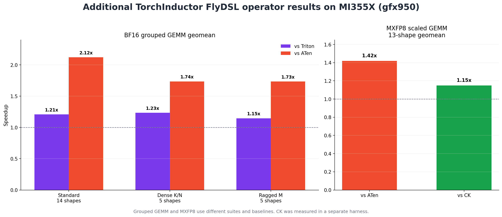

# Bringing FlyDSL to PyTorch: High-Performance ROCm Kernels in Eager and TorchInductor

*A new optional backend brings Python-authored, architecture-specific ROCm kernels to
both eager PyTorch and `torch.compile`.*

> **Status (August 18, 2026):** This is a pre-publication draft describing the work
> tracked by the [PyTorch RFC](https://github.com/pytorch/pytorch/issues/190875).
> Several operator and TorchInductor pull requests are still under review, so no
> released PyTorch build contains the complete operator set described below.

<!--
Publication checklist:
- Replace the status note with the first supported PyTorch nightly/release.
- Re-run the published benchmark suite on the final merged revisions.
- Add author names and publication date in the PyTorch blog CMS.
-->

## Introduction

We are adding [FlyDSL](https://github.com/ROCm/FlyDSL) as an optional PyTorch kernel
backend for AMD GPUs. The integration covers both ways in which users commonly run
PyTorch:

1. **Eager mode**, through targeted native operator overrides.
2. **`torch.compile`**, through TorchInductor templates and autotuning.

The initial operator set is intentionally focused. In eager mode, FlyDSL accelerates
RMSNorm and TopK. In TorchInductor, it provides templates for FP16/BF16 dense GEMM,
grouped GEMM, and MXFP8/MXFP4 scaled GEMM. These kernels target AMD CDNA4 `gfx950`
GPUs, including the MI355X used for the measurements in this article.

The central design principle is **additive integration**. FlyDSL is not a required
PyTorch dependency and it does not replace ATen, Triton, Composable Kernel, CK-Tile,
or vendor libraries by policy. PyTorch uses FlyDSL only when the runtime is available,
the device and inputs match an explicitly tested support region, and—under
TorchInductor—the FlyDSL candidate wins autotuning. Every other case retains the
existing PyTorch path.

The first results show why this additional backend is useful:

- Eager RMSNorm improves representative aligned shapes by roughly **1.2x–1.5x**
  over ATen and off-by-one hidden dimensions by up to **3.7x**.
- Eager TopK's register kernel improves the sampled non-deterministic cases by
  **1.80x–12.04x**, while the radix-select kernels reach up to **2.85x**.
- BF16 dense NT GEMM delivers a **1.19x geometric-mean speedup over Triton** and
  **1.15x over ATen** across 15 measured shapes.
- BF16 grouped GEMM delivers a **1.21x geometric-mean speedup over Triton** and
  **2.12x over ATen** on the standard 14-shape suite.
- MXFP8 BlockWise1x32 scaled GEMM delivers a **1.42x geometric-mean speedup over
  ATen** and **1.15x over CK** across 13 shapes.

These results are from different operator suites and benchmark methods, so they should
be interpreted within each section rather than compared directly with one another.
All measurements were collected on an AMD 256-CU MI355X (`gfx950`). Eager results
measure warm operator latency; compiler results use steady-state or graph-replay
throughput. Unless stated otherwise, first-call JIT compilation and autotuning time
are excluded. The exact ROCm, FlyDSL, and PyTorch revisions differ by pull request
and are recorded in the linked benchmark reports.

## Why FlyDSL?

FlyDSL—Flexible Layout Python DSL—is a Python DSL and MLIR stack for authoring
high-performance GPU kernels with explicit layouts and tiling. A kernel author can
describe tensor shapes, strides, coordinate mappings, thread/value partitions, tiled
copies, LDS (AMD GPU shared memory) usage, and matrix fused multiply-add (MFMA)
instructions in Python while retaining control over the hardware execution hierarchy.

The compilation path is:

```text
Python kernel
    → Fly MLIR dialect
    → GPU and ROCDL dialects
    → LLVM AMDGPU
    → HSACO GPU code object
```

This programming model is a useful match for performance-critical ROCm kernels.
High-level tensor semantics remain in Python, while architecture-specific choices such
as MFMA shapes, vectorized global-memory transfers, LDS staging, wave layouts, and
pipeline depth remain explicit and tunable.

FlyDSL also provides the runtime pieces needed by a framework integration: a HIP tensor
ABI, current-stream execution, JIT compilation, and in-memory and persistent artifact
caches. PyTorch can therefore integrate a reviewed kernel family without embedding the
FlyDSL compiler itself in the PyTorch source tree.

As with the [TorchInductor CuteDSL backend](https://pytorch.org/blog/gemms-torchinductor-cutedsl-backend/),
the goal is not to generate every operation with a lower-level DSL. Existing PyTorch
backends already perform well over broad regions. We add a FlyDSL implementation only
where an architecture-qualified kernel has a clear performance advantage and a
maintainable correctness and fallback story.

## Two Independent Integration Paths

Eager dispatch and TorchInductor selection solve different problems, so they are
separate control planes. They share runtime detection, stream handling, compilation,
and caching, but neither plane enables the other.


*Figure 1. Eager dispatch and TorchInductor autotuning are independent selection
planes over the same optional FlyDSL compiler/runtime.*

For both paths:

- `import torch` does not import FlyDSL or initialize the ROCm runtime.
- PyTorch checks for a compatible optional FlyDSL 0.3.x package without eagerly
  importing it.
- PyTorch-facing wrappers and reviewed kernel snapshots live in the PyTorch tree;
  the compiler/runtime remains in the external FlyDSL package.
- Unsupported devices, dtypes, shapes, layouts, or options fall back without changing
  user-visible operator semantics.
- Compiled specializations are cached so warm calls do not repeatedly compile the
  same kernel.

### Eager path

The eager integration extends PyTorch's existing `torch._native` DSL mechanism:

```text
PyTorch operator
    → FlyDSL support and performance predicate
    → lazy kernel import
    → JIT compile/cache
    → launch on the current ROCm stream
```

The corresponding user control is exposed through
`torch.backends.python_native.flydsl`. Users can disable FlyDSL globally or in a
context manager without affecting TorchInductor.

### TorchInductor path

The compiler integration adds FlyDSL as a GEMM autotuning backend:

```text
ATen lowering
    → check FlyDSL eligibility
    → generate and prune template configurations
    → asynchronously compile valid choices
    → benchmark FlyDSL with existing choices
    → select and cache the fastest valid implementation
```

The implementation adds a `FlyDSLTemplate`, FlyDSL scheduling and generated-wrapper
support, an `async_compile.flydsl` entry point, template heuristics, and runtime cache
integration. Tensor layouts and runtime values stay dynamic where possible, while
tile shape, pipeline depth, wave layout, and related parameters become compile-time
specializations.

## Eager Mode: Targeted Native Overrides

### RMSNorm

RMSNorm is the first FlyDSL eager operator. The current work accelerates the fused
forward path; backward remains on the existing PyTorch implementation. The kernel
returns both the normalized output and the FP32 reciprocal standard deviation required
by the operator contract.

The initial support region is deliberately narrow:

- AMD `gfx950`;
- FP16, BF16, or FP32 input and weight;
- contiguous tensors with one normalized dimension;
- matching input/weight dtype and device;
- non-negative `eps`;
- measured `(M, N)` regions where the FlyDSL kernel wins.

N-dimensional inputs are logically flattened to `(M, N)`. The dispatcher predicate
checks the full contract before importing or compiling FlyDSL. Inputs outside the
support and performance gates use ATen.

The current performance gate covers the following flattened shapes:

| Normalized dimension `N` | Minimum row count `M` |
|---|---:|
| `4096 <= N < 8192` | `8192` |
| `8192 <= N < 16384` | `4096` |
| `16384 <= N <= 114688` | `2048` |

The kernel combines normalization, scaling, and output generation while using
architecture-specific reductions and vectorized loads. It also handles dimensions
that are not naturally aligned to the baseline kernel's preferred vector width. This
is especially helpful for the measured `N + 1` cases, where the speedup reaches 3.66x.

Across the representative measurements, aligned dimensions improve by 1.16x–1.54x
and off-by-one dimensions by 1.78x–3.66x. A broader 60-case warm-runtime suite reported
a **1.50x overall geometric-mean speedup**: 1.58x for FP16, 1.58x for BF16, and 1.35x
for FP32.


*Figure 2. Warm eager RMSNorm speedup over ATen for every representative shape
reported in the RMSNorm pull request.*

The chart includes every representative row reported in the RMSNorm pull request.
Latency is measured with GPU events after 10 warmup iterations and over 50 timed
iterations. Every row was confirmed to dispatch to FlyDSL, and both output and `rstd`
were checked against ATen. The measurements represent warm execution and exclude
first-call compilation. Each plotted row is one run; repeating the smallest shape ten
times produced a 1.16x–1.26x speedup range.

### Other eager operator: TopK (summary)

TopK uses two kernel families selected by the input shape and requested `K`:

- A **register kernel** for small fixed `K` values `{2, 4, 8, 16}`.
- A **radix-select kernel** for continuous ranges from `K=64` through `K=1024`.

The initial override supports contiguous FP32 `gfx950` inputs, reduction over the last
dimension, and `largest=True, sorted=True`. Both functional and `out=` variants are
covered. Deterministic mode preserves ATen's tie ordering.

For non-power-of-two `K`, the radix path pads to the next complete bitonic sorting
network. This preserves correctness across continuous `K` ranges while keeping the
selection and final ordering inside a tuned GPU kernel.

Across all reported rows, the register family has a **4.81x sampled geomean** in
non-deterministic mode and **4.02x** in deterministic mode. The four radix bands
range from **1.63x–1.97x** and **1.40x–1.69x** respectively. The largest individual
speedups are 12.04x for the register kernel and 2.85x for radix select.


*Figure 3. Geometric-mean TopK speedup calculated from the sampled rows reported in
the TopK pull request.*

TopK uses 20 warmup and 100 timed iterations and reports the median of three runs.
One smallest deterministic radix sample measured 0.99x; the chart reports geomeans
over the sampled rows rather than a whole-domain performance guarantee.

## TorchInductor: Templates, Caching, and Autotuning

### Dense FP16/BF16 GEMM

The first compiler target is static 2D `aten.mm(A, B.T)` on `gfx950`: row-major
`A[M, K]` is multiplied by `B[N, K].T` to produce `C[M, N]`. The FlyDSL wrapper
adapts PyTorch's right-hand-side transpose view to the kernel's `[N, K]` contract
while preserving supported row strides and storage offsets.

Eligibility currently requires:

- FP16 or BF16 inputs and matching output;
- a static, non-empty 2D shape;
- the supported NT layout and vector-load alignment;
- `N` and `K` multiples of 32;
- `gfx950`;
- FlyDSL in the Inductor GEMM backend list;
- GEMM max-autotuning enabled.

The lowering filters configurations that cannot support the concrete shape before
benchmarking. The configuration space covers tile sizes, `K` depth, pipeline stages,
wave grids, output-tile grouping, and half-tile interleaving. By default, PyTorch can
use a single baseline configuration. Enabling FlyDSL autotuning exposes the curated
default set, while `EXHAUSTIVE` search explores the larger pruned space.

At the kernel level, workgroups stage `A` and `B` tiles through LDS, reuse those tiles
across waves, and issue MFMA operations into register-blocked accumulators. Tile
dimensions, pipeline depth, wave layout, `GROUP_M` swizzling, and half-tile
interleaving are template parameters. TorchInductor specializes and benchmarks these
parameters for the concrete problem shape instead of committing PyTorch to one
configuration for every GEMM.

Compiled dispatchers are cached by the constexpr configuration while tensor layouts
remain runtime inputs. The FlyDSL persistent cache is placed under TorchInductor's
cache root by default, so normal Inductor cache cleanup and subprocess warming also
cover FlyDSL artifacts.

On 15 BF16 NT GEMM shapes, FlyDSL achieved:

- **1.19x geomean over Triton**: 14 wins, 1 tie, 0 losses;
- **1.15x geomean over ATen**: 11 wins, 2 ties, 2 losses;
- **1.10x geomean over the faster baseline at each shape**: 10 wins, 3 ties,
  2 losses.


*Figure 4. BF16 dense NT GEMM throughput. Each panel uses its own y-axis scale so the
backend differences remain visible across decode, projection, and large-GEMM shapes.*

The suite includes decode shapes from `M=8` upward, square GEMMs through
`8192 × 8192 × 8192`, LLM projection widths `N=14336` and `N=28672`, and a
`4096 × 256 × 4096` rectangular case. All GEMM shape labels use `M × N × K`.

### Other TorchInductor operators (summary)

**Grouped GEMM.** The `torch.nn.functional.grouped_mm` template supports ragged 2D
`A` and grouped `B[G, K, N]`, with a persistent kernel designed for MoE-like workloads.
On the standard 14-shape BF16 suite it reaches a **1.21x geomean over Triton** and
**2.12x over ATen**, winning 11 of 14 cases. The dense-`K/N` and ragged-`M` suites
reach 1.23x and 1.15x over Triton respectively; FlyDSL wins all five ragged-`M` cases.

**MXFP8/MXFP4 scaled GEMM.** Dedicated BlockWise1x32 scaled GEMM families reuse the
FlyDSL lowering and autotuning infrastructure. Across 13 MXFP8 shapes, FlyDSL reaches
a **1.42x geomean over ATen** and **1.15x over CK**, including 2331.6 TFLOP/s at
`8192 × 8192 × 8192`. MXFP4 has its own kernel and configuration family, but the
referenced change does not yet publish a comparable full performance table.



*Figure 5. Summary of the grouped GEMM and MXFP8 scaled GEMM benchmark suites. The
suites and baselines differ, so compare bars only within each subplot.*

Dense GEMM uses the median of four accuracy-checked runs and CUDA-graph replay with
FlyDSL and Triton in the `EXHAUSTIVE` search space. Grouped GEMM reports steady-state
throughput with a fresh process/cache per shape and excludes compilation. MXFP8 uses
25 warmup iterations, 100 timed iterations, four repeats, and the median graph-replay
throughput. These methods isolate warm kernel performance; they do not represent
first-call compilation or autotuning latency.

## Optional by Construction

An optional compiler backend must remain invisible when it cannot run. The integration
therefore treats all of the following as normal fallback cases:

- CPU-only or CUDA-only PyTorch;
- ROCm PyTorch without FlyDSL installed;
- a missing FlyDSL MLIR runtime;
- a FlyDSL version outside the tested 0.3.x line;
- a non-`gfx950` device for the current PyTorch kernels;
- unsupported dtype, layout, shape, alignment, or operator options;
- a valid FlyDSL candidate that loses TorchInductor autotuning.

The eager and compiler controls are also independent. Disabling
`python_native.flydsl` restores eager ATen dispatch but does not remove FlyDSL from
TorchInductor. Conversely, removing `FLYDSL` from
`max_autotune_gemm_backends` disables the Inductor templates without changing eager
overrides.

## How to Try It

While the upstream pull requests are under review, trying the complete integration
requires a source build from the corresponding PyTorch PR stack. The runtime dependency
is a compatible FlyDSL 0.3.x package:

```bash
# Use the ROCm PyTorch wheel/nightly matching your ROCm installation.
# Then install the optional FlyDSL compiler/runtime.
python -m pip install "flydsl>=0.3,<0.4"
```

After the integration lands, use the first PyTorch nightly or release that lists
FlyDSL support in its release notes.

### Eager mode

Eligible eager operations dispatch automatically. The `python_native` controller can
inspect availability or provide an explicit fallback context:

```python
import torch
import torch.nn.functional as F
import torch.backends.python_native as pn

assert torch.version.hip is not None
print("FlyDSL available:", "flydsl" in pn.available_dsls)

x = torch.randn(8192, 4096, device="cuda", dtype=torch.bfloat16)
weight = torch.randn(4096, device="cuda", dtype=torch.bfloat16)

# Uses FlyDSL when every support and performance predicate passes.
y = F.rms_norm(x, (4096,), weight, eps=1e-5)

# Explicitly run the normal ATen path.
with pn.flydsl.disabled():
    y_aten = F.rms_norm(x, (4096,), weight, eps=1e-5)

torch.testing.assert_close(y, y_aten)
```

The same controller supports `enable()`, `disable()`, an `enabled` property, and a
`disabled()` context manager. Unsupported calls need no user handling—they retain
ATen behavior.

### TorchInductor

Add `FLYDSL` to the GEMM autotuning backends and enable multiple FlyDSL
configurations:

```python
import torch
import torch._inductor.config as config

config.max_autotune_gemm_backends = "ATEN,TRITON,FLYDSL"
config.flydsl_enable_autotuning = True

A = torch.randn(128, 4096, device="cuda", dtype=torch.bfloat16)
B = torch.randn(14336, 4096, device="cuda", dtype=torch.bfloat16)

@torch.compile(mode="max-autotune-no-cudagraphs")
def f(a, b):
    # The initial dense template targets A @ B.T.
    return a @ b.T

out = f(A, B)  # The first call compiles and benchmarks eligible choices.
```

The equivalent environment configuration is:

```bash
TORCHINDUCTOR_MAX_AUTOTUNE_GEMM=1 \
TORCHINDUCTOR_MAX_AUTOTUNE_GEMM_BACKENDS="ATEN,TRITON,FLYDSL" \
FLYDSL_ENABLE_AUTOTUNING=1 \
python my_script.py
```

For the largest search space, additionally set:

```bash
TORCHINDUCTOR_MAX_AUTOTUNE_GEMM_SEARCH_SPACE=EXHAUSTIVE
```

`EXHAUSTIVE` is useful for kernel evaluation, but it can compile many configurations
and substantially increase first-run autotuning time. The curated default search is
the practical starting point.

## Validation

The integration includes tests at several layers:

- optional dependency, version, and architecture detection;
- import laziness and fallback behavior;
- eager enable/disable controls;
- JIT cache keys, cache reuse, and instrumentation;
- operator accuracy against ATen/reference outputs;
- generated FlyDSL wrappers and template rendering;
- async compile and precompile metadata;
- shape/configuration filtering;
- multi-choice autotuning;
- deterministic TopK ties and functional/`out=` variants;
- a dedicated `gfx950` ROCm CI shard for end-to-end compilation and execution.

This layered structure matters because most PyTorch CI jobs should not need FlyDSL.
Dependency-absent and unsupported-device behavior can be validated everywhere, while
only selected `gfx950` jobs install the package and execute the kernels.

## Future Work

The current integration establishes the framework pieces needed to grow FlyDSL support
without changing PyTorch's default behavior. The next areas include:

- performance qualification on additional AMD GPU architectures;
- FP16 performance reporting for dense GEMM;
- broader layouts and dynamic-shape specialization;
- additional scaled and grouped/expert GEMM families;
- epilogue fusion;
- attention-family templates;
- bounded, heuristic-guided autotuning spaces;
- parallel precompilation and continued persistent-cache improvements;
- AOT-compatible compilation and packaging.

Each expansion should keep the same standard: an explicit support matrix, correctness
and fallback tests, cold and warm cost reporting, and performance evidence against
the fastest available PyTorch backend.

## Conclusion

FlyDSL gives PyTorch a new, Python-authored path to architecture-specific ROCm kernels.
The work integrates that path where users need it: transparent eager execution for
targeted operators and competitive selection inside TorchInductor autotuning.

The important result is broader than any single kernel. This integration model lets
PyTorch adopt tuned FlyDSL implementations without taking a hard compiler dependency,
changing behavior on unsupported systems, or committing to a blanket backend
replacement. The initial RMSNorm, TopK, dense GEMM, grouped GEMM, and scaled GEMM
results demonstrate that the model can deliver meaningful gains while preserving the
correctness, fallback, and operational properties expected from PyTorch.

## References

- [RFC: Integrating FlyDSL with PyTorch DSL Extension Points](https://github.com/pytorch/pytorch/issues/190875)
- [FlyDSL native-op backend infrastructure](https://github.com/pytorch/pytorch/pull/191446)
- [Eager FlyDSL RMSNorm](https://github.com/pytorch/pytorch/pull/191447)
- [Eager FlyDSL TopK](https://github.com/pytorch/pytorch/pull/193548)
- [TorchInductor FlyDSL dense GEMM](https://github.com/pytorch/pytorch/pull/190903)
- [TorchInductor FlyDSL grouped GEMM](https://github.com/pytorch/pytorch/pull/191475)
- [TorchInductor FlyDSL MXFP8/MXFP4 scaled GEMM](https://github.com/pytorch/pytorch/pull/193527)
- [FlyDSL repository and documentation](https://github.com/ROCm/FlyDSL)
- [Generating State-of-the-Art GEMMs with TorchInductor's CuteDSL backend](https://pytorch.org/blog/gemms-torchinductor-cutedsl-backend/)
