# Accelerating PyTorch on AMD GPUs with FlyDSL

PyTorch users on AMD MI350-series GPUs can now use
[FlyDSL](https://github.com/ROCm/FlyDSL) through existing operator APIs for
dense and grouped GEMM, MXFP8/MXFP4 scaled GEMM, RMSNorm, and TopK. The optional
backend covers both eager execution and `torch.compile` without requiring
applications to call custom kernels.

Across the reported kernel-level operator suites, FlyDSL provides a **1.10x
geometric-mean speedup for the 15-shape BF16 dense-GEMM suite over the faster
ATen/Triton baseline**,
**1.58x and 1.68x geometric means over ATen across 17 shapes per MXFP format**,
**1.20x geometric mean over Triton across all 24 grouped-GEMM cases**, and
**1.17x–3.66x over ATen across the 22 RMSNorm cases**. For the 10 small-K TopK
cases, the geometric mean is **4.82x over ATen** with deterministic algorithms
disabled. These gains are most relevant when the supported operations account
for a significant share of model runtime.
In end-to-end vLLM A/B tests, whole-request speedup reaches **1.13x for BF16**,
**2.04x for MXFP8**, and **3.01x for MXFP4**, with the result depending on model
and concurrency.

Users enable FlyDSL with `torch.compile` and GEMM autotuning for dense, grouped,
and MXFP GEMMs; eligible eager RMSNorm and TopK calls dispatch automatically.
Unsupported inputs retain existing PyTorch implementations.

## Why FlyDSL as a PyTorch Backend

GPU DSLs choose different abstraction levels. The block-tensor programming model
in [Triton](https://github.com/triton-lang/triton) lets authors describe
program-level tiles while the compiler manages much of the thread, wave, and
instruction mapping. FlyDSL makes those mappings explicit through layout
algebra: kernel authors can partition tiles across blocks, waves, threads, and
values; select tiled-copy and MFMA atoms; define LDS swizzles and staging; and
place synchronization or compiler-scheduling boundaries. The two approaches are
complementary. FlyDSL is useful for architecture-specific templates where data
movement and instruction ownership are part of the algorithm.

These controls appear directly in the kernels: HTI and staged LDS in Dense/MXFP
GEMM, matched operand-scale lifetimes and scaled MFMA in MXFP, and persistent
expert scheduling in Grouped GEMM. FlyDSL expresses them in Python and lowers
them through MLIR while preserving explicit hardware mapping.

PyTorch turns those specialized templates into an additive, measurable backend.
Unsupported workloads retain existing implementations:

- **Eager execution:** eligible RMSNorm and TopK calls dispatch to FlyDSL when
  the optional runtime is installed and enabled; other calls retain ATen.
- **`torch.compile`:** TorchInductor filters eligible Dense, Grouped, and MXFP
  GEMM candidates, benchmarks FlyDSL beside ATen and Triton where supported,
  caches the winner for each workload, and runs the fastest measured kernel.


*Figure 1. FlyDSL in PyTorch, with the optional package installed and FlyDSL
enabled for GEMM autotuning. Eager execution dispatches by input support;
TorchInductor selects by measured performance, with candidates depending on the
operation. Both paths use PyTorch operator APIs.*

## Supported Features

Current support targets AMD MI350-series GPUs with the `gfx950` architecture.
The following features are available in PyTorch:

| Operation | Mode | PyTorch API | Input dtype | Layout / shape | Output / options |
| --- | --- | --- | --- | --- | --- |
| Dense GEMM | Compile | `torch.mm` | FP16, BF16 | Static 2D; NN/NT/TN/TT | Same dtype |
| MXFP scaled GEMM | Compile | `F.scaled_mm` | MXFP8, MXFP4 | Static 2D; A row-major, B column-major | FP16/BF16; block scales |
| Grouped GEMM | Compile | `F.grouped_mm` | FP16, BF16 | Ragged 2D A; grouped 3D B | Uneven/empty groups |
| RMSNorm | Eager | `F.rms_norm` | FP16, BF16, FP32 | Contiguous; 1-D norm shape | Forward |
| TopK | Eager | `torch.topk` | FP32 | Contiguous; last dimension | Largest, sorted; functional/`out=` |

Dense GEMM's [four-layout support](https://github.com/pytorch/pytorch/pull/194981)
accepts row-major and column-major inputs, including eligible transpose views.
In the layout names, the first letter describes A and the second describes B;
`N` and `T` denote non-transposed and transposed input layouts.
Grouped GEMM supports different row counts per group, allowing experts to process
uneven token assignments. Its current input-layout requirements are separate
from dense GEMM's four-layout coverage. RMSNorm backward continues through
PyTorch's existing implementation.

MXFP scaled GEMM accepts FP8 E4M3 or packed FP4 E2M1 operands, with one E8M0
scale per 32 values along the reduction dimension (`BlockWise1x32`). Applications
supply the quantized operands and contiguous, unswizzled scale tensors. Both
formats use FP32 accumulation and return FP16 or BF16; the current path requires
`K` to be a multiple of 128. It supports an optional one-dimensional bias whose
length is `N` and whose dtype matches the output; fast accumulation is not
supported. Under `torch.compile`, Inductor's layout constraint runs before
backend selection and requires unit stride along K for A and B—row-major A and
column-major B—while preserving compatible leading strides. For incompatible
inputs, Inductor inserts a layout copy. The FlyDSL MXFP kernel and the
measurements below use these constrained layouts. This constraint is specific to
scaled GEMM: Dense `torch.mm` detects eligible NN/NT/TN/TT strides and passes
their layout flags to FlyDSL without applying the MXFP canonicalization.

Each operation has shape and alignment requirements. The detailed
[dense GEMM](https://github.com/pytorch/pytorch/pull/194981),
[MXFP scaled GEMM](https://github.com/pytorch/pytorch/pull/196719),
[grouped GEMM](https://github.com/pytorch/pytorch/pull/194032),
[RMSNorm](https://github.com/pytorch/pytorch/pull/191447), and
[TopK](https://github.com/pytorch/pytorch/pull/193548) support descriptions define
those boundaries. Unsupported eager calls retain ATen behavior; compiled GEMMs
can use the other enabled backends.

## Kernel-Level Performance

The following operator-level benchmarks compare execution on AMD `gfx950` GPUs.
The suites use separate measurement setups: dense GEMM uses graph replay,
grouped GEMM reports steady-state throughput, and RMSNorm and TopK use GPU-event
timing. The MXFP source reports TFLOP/s but not the timing protocol, benchmark
output dtype, or complete software stack. Compilation, first-call autotuning,
and end-to-end latency are excluded; MXFP also starts from already quantized
operands. A speedup above 1.0 means FlyDSL is faster than the named baseline, and
geometric means weight sampled cases equally. Each figure and caption identifies
its comparison baseline and aggregation scope.

### Dense GEMM: Linear-Layer Workloads

Dense matrix multiplication is a building block of transformer projection and
feed-forward layers. Its dimensions vary substantially with the number of tokens
being processed, making performance across a range of shapes relevant to model
developers.

For large GEMMs, the tuned HTI configurations use a 256 × 256 output tile computed by an eight-wave workgroup (Wave64, 512 threads total)—two waves along M and four along N.
The half-tile interleaved (HTI) schedule splits A along M and B along N, keeping four output-quadrant accumulators in registers.
It processes consecutive K tiles in pairs, interleaving asynchronous loads from global memory into local data share (LDS), LDS-to-register reads, and matrix fused multiply-add (MFMA) computation. Smaller shapes can autotune among narrower full-tile and HTI configurations.

The full-tile path uses a configurable `STAGES`-deep K-tile ring.
Its prologue primes the ring, the steady-state loop overlaps computation on staged data with prefetches into reusable slots, and the epilogue drains the remaining stages.
HTI uses two stages but schedules operand-buffer reuse at half-tile granularity, allowing individual A/B regions to be refilled without waiting for the entire tile’s computation to finish.

For a step-by-step explanation of the producer/consumer ring and its wait
semantics, see AMD's
[Multi-Stage LDS Pipeline: Keep K Blocks in Flight](https://rocm.blogs.amd.com/software-tools-optimization/accelerating-llm-inference-on-amd-gpus-with-low-latency-gemms/README.html#multi-stage-lds-pipeline-keep-k-blocks-in-flight).
The FlyDSL GEMM schedule here adopts the same multi-stage LDS producer/consumer
concept.

HTI uses two LDS stages for consecutive K tiles, with stage 0 assigned to tile `t` and stage 1 to `t+1`.
Within each tile, `A0` feeds `C00/C01`, `A1` feeds `C10/C11`, `B0` feeds `C00/C10`, and `B1` feeds `C01/C11`.
Once an operand half’s required LDS-to-register reads are complete and the necessary synchronization is satisfied, its LDS region can be reused while MFMA continues on register-resident fragments.
In steady state, the schedule progressively refills stage 0 with `t+2` and stage 1 with `t+3`, beginning those prefetches during computation of `t` and `t+1`, respectively.
The two stages alternate in this way across K.

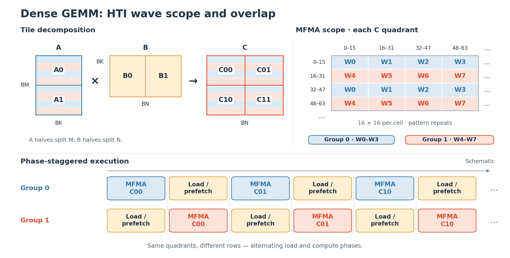

*Figure 2. Dense GEMM tiled scheduling. HTI splits A and B into halves, then the
same eight waves update `C00`–`C11` for each K tile. Stage 0 and stage 1 hold
consecutive tiles; after the second use of an A/B half, that region is recycled
for the tile two positions ahead.*

Across 15 BF16 NT shapes, FlyDSL delivers a **1.10x geometric-mean speedup over
the faster ATen/Triton baseline at each shape**. Gains are strongest in smaller
and medium-sized problems: `M × N × K = 64 × 4096 × 4096`, for example, improves
by **1.33x**.

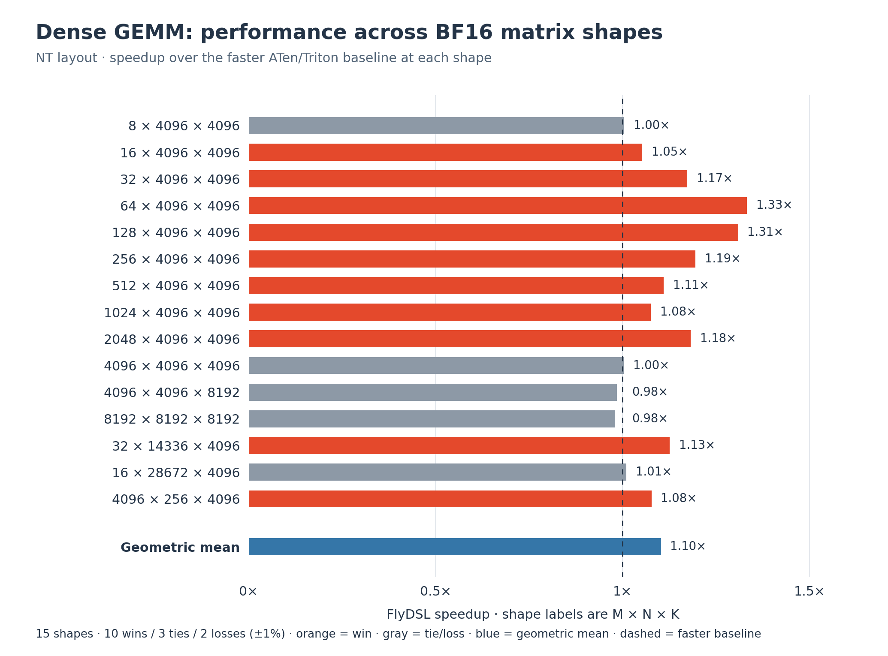

*Figure 3. BF16 NT GEMM on MI355, relative to the faster ATen/Triton baseline at
each shape. All 15 cases are shown: 10 wins, three ties, and two losses using a
±1% tie band.*

A later regression check of the current all-layout kernel over the same shapes
reported a **1.12x aggregate speedup** over the faster original baseline. Figure 3
retains the earlier per-shape measurements because the later check published
aggregate results only.

The two largest square-output problems in this suite slightly favor ATen. Keeping
multiple backends enabled lets PyTorch make that choice for each workload.
These results characterize NT GEMM; NN, TN, and TT are also supported, with their
performance depending on the workload.

### MXFP Scaled GEMM: Extending to Low-Precision Workloads

Microscaled formats combine low-precision values with a shared scale for each
small block of elements. They reduce operand storage while allowing matrix
multiplication to accumulate in FP32. FlyDSL's MXFP8 and MXFP4 support makes
these kernels available to quantized workloads through `torch.compile`.

MXFP is a specialization of the same gfx950 GEMM scheduler rather than an
independent schedule: it reuses the Dense/BF16 tile configurations, wave layout,
full-tile/HTI choice, four resident C quadrants, and K-pair prefetch pipeline.
Its additions are packed MXFP8/MXFP4 operand layouts, E8M0 scales staged through
LDS with A/B, and CDNA4 scaled MFMA instructions. For HTI, the scale-chunk length
is derived from the tile and workgroup geometry and cycled through the staged
buffers. A/B stages ping-pong per K tile, whereas scale slots ping-pong per
multi-tile chunk; data and scale fragments are read together before either slot
can be recycled. For the common `256 × 256` HTI configurations this gives four
K tiles per MXFP8 scale chunk (`BK=128`) and two per MXFP4 chunk (`BK=256`);
the implementation derives the value rather than treating it as a universal
constant. In the full-tile MXFP path, `scale_chunk_tiles=1`: scales occupy the
same configurable `STAGES`-deep per-stage ring as A/B. The separate multi-tile
scale-chunk ring shown below is specific to HTI.

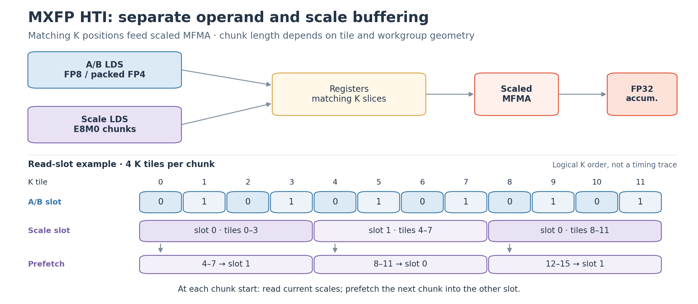

*Figure 4. MXFP scaled-GEMM scheduling. The C-quadrant and K-pair schedule is
shared with Dense/BF16. MXFP adds packed A/B values, E8M0 scale chunks, and
scaled MFMA. The A/B ring follows the same quadrant consumer order and refills
after the last data consumer; the scale ring retains matching scales until
those consumers finish, then prefetches the next chunk.*

On MI355X, the 17-shape NT suite shows a **1.58x geometric-mean speedup for
MXFP8 over ATen** and a **1.68x speedup for MXFP4 over ATen**.

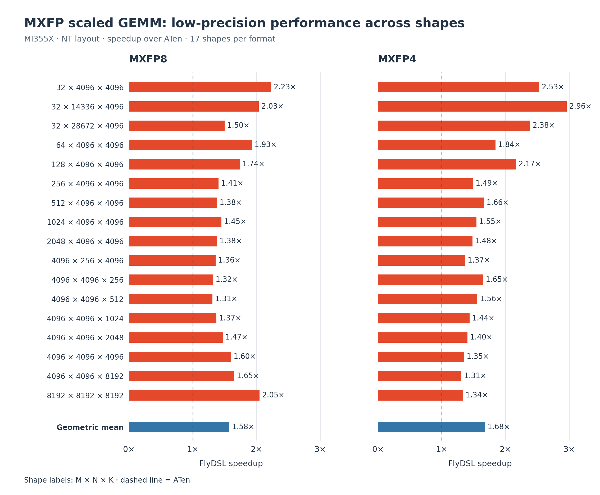

*Figure 5. NT scaled GEMM on MI355X. Each panel shows all 17 cases and their
geometric mean relative to ATen.*

FlyDSL exceeds ATen throughput in every reported case for both formats.
MXFP8 speedups range from **1.31x to 2.23x**, with the largest gain at
`32 × 4096 × 4096`. MXFP4 ranges from **1.31x to 2.96x**, peaking at
`32 × 14336 × 4096`. The integrated MXFP autotuning path chooses between ATen
and FlyDSL for each eligible workload. The measurements cover NT layout.

### Grouped GEMM: Uneven Work Across Experts

In mixture-of-experts models, experts can receive very different numbers of
tokens. Grouped GEMM processes these matrix multiplications together while
accommodating uneven—and sometimes empty—groups. PyTorch represents the inputs
as concatenated activations `A[sum(M_g), K]`, grouped weights `B[G, K, N]`, and
offsets that mark each expert's row boundary.

Instead of launching one kernel per expert, a persistent grid assigns every
workgroup a strided sequence of tiles across the cumulative group offsets,
naturally skipping empty groups. A compute-die-aware swizzle distributes work
across the GPU's eight Accelerator Complex Dies (XCDs), with an N-major fallback
that keeps concurrent workgroups on reusable B tiles; HTI configurations remain
available to autotuning.

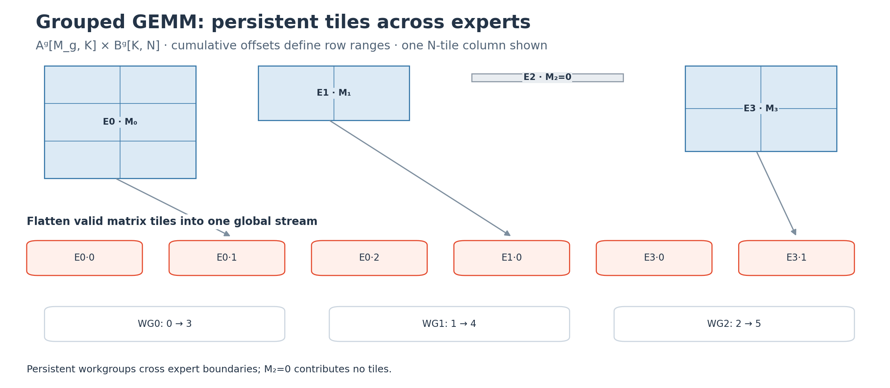

*Figure 6. Grouped-GEMM scheduling. One N-tile column is shown: experts contribute
`ceil(M_g / BM)` tiles to a cumulative stream, while a zero-row expert
contributes none. Persistent workgroups start at `blockIdx.x` and advance by the
grid size, so they can cross expert boundaries without launching per expert.*

The 24 reported cases are divided by the workload dimension being tested. In a
uniform shape `G × M × K × N`, `G` is the number of experts, `M` is the token
count per expert, and `K` and `N` are the reduction and output dimensions:

- **Uniform groups (14 cases):** all experts use the same `M`, while
  `G`, `M`, `K`, and `N` vary across common grouped-GEMM shapes.
- **Projection dimensions (five cases):** `G = 8` and `M = 512` are fixed while
  `K` and `N` cover MoE up/down projections and a small-`N` case.
- **Ragged expert loads (five cases):** `G = 8` and `K = N = 4096` are fixed,
  while each label lists the eight per-expert `M` values, including empty and
  highly imbalanced experts.

Across all 24 cases, FlyDSL reaches **1.20x geometric-mean speedup over Triton**
and **1.95x over ATen**. Uniform groups reach **1.21x** and **2.12x**,
respectively, with FlyDSL the fastest backend in **11 of 14 cases**. The
projection-dimension cases reach **1.23x** and **1.73x**; the ragged cases reach
**1.15x** and **1.73x**, and FlyDSL wins all five.

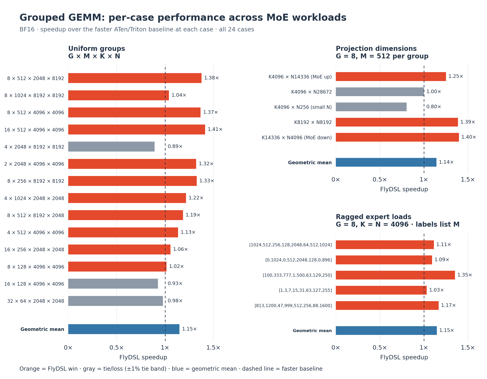

*Figure 7. All 24 BF16 grouped-GEMM cases on gfx950, split into three panels.
Each bar compares FlyDSL with the faster ATen/Triton result for that case; each
panel ends with its geometric mean.*

The per-case view makes the shape sensitivity explicit: the projection sweep
contains a small-`N` case where Triton is faster and a wide-`N` case tied with
ATen, while all five ragged expert-load cases favor FlyDSL.

### RMSNorm: Gains Across Hidden Dimensions

RMSNorm normalizes and scales activations, a repeated step in many transformer
models. FlyDSL accelerates the forward operation while retaining the normal
PyTorch API and backward behavior.

The kernel assigns one thread block (CTA) to each row and chooses 256, 512, or
1024 threads from the normalized dimension, corresponding to 4, 8, or 16
Wave64s. It loads the vectorizable body with 128-bit copies, handles any
remaining elements with a scalar tail, and keeps the loaded input in registers.
FP32 sum-of-squares first reduces within each Wave64 using shuffle operations,
then combines one partial per wave through a small LDS buffer. The resident
values are reused to apply `rsqrt` and the weight and to return the `rstd` needed
by backward.

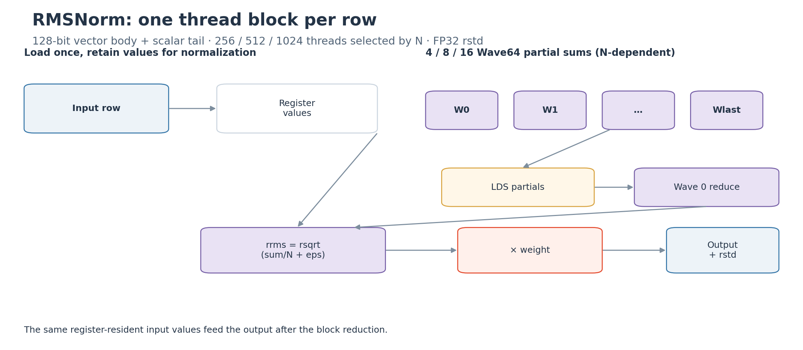

*Figure 8. RMSNorm scheduling. One thread block loads a row into registers,
produces 4/8/16 Wave64 partial sums depending on N, combines them through LDS,
then reuses the resident values to write the normalized output and backward
`rstd`.*

For the measured aligned hidden dimensions, speedups over ATen are approximately
**1.2x–1.5x**. Dimensions one element above an aligned size—for example, `4097`
rather than `4096`—show larger gains, reaching **3.66x**.

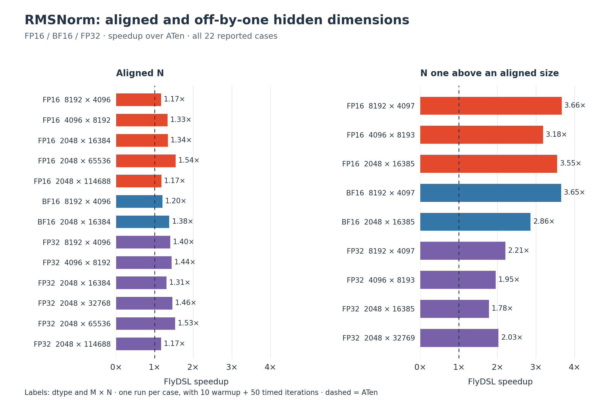

*Figure 9. All 22 reported RMSNorm cases on MI355X. Labels identify dtype and
M × N, where M is the row count and N the normalized dimension. Both panels use
the same speedup scale.*

The split between aligned and off-by-one dimensions shows why the input shape
matters when interpreting the peak result. The 3.66x speedup applies to a
particular FP16 case; gains on aligned dimensions are more modest.

### TopK: Faster Selection for Small and Large K

TopK selects the highest-scoring elements from each row. The amount of output
requested changes the workload: selecting a handful of elements is different
from selecting hundreds. FlyDSL provides specialized paths for these regimes.
For small fixed K, a gfx950 CTA contains two Wave64s and processes two rows—one
wave per row. Each lane reads 128-bit chunks, bitonic-sorts one group at a time,
and folds each group into a register-resident local top-K. Butterfly shuffles
then merge those candidates across the wave, and lane 0 writes the final K
pairs.
For larger K, four 8-bit radix passes find the K-th threshold, gather only the
surviving candidates, and bitonic-sort a buffer rounded from K to the next power
of two instead of sorting the full row.

Here, “determinism on” means `torch.use_deterministic_algorithms(True)`. The
radix path then uses prefix-sum slots to preserve finite-value tie order; with
determinism off it uses atomic slot allocation, so equal-value indices can vary.
The register kernel itself is reproducible in both modes, although its tie
ordering can differ from ATen. NaNs are canonicalized to one ordinal, so exact
NaN payload and index selection can differ from ATen even in deterministic mode.

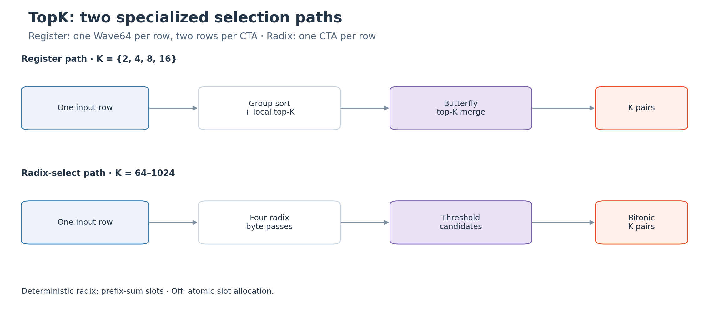

*Figure 10. TopK scheduling. The register path processes two rows per CTA with
one Wave64 per row, then butterfly-merges local top-K candidates. The radix path
uses one CTA per row and four byte passes to identify a threshold before sorting
only the surviving candidates.*

For small `K = {2, 4, 8, 16}`, FlyDSL achieves a **4.82x geometric-mean speedup
over ATen with deterministic algorithms disabled**, and **4.02x with them
enabled**. For the larger sampled K bands, the geometric-mean speedup ranges
from **1.40x to 1.97x**.

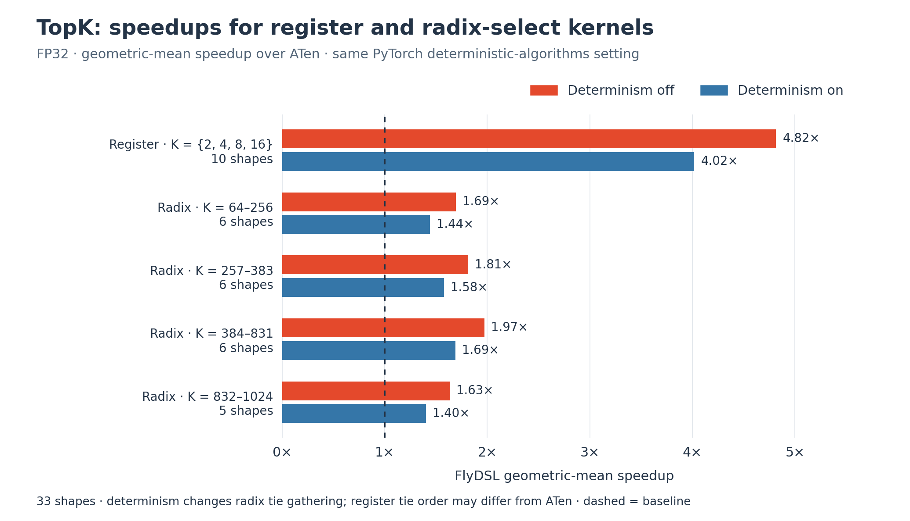

*Figure 11. FP32 TopK on MI355X, compared with ATen under the same determinism
setting. The bars aggregate all 33 reported cases by kernel family and K band.*

The small-K register path shows the largest average gain. The radix-select paths
extend the benefit to larger K ranges, although some individual cases are near
parity. For applications that inspect indices, equal-value ties can be ordered
differently across backends; reproducibility does not guarantee identical tied
indices.

## End-to-End vLLM Inference

We used `vllm bench serve` on one MI355X (`TP=1`) with
Llama-3.1-8B-Instruct, Qwen3-32B, and Llama-3.3-70B-Instruct. Each request has a
256-token input and fixed 512-token output; concurrency ranges from 8 to 256.
The baseline and treatment use the same serving configuration and per-model KV
cache, with only the Inductor GEMM candidate list changed. The figure reports
whole-request speedup.

**BF16.** Adding FlyDSL to the ATen/Triton baseline produces the clearest gains
for Llama-3.1-8B at low-to-medium concurrency, peaking at **1.13x**; Qwen3-32B
peaks at **1.06x**, while Llama-3.3-70B remains mostly within the **1.79%**
measured noise floor. The BF16 results report medians from at least two
ABBA-interleaved repetitions.

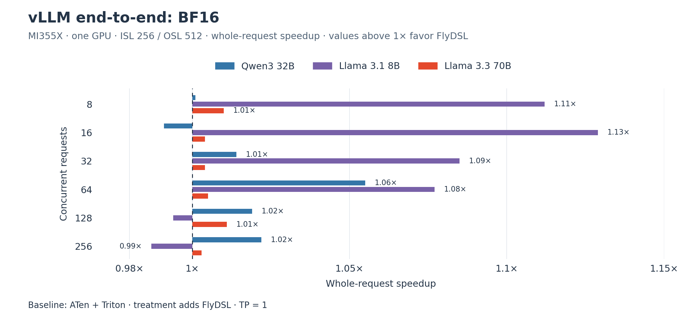

*Figure 12. BF16 whole-request speedup on one MI355X. The baseline enables ATen
and Triton; the treatment adds FlyDSL. Values above 1x favor FlyDSL.*

**MXFP8 A8W8.** With ATen (hipBLASLt) as the baseline, FlyDSL improves all 18
model-concurrency combinations: **1.40x–2.03x** for Qwen3-32B,
**1.04x–1.92x** for Llama-3.1-8B, and **1.38x–2.04x** for Llama-3.3-70B.

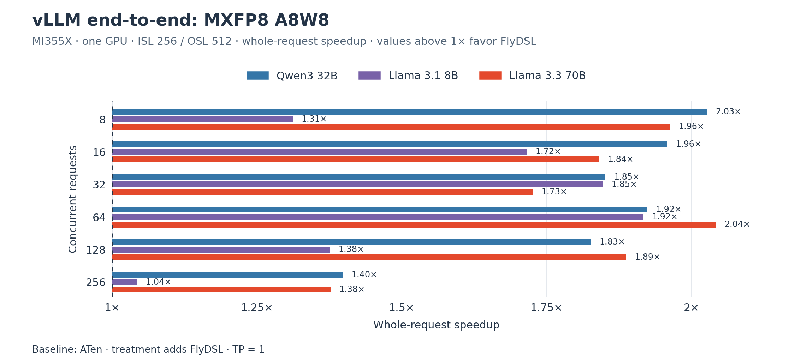

*Figure 13. MXFP8 A8W8 whole-request speedup on one MI355X. The baseline is
ATen; the treatment adds FlyDSL. Values above 1x favor FlyDSL.*

**MXFP4 A4W4.** With `lm_head` left unquantized, all 18 combinations also
improve: **1.53x–3.01x** for Qwen3-32B, **1.25x–1.85x** for Llama-3.1-8B,
and **1.50x–2.82x** for Llama-3.3-70B. MXFP8 and MXFP4 each have one measured
run per cell, so small differences should not be treated as
variance-qualified results.

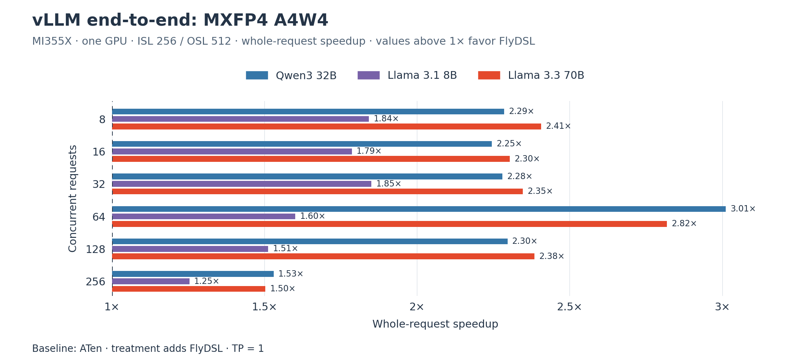

*Figure 14. MXFP4 A4W4 whole-request speedup on one MI355X. The baseline is
ATen; the treatment adds FlyDSL. Values above 1x favor FlyDSL.*

## Try It in PyTorch

Use a recent [ROCm PyTorch nightly](https://pytorch.org/get-started/locally/) for
MI350-series GPUs. This article assumes that it already contains all the FlyDSL
integrations described above, including MXFP scaled GEMM. Then install an
optional runtime from the supported 0.3.x series:

```bash
python -m pip install --upgrade "flydsl>=0.3.0,<0.4"
```

The examples below require a `gfx950` GPU; ROCm builds use PyTorch's `"cuda"`
device string.

### Dense and Grouped GEMM

Enable FlyDSL as a candidate and let `torch.compile` select the implementation:

```python
import torch
import torch._inductor.config as config

config.max_autotune_gemm_backends = "ATEN,TRITON,FLYDSL"
config.flydsl_enable_autotuning = True

a = torch.randn(128, 4096, device="cuda", dtype=torch.bfloat16)
b = torch.randn(4096, 14336, device="cuda", dtype=torch.bfloat16)

@torch.compile(mode="max-autotune")
def mm(a, b):
    return a @ b

out = mm(a, b)
```

This example uses NN layout. Eligible transposed inputs enable NT, TN, and TT
without another flag. The same settings apply to `F.grouped_mm`.

The first call includes compilation and tuning; later calls reuse the selected
implementation. Enabling FlyDSL gives PyTorch another candidate, so either ATen
or Triton may still be selected. Use `max-autotune-no-cudagraphs` when the
workload is incompatible with GPU graph capture. These Inductor configuration
controls are version-sensitive and may change between nightly builds.

### MXFP8 and MXFP4 Scaled GEMM

With the GEMM configuration above, compile a call on already quantized operands
and their block scales. This wrapper uses the public `F.scaled_mm` API supported
by the integration:

```python
import torch.nn.functional as F
from torch.nn.functional import ScalingType, SwizzleType


@torch.compile(mode="max-autotune")
def mxfp_mm(a, b, scale_a, scale_b):
    return F.scaled_mm(
        a,
        b,
        scale_a,
        ScalingType.BlockWise1x32,
        scale_b,
        ScalingType.BlockWise1x32,
        SwizzleType.NO_SWIZZLE,
        SwizzleType.NO_SWIZZLE,
        output_dtype=torch.bfloat16,
    )
```

For an MXFP8 NT call, pass row-major `a[M, K]` and column-major `b[K, N]`
with dtype `torch.float8_e4m3fn`. Both scales have dtype `torch.float8_e8m0fnu`,
with contiguous shapes `[M, K // 32]` and `[N, K // 32]`.
For MXFP4, use packed `torch.float4_e2m1fn_x2` operands with storage shapes
`[M, K // 2]` and `[K // 2, N]`; the scale shapes use the logical `K`.
The wrapper supports both formats with the same backend settings.

### Eager RMSNorm and TopK

Eligible eager calls use FlyDSL automatically. The backend controller makes it
easy to compare with ATen:

```python
import torch
import torch.nn.functional as F
import torch.backends.python_native as pn

assert torch.version.hip is not None
assert torch.cuda.get_device_properties(0).gcnArchName.split(":")[0] == "gfx950"
assert pn.flydsl.available

x = torch.randn(8192, 4096, device="cuda", dtype=torch.bfloat16)
weight = torch.ones(4096, device="cuda", dtype=torch.bfloat16)

y = F.rms_norm(x, (4096,), weight, eps=1e-5)
with pn.flydsl.disabled():
    y_aten = F.rms_norm(x, (4096,), weight, eps=1e-5)

torch.testing.assert_close(y, y_aten)
```

The same `pn.flydsl.disabled()` context manager applies to eligible
`torch.topk` calls. Actual dispatch depends on the operation's shape, dtype, and
layout.

## What's Next

The next steps extend the range of workloads that can benefit from FlyDSL:

- **Broader hardware coverage:** extend the PyTorch integration and optimized
  kernel set to AMD Instinct MI450 Series GPUs.
- **More low-precision workloads and attention:** add MXFP8 grouped GEMM and
  FlexAttention kernels for more inference workloads.
- **Fusion and training:** support GEMM epilogue fusion and broader backward
  coverage.
- **Deployment and validation:** add AOTInductor support and expand end-to-end
  model benchmarks.

These extensions are in progress and are outside the current support and
performance results presented here.

## Conclusion

The current integration connects FlyDSL kernel development to both eager
operators and compiled GEMMs, giving PyTorch users a practical way to benefit
from optimized AMD kernels. The vLLM results show how those kernel choices can
translate into model-level gains, particularly for low-precision MXFP8 and
MXFP4 workloads. Try it on your workloads and share results or feature requests
through the
[PyTorch issue tracker](https://github.com/pytorch/pytorch/issues/new/choose).
