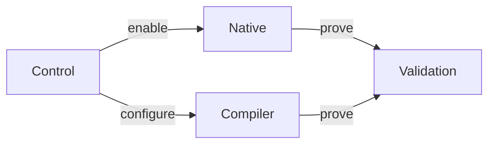
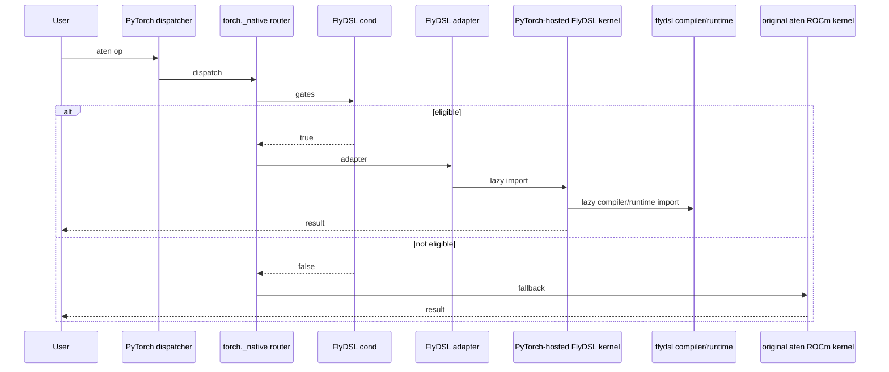
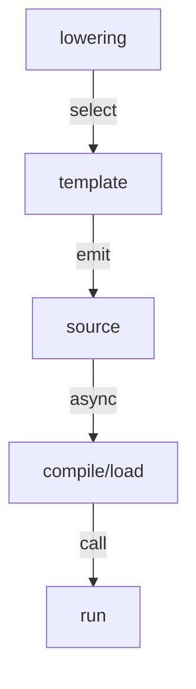
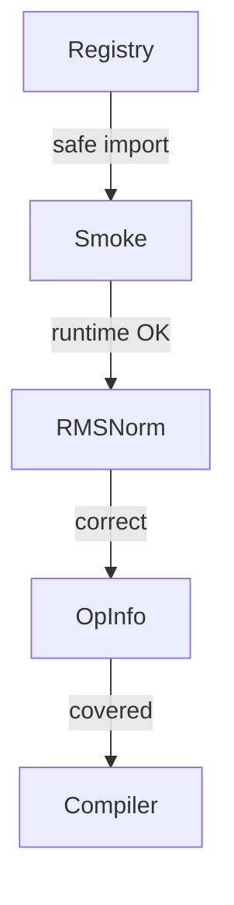

# RFC: Integrating FlyDSL with PyTorch DSL Extension Points

Status: Draft  
Authors: FlyDSL contributors  
Companion analysis: `docs/cutedsl_pytorch_integration_report.md`

## Motivation

PyTorch already has multiple extension points for Python GPU DSLs:

- `torch._native` for eager/native dispatcher overrides with aten fallback.
- `torch.backends.python_native` for user-visible DSL enable/disable controls.
- `torch._inductor.codegen.*` for template-based compiler backends used by `torch.compile`.
- test and CI utilities for optional DSL runtimes, version gates, and skip behavior.

CuteDSL uses these extension points for CUDA. FlyDSL is a ROCm-oriented Python DSL with an MLIR lowering pipeline, `torch.Tensor` ABI support, stream support, and JIT/runtime caching. The goal of this RFC is to define how FlyDSL should plug into the same PyTorch DSL architecture without adding FlyDSL as a required PyTorch dependency or destabilizing existing ROCm execution paths.

## Goals

1. Add FlyDSL as an optional ROCm DSL runtime known to PyTorch.
2. Reuse existing PyTorch DSL infrastructure instead of inventing a FlyDSL-specific integration path.
3. Support both eager/native overrides and a future Inductor template path.
4. Keep the FlyDSL compiler/runtime outside PyTorch while allowing PyTorch native ops to host small FlyDSL kernel sources directly.
5. Preserve aten behavior for unsupported platforms, package versions, dtypes, shapes, layouts, and architectures.
6. Use RMSNorm as the first native override candidate; treat LayerNorm as the fallback candidate if RMSNorm API or benchmark evidence is not ready.
7. Provide a staged implementation plan that can be reviewed as small PRs.

## User and Maintainer Impact

| Audience | Impact |
|---|---|
| PyTorch users without FlyDSL | No behavior change; FlyDSL remains unavailable and silent by default. |
| ROCm users with FlyDSL installed | Eligible calls may use FlyDSL kernels; unsupported calls fall back to aten. |
| PyTorch maintainers | Review PyTorch-owned native op predicates, fallback behavior, and the FlyDSL kernel source used by the native op. |
| FlyDSL maintainers | Provide stable package versions, compiler/runtime compatibility, JIT/cache behavior, and packaging fixes. |

## Non-Goals

| Non-goal | Reason |
|---|---|
| Make `flydsl` a required PyTorch dependency | PyTorch default installs must remain unchanged. |
| Vendor FlyDSL's MLIR compiler into PyTorch | The compiler is large and should remain FlyDSL-owned. |
| Replace CK, CKTile, Triton, or aten ROCm kernels | FlyDSL is an optional accelerator path. |
| Land native overrides and Inductor support in one PR | These are different review surfaces. |
| Turn FlyDSL into a PyTorch-bundled kernel library | PyTorch should host only the native-op FlyDSL kernel sources it owns and reviews; reusable external kernel APIs can remain a separate FlyDSL concern. |

## Existing PyTorch DSL Architecture

PyTorch's current DSL integration is easier to reason about as four separate planes. FlyDSL should plug into each plane using the same shape as existing DSLs, instead of introducing a FlyDSL-only path.



Diagram legend:

| Node | Meaning |
|---|---|
| Control | Registers the DSL identity, exposes user controls, and answers availability/version queries without importing the runtime. |
| Native | Adds eager dispatcher overrides with cheap predicates, lazy FlyDSL imports, and aten fallback. |
| Compiler | Adds future Inductor template integration after native/runtime stability is proven. |
| Validation | Tests import safety, optional dependency behavior, correctness, fallback, user controls, and future compiler codegen. |

The important dependency is not that every plane must land together. The control plane can land first, native RMSNorm can land next, and Inductor can remain a documented future path until there is a tested template.

The planes are independent enough to land in stages:

| Plane | Existing PyTorch mechanism | What FlyDSL adds | First PR? |
|---|---|---|---|
| Control | `torch._native.dsl_registry`, `torch.backends.python_native` | Register `flydsl`, expose `python_native.flydsl` | Yes |
| Native / eager | `torch._native.registry`, per-op `cond` / `impl` wrappers | ROCm op adapters plus PyTorch-hosted FlyDSL kernel sources that lazily import the FlyDSL runtime | After control |
| Compiler / Inductor | `KernelTemplate`, scheduling, `async_compile.*`, autotune | `FlyDSLTemplate`, `FlyDSLScheduling`, `async_compile.flydsl` | Later |
| Validation | optional package install, skip helpers, smoke tests, OpInfo | FlyDSL CI install and tests | Yes, then expand |

CuteDSL currently uses this architecture for CUDA:

| Plane | CuteDSL implementation | FlyDSL equivalent |
|---|---|---|
| Control | [`torch.backends.python_native.cutedsl`][pytorch-python-native] | `torch.backends.python_native.flydsl` |
| Native/eager | [`torch/_native/cutedsl_utils.py`][pytorch-cutedsl-utils], op wrappers, PyTorch-hosted DSL kernel files | `torch/_native/flydsl_utils.py`, ROCm op wrappers, PyTorch-hosted FlyDSL kernel files |
| Compiler | [`torch/_inductor/codegen/cutedsl/`][pytorch-inductor-cutedsl] | `torch/_inductor/codegen/flydsl/` later |
| Validation | [CI install helper][pytorch-ci-common-utils], smoke tests, OpInfo | `install_flydsl`, smoke tests, OpInfo |

The dependency model should also mirror CuteDSL: PyTorch may carry the kernel/helper source that belongs to a PyTorch integration, while the DSL compiler/runtime remains an optional, explicitly installed Python package. CuteDSL code imports `cutlass` from `nvidia-cutlass-dsl`; FlyDSL code should import `flydsl` from the optional FlyDSL package.

### Reference Material

These files are useful companion reads when reviewing or implementing this RFC:

| Topic | Reference | Why it helps |
|---|---|---|
| PyTorch native DSL contract | PyTorch: [`torch/_native/README.md`][pytorch-native-readme] | Defines `cond` / `impl`, lazy imports, FakeTensor constraints, logging, and OpInfo expectations. |
| PyTorch DSL registry | PyTorch: [`torch/_native/dsl_registry.py`][pytorch-dsl-registry], [`torch/_native/registry.py`][pytorch-native-registry] | Shows how DSL availability and dispatcher override routing are represented. |
| User controls | PyTorch: [`torch/backends/python_native/__init__.py`][pytorch-python-native] | Shows the shared `torch.backends.python_native.<dsl>` control surface. |
| RMSNorm schemas | PyTorch: [`aten/src/ATen/native/native_functions.yaml`][pytorch-native-functions] | Shows `aten.rms_norm`, `_fused_rms_norm`, and `_fused_rms_norm_backward`. |
| CuteDSL native adapters | PyTorch: [`torch/_native/ops/topk/cutedsl_impl.py`][pytorch-topk-cutedsl], [`torch/_native/ops/scatter_add/cutedsl_impl.py`][pytorch-scatter-cutedsl] | Concrete examples of cheap predicates plus lazy runtime imports. |
| CuteDSL RMSNorm OpInfo | PyTorch: [`torch/testing/_internal/common_methods_invocations.py`][pytorch-common-methods] | Shows the existing CuteDSL RMSNorm sample-input pattern. |
| CuteDSL compiler templates | PyTorch: [`torch/_inductor/codegen/cutedsl/`][pytorch-inductor-cutedsl], [`torch/_inductor/async_compile.py`][pytorch-async-compile] | Interface-level model for a future FlyDSL Inductor path. |
| FlyDSL kernel authoring | FlyDSL: `docs/kernel_authoring_guide.md`, `examples/01-vectorAdd.py` | Shows `@flyc.kernel`, `@flyc.jit`, tensor arguments, streams, launch shape, and cache behavior. |
| FlyDSL RMSNorm coverage | FlyDSL: `tests/kernels/test_rmsnorm.py` | Existing correctness and benchmark shape source for the proposed MVP op. |
| FlyDSL test and benchmark flow | FlyDSL: `docs/testing_benchmarking_guide.md` | Explains GPU kernel tests, selective benchmark execution, and expected output format. |

## Proposed Implementation

This RFC proposes one architecture with staged implementation. The first PRs should establish the control and native planes. The compiler plane is part of the design, but should be implemented after the native path proves package and kernel stability.

### Proposed Code Layout

The implementation should be reviewed by file group, not as one large directory tree.

| Stage | File or directory | Change | Purpose |
|---:|---|---|---|
| 1 | `torch/_native/flydsl_utils.py` | New | FlyDSL availability, version gate, register/deregister wrappers. |
| 1 | `torch/_native/__init__.py` | Small edit | Import `flydsl_utils` so the DSL name is registered. |
| 1 | `test/python_native/test_flydsl_registry.py` | New | Verify missing FlyDSL is silent and controls are exposed only when available. |
| 2 | `.ci/pytorch/common_utils.sh` | Small edit | Add `install_flydsl()` for selected ROCm jobs. |
| 2 | `test/python_native/test_flydsl_smoketest.py` | New | Compile and run a tiny FlyDSL kernel on ROCm. |
| 3 | `torch/_native/ops/norm/flydsl_rmsnorm_impl.py` | New | First RMSNorm eager/native adapter. |
| 3 | `torch/_native/ops/norm/flydsl_kernels.py` | New | PyTorch-hosted FlyDSL RMSNorm DSL kernel source and launch wrapper. |
| 3 | `torch/_native/flydsl_cache.py` | New | Shared in-process specialization cache for FlyDSL native-op compile wrappers. |
| 3 | `test/python_native/test_rmsnorm_flydsl.py` | New | Correctness, fallback, cache reuse, and user-disable coverage. |
| 4 | `torch/testing/_internal/common_utils.py` | Small edit | Add `TEST_FLYDSL` / skip helper if generic helper is insufficient. |
| 4 | `torch/testing/_internal/common_methods_invocations.py` | Small edit | Add OpInfo entries for FlyDSL-covered ops. |
| 5+ | `torch/_inductor/codegen/flydsl/` | New | Future Inductor template implementation. |
| 5+ | `torch/_inductor/async_compile.py` | Small edit | Add `async_compile.flydsl()` after a template exists. |
| 5+ | `test/inductor/test_flydsl_template.py` | New | Future generated-code and template tests. |

The expected ownership boundary is:

| PyTorch contains | FlyDSL package contains |
|---|---|
| Availability checks and user controls | Python DSL frontend |
| Dispatcher predicates and schema adapters | MLIR compiler and ROCm lowering |
| Native-op FlyDSL kernel source for PyTorch-owned overrides | JIT artifact cache and arch-specific codegen |
| Shared native-op specialization cache wrapper | Runtime libraries and packaging |
| CI/test integration | Example kernels, benchmarks, and reusable non-PyTorch integrations |
| Optional Inductor template glue | Compiler APIs used by templates |

### Maintenance Contract

| Owner | Owns | Does not own |
|---|---|---|
| PyTorch | DSL registry entry, user controls, dispatcher predicates, schema adapters, PyTorch-hosted FlyDSL kernel source, native-op specialization cache helper, and tests that protect PyTorch behavior. | FlyDSL compiler internals, ROCm lowering, persistent artifact cache implementation, FlyDSL package releases. |
| FlyDSL | Compiler/runtime APIs called by PyTorch, supported package versions, JIT artifact cache, ROCm runtime packaging, release/version compatibility. | PyTorch dispatcher semantics, aten schema compatibility, PyTorch CI policy, PyTorch-owned native-op kernel code. |

PyTorch should be able to disable or remove a FlyDSL adapter without changing FlyDSL's package. FlyDSL should be able to update its compiler/runtime/cache implementation without PyTorch code changes, as long as the public compiler APIs used by the PyTorch-hosted kernels remain compatible.

### Control Plane

The control plane makes FlyDSL visible to PyTorch without importing the FlyDSL runtime.


Control plane responsibilities:

| Step | What happens | What must not happen |
|---|---|---|
| `import torch` | PyTorch imports `torch._native` as part of normal initialization. | No FlyDSL package import, no ROCm runtime initialization, no device query. |
| `_native` | Imports `flydsl_utils.py` so the DSL name can be registered. | No kernel module import and no architecture probing. |
| `register` | Adds `flydsl` to the generic DSL registry using metadata/spec checks. | No operator override is required in the first PR. |
| `python_native` | Exposes `torch.backends.python_native.flydsl` when the DSL is known. | No FlyDSL-specific public API beyond the generic DSL control surface. |
| `state` | Reports enabled/disabled, available/unavailable, and version information. | Missing FlyDSL should not warn or change behavior by default. |

Reviewer focus for this plane:

| Question | Expected answer |
|---|---|
| Does `import torch` remain fork-safe? | Yes; only metadata/spec checks are allowed. |
| Can users disable FlyDSL globally? | Yes, through `torch.backends.python_native.flydsl.enabled = False`. |
| Does unsupported package/version state change aten behavior? | No; FlyDSL simply remains unavailable. |

`torch/_native/flydsl_utils.py` should mirror the existing DSL utility contract:

- `runtime_available() -> bool`
- `runtime_version() -> Version | None`
- `register_op_override(...) -> None`
- `deregister_op_overrides() -> None`

Availability checks must be import-safe:

```python
_FLYDSL_DSL_NAME = "flydsl"
_FLYDSL_REQUIRED_VERSIONS = {Version("0.2.2")}

@functools.cache
def _check_runtime_available() -> tuple[bool, Version | None]:
    if not _cuda.is_built():
        return False, None

    import torch
    if torch.version.hip is None:
        return False, None

    reason = _unavailable_reason([("flydsl", "flydsl")])
    if reason is not None:
        log.info("FlyDSL operators require optional package `flydsl`; %s", reason)
        return False, None

    return True, _available_version("flydsl")
```

The check must not:

- `import flydsl`
- call `torch.cuda.is_available()`
- call `torch.cuda.get_device_properties()`
- call `flydsl.runtime.device.get_rocm_arch()`
- run `rocm_agent_enumerator`

### Native / Eager Plane

Native overrides should be used for the first real FlyDSL kernels because they provide the smallest behavioral surface and a clear fallback story.



MVP native operator: RMSNorm.

| Candidate | Reason |
|---|---|
| RMSNorm | Primary MVP. PyTorch already has `aten.rms_norm` / `_fused_rms_norm`, CuteDSL already has RMSNorm OpInfo coverage, and FlyDSL already has `tests/kernels/test_rmsnorm.py`. |
| LayerNorm | Backup candidate if RMSNorm forward/backward API or benchmark evidence is not ready. |

Initial predicate policy:

| Check | Initial rule |
|---|---|
| Backend | `tensor.is_cuda` and `torch.version.hip is not None`. |
| Package | Register only for known-good FlyDSL versions. |
| Dtype | Start with bf16/f16 or another benchmarked subset. |
| Shape | Static rank and bounded hidden sizes. |
| Layout | Contiguous or explicitly supported stride patterns. |
| Architecture | Allowlist tested `gfx` targets. |
| Unsupported case | Return `False`; do not raise. |

PyTorch adapter responsibilities:

- Match the aten schema exactly.
- Allocate outputs in PyTorch when needed.
- Convert tensors/streams using FlyDSL's public compiler/runtime API.
- Keep FlyDSL imports lazy by importing kernel modules only from override implementations.
- Preserve autograd behavior by targeting existing aten/fused op semantics or explicit forward/backward pairs.
- Avoid recursive dispatcher calls inside the override implementation.

### Eager JIT Compile and Cache Policy

FlyDSL kernels are JIT-compiled, so the native/eager path must not compile arbitrary code on every eligible aten call. The PyTorch predicate should only decide whether the input is eligible. The PyTorch-hosted kernel module may then use a narrow native-op specialization cache before calling FlyDSL's compiler API. FlyDSL still owns the lower-level compiler artifact cache and optional persistent cache.

| Policy | Requirement |
|---|---|
| Cold compile is exceptional | The first call for a supported specialization may compile, but only after a strict predicate has proven the case is supported and expected to benefit. |
| Warm cache is the performance path | Steady-state benchmarks must report warm-cache runtime separately from first-run compile cost. |
| Stable native-op specialization key | PyTorch should key the native-op compiled callable over the values that affect generated code, such as normalized dimension, dtype, arch, compile backend, and variant. Runtime tensors and streams must not enter this key. |
| Runtime dimensions stay runtime | Batch/row count should be runtime where possible; compile-specialized dimensions such as RMSNorm `N` must be bounded and documented. |
| Persistent cache is FlyDSL-owned | The FlyDSL package should own compiler artifact memory/disk cache behavior. PyTorch should not manage FlyDSL compiler internals or artifact formats. |
| Native-op cache is PyTorch-owned | PyTorch may keep a small in-process cache of `flyc.compile(...)` results to avoid rebuilding launchers and re-entering the compile path on every eligible call. |
| Cache warming is desirable | A compile-only or prewarm mode should be available for CI, benchmarking, and production warmup. |
| Fallback remains safe | Unsupported or unbenchmarked cases return `False` from `cond` and use aten; they should not trigger surprise compilation. |

The native adapter remains the schema-compatible `cond` / `impl` wrapper shown below. The cache-sensitive part should live next to the PyTorch-hosted FlyDSL kernel source, while FlyDSL's compiler still owns persistent artifacts. A representative shape is:

```python
# In PyTorch: torch/_native/flydsl_cache.py
@jit_cache
def _compile_rmsnorm(n: int, dtype: str, arch: str, backend: str, *, compile_args):
    input_2d, weight, output_2d, rows_m, stream = compile_args
    launch = _build_rmsnorm_module(n, dtype)
    return flyc.compile(
        launch,
        _make_compile_arg(input_2d),
        flyc.from_torch_tensor(weight),
        _make_compile_arg(output_2d),
        rows_m,
        stream,
    )


def rmsnorm(input, normalized_shape, weight=None, eps=None):
    n = int(normalized_shape[0])
    rows_m = input.numel() // n
    output = torch.empty_like(input)
    stream = current_stream()

    compiled = _compile_rmsnorm(
        n,
        dtype_to_flydsl(input.dtype),
        current_gfx_target(),
        flyc.compile_backend_name(),
        compile_args=(input, weight, output, rows_m, stream),
    )

    compiled(input, weight, output, rows_m, stream)
    return output
```

This is illustrative, not a required public API shape. The invariant is that PyTorch's `cond` remains cheap, the kernel implementation remains visible in the PyTorch review surface, and FlyDSL can evolve its internal compiler cache layout and persistent artifact format behind its public compiler API.

Autograd policy for the MVP:

| Scope | Policy |
|---|---|
| Inference-only RMSNorm | Acceptable for the first performance experiment only if the override targets an inference-only aten path and tests make that explicit. |
| Training/autograd RMSNorm | Requires a forward/backward pair or a schema whose existing autograd behavior is preserved. |
| Unsupported gradient cases | Must fall back to aten rather than returning partial FlyDSL behavior. |

FlyDSL responsibilities:

- Provide stable compiler/runtime functions callable by PyTorch-hosted kernels.
- Own ROCm lowering, runtime library packaging, persistent artifact cache behavior, and compiler version compatibility.
- Document compiler/runtime requirements and any cache/prewarm knobs used by PyTorch CI.

PyTorch responsibilities for the first kernel:

- Own the native-op FlyDSL kernel source under `torch/_native/ops/...`.
- Own the support predicate, fallback policy, and tests.
- Own a small in-process specialization cache helper for native-op compile wrappers.
- Document supported dtype/shape/layout/arch combinations for the PyTorch override.

Illustrative native adapter shape:

```python
# torch/_native/ops/norm/flydsl_rmsnorm_impl.py
# NOTE: illustrative only; final signature must match the selected aten schema.
import torch

from ... import flydsl_utils as fu

_RMSNORM_OP = "rms_norm"
_SUPPORTED_HIDDEN_SIZES = {128, 256, 512, 1024, 2048, 4096, 8192}


def _cond(input, normalized_shape, weight=None, eps=None) -> bool:
    if len(normalized_shape) != 1:
        return False

    hidden_size = int(normalized_shape[0])
    return (
        fu.runtime_available()
        and torch.version.hip is not None
        and input.is_cuda
        and input.dtype in (torch.float16, torch.bfloat16)
        and input.is_contiguous()
        and input.shape[-1] == hidden_size
        and hidden_size in _SUPPORTED_HIDDEN_SIZES
    )


def _impl(input, normalized_shape, weight=None, eps=None):
    from .flydsl_kernels import rmsnorm  # lazy FlyDSL runtime import

    return rmsnorm(input, normalized_shape, weight, eps)


def register_to_dispatch() -> None:
    fu.register_op_override(
        "aten",
        _RMSNORM_OP,
        "CUDA",
        cond=_cond,
        impl=_impl,
    )
```

The key points are the same as [`torch/_native/README.md`][pytorch-native-readme]: `cond` is cheap and schema-compatible, `_impl` lazily imports FlyDSL, and unsupported cases are handled by returning `False` from `_cond`. If the first implementation chooses `_fused_rms_norm` instead of `rms_norm`, the adapter must also cover the fused op's tuple output and backward/autograd contract.
The dispatch key string remains `"CUDA"` because PyTorch uses the CUDA backend key for both CUDA and HIP/ROCm tensor backends; ROCm-specific behavior is gated by `torch.version.hip is not None` and architecture predicates.

### Compiler / Inductor Plane

Inductor support is part of the target architecture, but not part of the first implementation PR. This section defines the intended shape so the native design does not block future compiler integration.



The compiler plane should mirror the CuteDSL template model at the interface level:

| Interface | FlyDSL role | Notes |
|---|---|---|
| Lowering | Existing Inductor lowering | Decides when a FlyDSL template is even a candidate; no global backend replacement. |
| Template | `FlyDSLTemplate` | Adds FlyDSL choices to an existing lowering, initially for one kernel family. |
| Source | `FlyDSLTemplateKernel` | Emits a small Python launcher that calls FlyDSL public APIs. |
| Compile/load | `async_compile.flydsl()` | Writes/loads generated source and returns a wrapper. |
| Run | `FlyDSLKernelWrapper` | Provides the callable `.run()` shape expected by Inductor. |
| Benchmark request | `FlyDSLBenchmarkRequest` | Added only when autotune is needed. |

Compiler plane interpretation:

| Topic | Decision for this RFC |
|---|---|
| First PR scope | Out of scope; this is an architectural target, not an initial implementation requirement. |
| First template scope | One kernel family only, with explicit shape/layout support. |
| Fusion | No general fusion in the first template. |
| Autotune | Add only after correctness, cache behavior, and benchmark request plumbing are tested. |
| Cache | Prefer FlyDSL's cache first; bridge into `TORCHINDUCTOR_CACHE_DIR` only if needed for Inductor integration. |
| User controls | Do not expose broad user-facing Inductor flags until there is a working template and tests. |

This section exists to keep the native design future-compatible. For example, the native adapter should depend on stable FlyDSL compiler/runtime APIs rather than compiler internals that an Inductor template would later need to bypass.

CuteDSL's first upstream compiler work started in Inductor, but this RFC should choose FlyDSL's starting point based on FlyDSL's current stable API surface. The staged plan below keeps Inductor support as a later compiler milestone, after optional-runtime behavior and one native op path are proven.

What should change:

| Area | Change |
|---|---|
| Codegen namespace | Add `torch/_inductor/codegen/flydsl/` after the native path lands. |
| Compile entry | Add `async_compile.flydsl()` once there is generated source to compile. |
| Cache location | Prefer FlyDSL's cache first; optionally place it under `TORCHINDUCTOR_CACHE_DIR`. |
| Backend config | Add `FLYDSL` only after one working template exists behind tests. |

What should not change initially:

| Area | Constraint |
|---|---|
| Fusion | No horizontal or vertical fusion in the first template. |
| Default backend order | Do not add FlyDSL to broad default backend lists. |
| Op coverage | Start with one template family, not generic graph lowering. |
| Public API | Do not expose user-facing Inductor flags until the path has tests and benchmark evidence. |

The first Inductor candidate should be selected separately from this RFC. GEMM/MoE are likely higher value than normalization, but they also require more autotune and layout work.

### Validation Plane

Validation should match existing optional DSL patterns.



Validation gates:

| Gate | Minimum proof | Failure behavior |
|---|---|---|
| Registry | Missing FlyDSL is silent; `python_native` state is correct; no runtime import. | Do not register FlyDSL as available. |
| Smoke | A tiny FlyDSL kernel compiles and runs only on selected ROCm CI jobs. | Skip outside supported ROCm jobs. |
| RMSNorm | Supported cases match aten/reference; unsupported cases fall back. | Predicate returns `False`; aten runs. |
| OpInfo | DSL-specific samples exercise supported shapes and user-disable behavior. | Do not broaden default coverage. |
| Compiler | Generated source, async compile/load, cache, and fallback are tested. | Keep `FLYDSL` out of broad backend choices. |

Test categories:

| Test | Purpose |
|---|---|
| Registry unavailable tests | Missing FlyDSL must be silent and safe. |
| Version-gate tests | Unsupported versions should not register overrides. |
| Smoke test | Compile and run a minimal FlyDSL kernel on ROCm. |
| Native op tests | Compare FlyDSL result against aten/reference. |
| Fallback tests | Unsupported dtype/shape/arch must use aten. |
| User control tests | `torch.backends.python_native.flydsl.enabled = False` disables overrides. |
| Inductor tests | Later: generated code, autotune, cache, fallback. |

CI should add a narrow helper for selected ROCm jobs:

```bash
function install_flydsl() {
  if [[ "${BUILD_ENVIRONMENT}" != *rocm* ]]; then
    echo "Skipping FlyDSL install: ROCm job required"
    return 0
  fi

  pip_install flydsl==0.2.2
}
```

## Review Boundary

This RFC asks reviewers to agree on the integration architecture and staging, not to approve every future FlyDSL kernel.

| In scope for this RFC | Out of scope for this RFC |
|---|---|
| FlyDSL as an optional PyTorch-known DSL runtime | Making FlyDSL a required dependency |
| Reusing `torch._native` and `python_native` control paths | Replacing existing ROCm backends |
| A path for future Inductor templates | Approving a full Inductor backend today |
| Hosting small PyTorch-owned FlyDSL native-op kernels in PyTorch | Vendoring FlyDSL's compiler/runtime into PyTorch |
| Staged CI and correctness testing | Broad performance claims for all FlyDSL kernels |

## Rollout Plan

| PR | Scope | Expected review focus |
|---:|---|---|
| 1 | `flydsl_utils.py`, DSL registry exposure, unavailable-runtime tests | import safety, optional dependency behavior |
| 2 | ROCm CI install helper, FlyDSL smoke test | package stability, CI cost |
| 3 | First RMSNorm native adapter plus PyTorch-hosted FlyDSL RMSNorm kernel source | schema compatibility, fallback, correctness, kernel-source reviewability |
| 4 | OpInfo and user-control tests | integration with existing DSL test machinery |
| 5 | Broader shapes or second op | benchmark evidence and support matrix |
| 6 | Inductor template prototype | compiler integration, cache, autotune |

## Compatibility

Default behavior should not change.

| Environment | Expected behavior |
|---|---|
| CPU-only PyTorch | FlyDSL unavailable, no import error, no warning by default. |
| CUDA/NVIDIA PyTorch | FlyDSL unavailable because `torch.version.hip is None`. |
| ROCm PyTorch without FlyDSL | FlyDSL unavailable, aten behavior unchanged. |
| ROCm PyTorch with supported FlyDSL | Eligible calls may use FlyDSL; unsupported calls use aten. |
| User disables FlyDSL | All FlyDSL overrides are disabled and aten behavior is restored. |

Compatibility invariants:

| Invariant | Required behavior |
|---|---|
| Import safety | `import torch` must not import `flydsl` or initialize ROCm runtime state. |
| Missing package | Missing FlyDSL is silent by default and visible only through availability APIs or debug logs. |
| Unsupported version | No FlyDSL overrides are registered unless the version is known-good or explicitly bypassed for development. |
| Unsupported inputs | Predicates return `False`; aten handles the call. |
| User disable | `torch.backends.python_native.flydsl.enabled = False` restores aten behavior. |
| CPU/CUDA builds | No behavior change. |

## Test Matrix

| Scenario | Expected result |
|---|---|
| CPU-only PyTorch | FlyDSL unavailable; tests skip or verify silent no-op. |
| CUDA/NVIDIA PyTorch | FlyDSL unavailable because `torch.version.hip is None`. |
| ROCm PyTorch without `flydsl` | FlyDSL unavailable; aten behavior unchanged. |
| ROCm PyTorch with unsupported FlyDSL version | Runtime visible as unavailable for native overrides. |
| ROCm PyTorch with supported FlyDSL version | Smoke kernel compiles and runs. |
| FlyDSL disabled via `python_native` | RMSNorm uses aten fallback. |
| RMSNorm unsupported dtype/shape/layout/arch | Predicate returns `False`; aten fallback. |
| RMSNorm supported dtype/shape/layout/arch | FlyDSL output matches aten/reference within tolerance. |

## Performance Acceptance Criteria

The first RMSNorm PR should include benchmark evidence before enabling the override by default.

| Requirement | Detail |
|---|---|
| Hardware | Report exact ROCm version and `gfx` target, e.g. `gfx942` or `gfx950`. |
| Shapes | Report the allowlisted hidden sizes and batch sizes used by the predicate. |
| Dtypes | Report only the dtypes enabled by the predicate. |
| Baseline | Compare against the aten or existing fused PyTorch ROCm implementation that fallback would use. |
| Regression policy | Shapes outside the benchmarked support matrix must fall back to aten. |
| Compile cost | Report first-run compile behavior separately from warm-cache runtime. |
| Cache behavior | Report in-process hit, persistent-cache load, and cold-compile behavior for supported shapes. |

## Alternatives

| Alternative | Why not preferred |
|---|---|
| Add FlyDSL as a required PyTorch dependency | Too heavy and unnecessary for users who do not need FlyDSL kernels. |
| Vendor FlyDSL into `torch/_vendor` | Compiler/runtime ownership and binary packaging become PyTorch problems. |
| Start with Inductor only | Larger review surface; does not validate runtime/package safety first. |
| Use `torch.library` custom ops outside PyTorch | Easier out of tree, but does not integrate with PyTorch's native DSL controls or OpInfo coverage. |
| Put RMSNorm behind `flydsl.torch.rmsnorm` in the FlyDSL package | Easier to share across frameworks, but makes the PyTorch integration look like an external kernel-library call rather than PyTorch directly authoring a native op with FlyDSL. |
| Copy or vendor the entire FlyDSL kernel library into PyTorch | Too broad; PyTorch should host only the kernel sources it reviews and owns for specific native overrides. |

## Risks and Mitigations

| Risk | Mitigation |
|---|---|
| Import-time side effects | Never import `flydsl` in `flydsl_utils.py`; use metadata/spec checks only. |
| ROCm arch detection cost | Do not run arch detection during registration; gate lazily in predicates. |
| Package/API instability | Start with a strict version whitelist. |
| Cold JIT compile in eager path | Require narrow predicates, PyTorch-owned specialization keys, FlyDSL-owned persistent artifacts, and separate cold/warm benchmarks. |
| Kernel correctness drift | Keep PyTorch-owned kernel sources covered by PyTorch native-op correctness and fallback tests. |
| CI cost | Install FlyDSL only on selected ROCm jobs. |
| Backend confusion | Use explicit names: `flydsl`, `FLYDSL`, `FlyDSLTemplate`, separate from CK/CKTile/Triton. |
| Unsupported behavior changes | Predicate must return `False` and fall back to aten. |

## Open Questions

1. Which exact FlyDSL package versions should PyTorch whitelist?
2. Which `gfx` targets should be considered supported in the first RMSNorm PR?
3. Should cold eager compilation be allowed on first eligible call, or should the override require explicit cache warmup before enabling?
4. When should `FLYDSL` appear in Inductor config: after the first template lands, or earlier behind an experimental flag?
5. Should PyTorch-hosted FlyDSL kernels be mirrored as FlyDSL examples, or should examples remain separate from PyTorch-native sources?

## Implementation Checklist

Before opening the first PyTorch PR, the implementation should be able to answer:

| Check | Expected answer |
|---|---|
| Import safety | `import torch` does not import `flydsl`, initialize ROCm, or query device properties. |
| Optional dependency | Missing or unsupported FlyDSL leaves PyTorch behavior unchanged. |
| User rollback | `torch.backends.python_native.flydsl.enabled = False` restores aten behavior. |
| First op schema | The adapter names the exact aten op, overload, outputs, and autograd behavior. |
| Support matrix | Enabled dtype, shape, layout, and `gfx` targets match tested FlyDSL coverage. |
| Native-op cache | PyTorch uses a stable specialization key and excludes runtime tensors/streams from the key. |
| FlyDSL artifact cache | FlyDSL's compiler/runtime cache behavior is observable enough to report cold compile, persistent-cache load, and warm runtime separately. |
| Correctness | Supported RMSNorm cases match aten/reference within documented tolerance. |
| Performance | Benchmarks separate first-run compile cost from warm-cache runtime. |

## Resolution / Next Steps

If accepted, implementation should proceed in the rollout order above. The first implementation step should prove optional-runtime import safety and user controls. The first native-kernel step should keep the support predicate narrow, host the FlyDSL kernel source in PyTorch, and rely on the optional FlyDSL package only for compiler/runtime services.

[pytorch-native-readme]: https://github.com/pytorch/pytorch/blob/main/torch/_native/README.md
[pytorch-cutedsl-utils]: https://github.com/pytorch/pytorch/blob/main/torch/_native/cutedsl_utils.py
[pytorch-dsl-registry]: https://github.com/pytorch/pytorch/blob/main/torch/_native/dsl_registry.py
[pytorch-native-registry]: https://github.com/pytorch/pytorch/blob/main/torch/_native/registry.py
[pytorch-python-native]: https://github.com/pytorch/pytorch/blob/main/torch/backends/python_native/__init__.py
[pytorch-ci-common-utils]: https://github.com/pytorch/pytorch/blob/main/.ci/pytorch/common_utils.sh
[pytorch-native-functions]: https://github.com/pytorch/pytorch/blob/main/aten/src/ATen/native/native_functions.yaml
[pytorch-topk-cutedsl]: https://github.com/pytorch/pytorch/blob/main/torch/_native/ops/topk/cutedsl_impl.py
[pytorch-scatter-cutedsl]: https://github.com/pytorch/pytorch/blob/main/torch/_native/ops/scatter_add/cutedsl_impl.py
[pytorch-common-methods]: https://github.com/pytorch/pytorch/blob/main/torch/testing/_internal/common_methods_invocations.py
[pytorch-inductor-cutedsl]: https://github.com/pytorch/pytorch/tree/main/torch/_inductor/codegen/cutedsl
[pytorch-async-compile]: https://github.com/pytorch/pytorch/blob/main/torch/_inductor/async_compile.py
