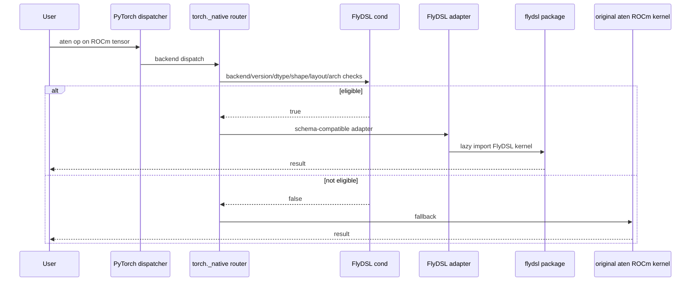
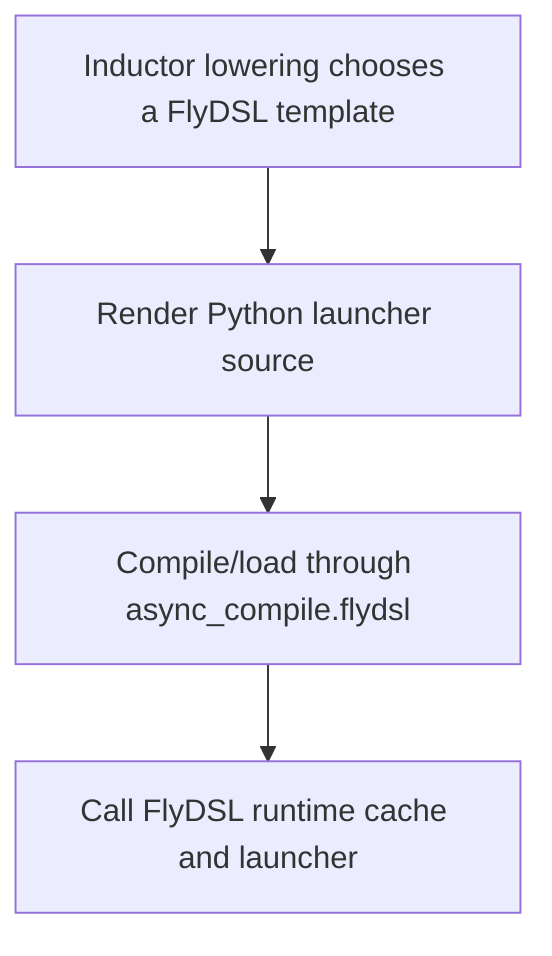
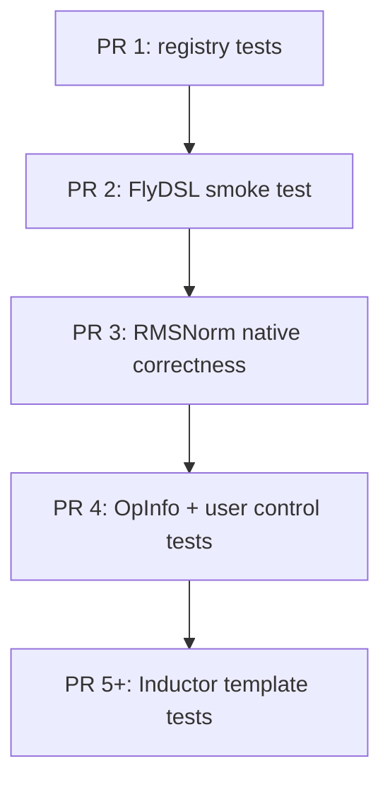

# RFC: Integrating FlyDSL with PyTorch DSL Extension Points

Status: Draft  
Authors: FlyDSL contributors  
Companion analysis: `docs/cutedsl_pytorch_integration_report.md`

## Motivation

PyTorch already has multiple extension points for Python GPU DSLs:

- `torch._native` for eager/native dispatcher overrides with aten fallback.
- `torch.backends.python_native` for user-visible DSL enable/disable controls.
- `torch._inductor.codegen.*` for template-based compiler backends used by `torch.compile`.
- test and CI utilities for optional DSL runtimes, version gates, and skip behavior.

CuteDSL uses these extension points for CUDA. FlyDSL is a ROCm-oriented Python DSL with an MLIR lowering pipeline, `torch.Tensor` ABI support, stream support, and a kernel library. The goal of this RFC is to define how FlyDSL should plug into the same PyTorch DSL architecture without adding FlyDSL as a required PyTorch dependency or destabilizing existing ROCm execution paths.

## Goals

1. Add FlyDSL as an optional ROCm DSL runtime known to PyTorch.
2. Reuse existing PyTorch DSL infrastructure instead of inventing a FlyDSL-specific integration path.
3. Support both eager/native overrides and a future Inductor template path.
4. Keep PyTorch wrappers thin; FlyDSL owns its compiler and kernel implementations.
5. Preserve aten behavior for unsupported platforms, package versions, dtypes, shapes, layouts, and architectures.
6. Use RMSNorm as the first native override candidate; treat LayerNorm as the fallback candidate if RMSNorm API or benchmark evidence is not ready.
7. Provide a staged implementation plan that can be reviewed as small PRs.

## User and Maintainer Impact

| Audience | Impact |
|---|---|
| PyTorch users without FlyDSL | No behavior change; FlyDSL remains unavailable and silent by default. |
| ROCm users with FlyDSL installed | Eligible calls may use FlyDSL kernels; unsupported calls fall back to aten. |
| PyTorch maintainers | Review a small integration layer first; FlyDSL compiler and kernel ownership stays outside PyTorch. |
| FlyDSL maintainers | Provide stable package versions, wrapper APIs, supported-shape docs, and kernel correctness fixes. |

## Non-Goals

| Non-goal | Reason |
|---|---|
| Make `flydsl` a required PyTorch dependency | PyTorch default installs must remain unchanged. |
| Vendor FlyDSL's MLIR compiler into PyTorch | The compiler is large and should remain FlyDSL-owned. |
| Replace CK, CKTile, Triton, or aten ROCm kernels | FlyDSL is an optional accelerator path. |
| Land native overrides and Inductor support in one PR | These are different review surfaces. |
| Copy large FlyDSL kernel implementations into PyTorch | PyTorch should own adapters, not external kernels. |

## Existing PyTorch DSL Architecture

PyTorch's current DSL integration is easier to reason about as four separate planes. FlyDSL should plug into each plane using the same shape as existing DSLs, instead of introducing a FlyDSL-only path.


The planes are independent enough to land in stages:

| Plane | Existing PyTorch mechanism | What FlyDSL adds | First PR? |
|---|---|---|---|
| Control | `torch._native.dsl_registry`, `torch.backends.python_native` | Register `flydsl`, expose `python_native.flydsl` | Yes |
| Native / eager | `torch._native.registry`, per-op `cond` / `impl` wrappers | ROCm op adapters that lazily call FlyDSL | After control |
| Compiler / Inductor | `KernelTemplate`, scheduling, `async_compile.*`, autotune | `FlyDSLTemplate`, `FlyDSLScheduling`, `async_compile.flydsl` | Later |
| Validation | optional package install, skip helpers, smoke tests, OpInfo | FlyDSL CI install and tests | Yes, then expand |

CuteDSL currently uses this architecture for CUDA:

| Plane | CuteDSL implementation | FlyDSL equivalent |
|---|---|---|
| Control | `torch.backends.python_native.cutedsl` | `torch.backends.python_native.flydsl` |
| Native/eager | `torch/_native/cutedsl_utils.py`, op wrappers | `torch/_native/flydsl_utils.py`, ROCm op wrappers |
| Compiler | `torch/_inductor/codegen/cutedsl/*` | `torch/_inductor/codegen/flydsl/*` later |
| Validation | `install_cutlass_dsl`, smoke tests, OpInfo | `install_flydsl`, smoke tests, OpInfo |

## Proposed Implementation

This RFC proposes one architecture with staged implementation. The first PRs should establish the control and native planes. The compiler plane is part of the design, but should be implemented after the native path proves package and kernel stability.

### Proposed Code Layout

The implementation should be reviewed by file group, not as one large directory tree.

| Stage | File or directory | Change | Purpose |
|---:|---|---|---|
| 1 | `torch/_native/flydsl_utils.py` | New | FlyDSL availability, version gate, register/deregister wrappers. |
| 1 | `torch/_native/__init__.py` | Small edit | Import `flydsl_utils` so the DSL name is registered. |
| 1 | `test/python_native/test_flydsl_registry.py` | New | Verify missing FlyDSL is silent and controls are exposed only when available. |
| 2 | `.ci/pytorch/common_utils.sh` | Small edit | Add `install_flydsl()` for selected ROCm jobs. |
| 2 | `test/python_native/test_flydsl_smoketest.py` | New | Compile and run a tiny FlyDSL kernel on ROCm. |
| 3 | `torch/_native/ops/norm/flydsl_impl.py` | New | First RMSNorm eager/native adapter. |
| 3 | `test/python_native/test_flydsl_norm.py` | New | Correctness, fallback, and user-disable coverage. |
| 4 | `torch/testing/_internal/common_utils.py` | Small edit | Add `TEST_FLYDSL` / skip helper if generic helper is insufficient. |
| 4 | `torch/testing/_internal/common_methods_invocations.py` | Small edit | Add OpInfo entries for FlyDSL-covered ops. |
| 5+ | `torch/_inductor/codegen/flydsl/` | New | Future Inductor template implementation. |
| 5+ | `torch/_inductor/async_compile.py` | Small edit | Add `async_compile.flydsl()` after a template exists. |
| 5+ | `test/inductor/test_flydsl_template.py` | New | Future generated-code and template tests. |

The expected ownership boundary is:

| PyTorch contains | FlyDSL package contains |
|---|---|
| Availability checks and user controls | Python DSL frontend |
| Dispatcher predicates and schema adapters | MLIR compiler and ROCm lowering |
| CI/test integration | Kernel implementations and tuning |
| Optional Inductor template glue | JIT artifact cache and arch-specific codegen |

### Maintenance Contract

| Owner | Owns | Does not own |
|---|---|---|
| PyTorch | DSL registry entry, user controls, dispatcher predicates, schema adapters, tests that protect PyTorch behavior. | FlyDSL compiler internals, ROCm lowering, kernel tuning, FlyDSL artifact cache implementation. |
| FlyDSL | Public wrapper APIs called by PyTorch, supported dtype/shape/arch matrix, kernel correctness, packaging, release/version compatibility. | PyTorch dispatcher semantics, aten schema compatibility, PyTorch CI policy. |

PyTorch should be able to disable or remove a FlyDSL adapter without changing FlyDSL's package. FlyDSL should be able to update kernels behind stable wrapper APIs without PyTorch code changes.

### Control Plane

The control plane makes FlyDSL visible to PyTorch without importing the FlyDSL runtime.


`torch/_native/flydsl_utils.py` should mirror the existing DSL utility contract:

- `runtime_available() -> bool`
- `runtime_version() -> Version | None`
- `register_op_override(...) -> None`
- `deregister_op_overrides() -> None`

Availability checks must be import-safe:

```python
_FLYDSL_DSL_NAME = "flydsl"
_FLYDSL_REQUIRED_VERSIONS = {Version("0.2.2")}

@functools.cache
def _check_runtime_available() -> tuple[bool, Version | None]:
    if not _cuda.is_built():
        return False, None

    import torch
    if torch.version.hip is None:
        return False, None

    reason = _unavailable_reason([("flydsl", "flydsl")])
    if reason is not None:
        log.info("FlyDSL operators require optional package `flydsl`; %s", reason)
        return False, None

    return True, _available_version("flydsl")
```

The check must not:

- `import flydsl`
- call `torch.cuda.is_available()`
- call `torch.cuda.get_device_properties()`
- call `flydsl.runtime.device.get_rocm_arch()`
- run `rocm_agent_enumerator`

### Native / Eager Plane

Native overrides should be used for the first real FlyDSL kernels because they provide the smallest behavioral surface and a clear fallback story.



MVP native operator: RMSNorm.

| Candidate | Reason |
|---|---|
| RMSNorm | Primary MVP. Existing FlyDSL kernel, simple output contract, and similar review surface to prior CuteDSL normalization work. |
| LayerNorm | Backup candidate if RMSNorm forward/backward API or benchmark evidence is not ready. |

Initial predicate policy:

| Check | Initial rule |
|---|---|
| Backend | `tensor.is_cuda` and `torch.version.hip is not None`. |
| Package | Register only for known-good FlyDSL versions. |
| Dtype | Start with bf16/f16 or another benchmarked subset. |
| Shape | Static rank and bounded hidden sizes. |
| Layout | Contiguous or explicitly supported stride patterns. |
| Architecture | Allowlist tested `gfx` targets. |
| Unsupported case | Return `False`; do not raise. |

PyTorch adapter responsibilities:

- Match the aten schema exactly.
- Allocate outputs in PyTorch when needed.
- Convert tensors/streams using FlyDSL's public API.
- Preserve autograd behavior by targeting existing aten/fused op semantics or explicit forward/backward pairs.
- Avoid recursive dispatcher calls inside the override implementation.

Autograd policy for the MVP:

| Scope | Policy |
|---|---|
| Inference-only RMSNorm | Acceptable for the first performance experiment only if the wrapper targets an inference-only aten path and tests make that explicit. |
| Training/autograd RMSNorm | Requires a forward/backward pair or a schema whose existing autograd behavior is preserved. |
| Unsupported gradient cases | Must fall back to aten rather than returning partial FlyDSL behavior. |

FlyDSL responsibilities:

- Provide stable wrapper functions callable by PyTorch adapters.
- Own kernel code, tuning, ROCm arch handling, and cache behavior.
- Document supported dtype/shape/layout/arch combinations.

### Compiler / Inductor Plane

Inductor support is part of the target architecture, but not part of the first implementation PR. This section defines the intended shape so the native design does not block future compiler integration.



The compiler plane should mirror the CuteDSL template model at the interface level:

| Interface | FlyDSL role | Notes |
|---|---|---|
| Template choice | `FlyDSLTemplate` | Adds FlyDSL candidates to an existing lowering, initially for one kernel family. |
| Source rendering | `FlyDSLTemplateKernel` | Emits a Python launcher that calls FlyDSL public APIs. |
| Scheduling hook | `FlyDSLScheduling` | Delegates codegen to `async_compile.flydsl()`. |
| Async compile | `async_compile.flydsl()` | Writes/loads generated source and returns a wrapper. |
| Runtime wrapper | `FlyDSLKernelWrapper` | Provides the callable `.run()` shape expected by Inductor. |
| Benchmark request | `FlyDSLBenchmarkRequest` | Added only when autotune is needed. |

What should change:

| Area | Change |
|---|---|
| Codegen namespace | Add `torch/_inductor/codegen/flydsl/` after the native path lands. |
| Compile entry | Add `async_compile.flydsl()` once there is generated source to compile. |
| Cache location | Prefer FlyDSL's cache first; optionally place it under `TORCHINDUCTOR_CACHE_DIR`. |
| Backend config | Add `FLYDSL` only after one working template exists behind tests. |

What should not change initially:

| Area | Constraint |
|---|---|
| Fusion | No horizontal or vertical fusion in the first template. |
| Default backend order | Do not add FlyDSL to broad default backend lists. |
| Op coverage | Start with one template family, not generic graph lowering. |
| Public API | Do not expose user-facing Inductor flags until the path has tests and benchmark evidence. |

The first Inductor candidate should be selected separately from this RFC. GEMM/MoE are likely higher value than normalization, but they also require more autotune and layout work.

### Validation Plane

Validation should match existing optional DSL patterns.



Test categories:

| Test | Purpose |
|---|---|
| Registry unavailable tests | Missing FlyDSL must be silent and safe. |
| Version-gate tests | Unsupported versions should not register overrides. |
| Smoke test | Compile and run a minimal FlyDSL kernel on ROCm. |
| Native op tests | Compare FlyDSL result against aten/reference. |
| Fallback tests | Unsupported dtype/shape/arch must use aten. |
| User control tests | `torch.backends.python_native.flydsl.enabled = False` disables overrides. |
| Inductor tests | Later: generated code, autotune, cache, fallback. |

CI should add a narrow helper for selected ROCm jobs:

```bash
function install_flydsl() {
  if [[ "${BUILD_ENVIRONMENT}" != *rocm* ]]; then
    echo "Skipping FlyDSL install: ROCm job required"
    return 0
  fi

  pip_install flydsl==0.2.2
}
```

## Review Boundary

This RFC asks reviewers to agree on the integration architecture and staging, not to approve every future FlyDSL kernel.

| In scope for this RFC | Out of scope for this RFC |
|---|---|
| FlyDSL as an optional PyTorch-known DSL runtime | Making FlyDSL a required dependency |
| Reusing `torch._native` and `python_native` control paths | Replacing existing ROCm backends |
| A path for future Inductor templates | Approving a full Inductor backend today |
| Keeping kernels and compiler in the FlyDSL package | Vendoring FlyDSL's compiler into PyTorch |
| Staged CI and correctness testing | Broad performance claims for all FlyDSL kernels |

## Rollout Plan

| PR | Scope | Expected review focus |
|---:|---|---|
| 1 | `flydsl_utils.py`, DSL registry exposure, unavailable-runtime tests | import safety, optional dependency behavior |
| 2 | ROCm CI install helper, FlyDSL smoke test | package stability, CI cost |
| 3 | First RMSNorm native adapter | schema compatibility, fallback, correctness |
| 4 | OpInfo and user-control tests | integration with existing DSL test machinery |
| 5 | Broader shapes or second op | benchmark evidence and support matrix |
| 6 | Inductor template prototype | compiler integration, cache, autotune |

## Compatibility

Default behavior should not change.

| Environment | Expected behavior |
|---|---|
| CPU-only PyTorch | FlyDSL unavailable, no import error, no warning by default. |
| CUDA/NVIDIA PyTorch | FlyDSL unavailable because `torch.version.hip is None`. |
| ROCm PyTorch without FlyDSL | FlyDSL unavailable, aten behavior unchanged. |
| ROCm PyTorch with supported FlyDSL | Eligible calls may use FlyDSL; unsupported calls use aten. |
| User disables FlyDSL | All FlyDSL overrides are disabled and aten behavior is restored. |

Compatibility invariants:

| Invariant | Required behavior |
|---|---|
| Import safety | `import torch` must not import `flydsl` or initialize ROCm runtime state. |
| Missing package | Missing FlyDSL is silent by default and visible only through availability APIs or debug logs. |
| Unsupported version | No FlyDSL overrides are registered unless the version is known-good or explicitly bypassed for development. |
| Unsupported inputs | Predicates return `False`; aten handles the call. |
| User disable | `torch.backends.python_native.flydsl.enabled = False` restores aten behavior. |
| CPU/CUDA builds | No behavior change. |

## Test Matrix

| Scenario | Expected result |
|---|---|
| CPU-only PyTorch | FlyDSL unavailable; tests skip or verify silent no-op. |
| CUDA/NVIDIA PyTorch | FlyDSL unavailable because `torch.version.hip is None`. |
| ROCm PyTorch without `flydsl` | FlyDSL unavailable; aten behavior unchanged. |
| ROCm PyTorch with unsupported FlyDSL version | Runtime visible as unavailable for native overrides. |
| ROCm PyTorch with supported FlyDSL version | Smoke kernel compiles and runs. |
| FlyDSL disabled via `python_native` | RMSNorm uses aten fallback. |
| RMSNorm unsupported dtype/shape/layout/arch | Predicate returns `False`; aten fallback. |
| RMSNorm supported dtype/shape/layout/arch | FlyDSL output matches aten/reference within tolerance. |

## Performance Acceptance Criteria

The first RMSNorm PR should include benchmark evidence before enabling the override by default.

| Requirement | Detail |
|---|---|
| Hardware | Report exact ROCm version and `gfx` target, e.g. `gfx942` or `gfx950`. |
| Shapes | Report the allowlisted hidden sizes and batch sizes used by the predicate. |
| Dtypes | Report only the dtypes enabled by the predicate. |
| Baseline | Compare against the aten or existing fused PyTorch ROCm implementation that fallback would use. |
| Regression policy | Shapes outside the benchmarked support matrix must fall back to aten. |
| Compile cost | Report first-run compile behavior separately from warm-cache runtime. |

## Alternatives

| Alternative | Why not preferred |
|---|---|
| Add FlyDSL as a required PyTorch dependency | Too heavy and unnecessary for users who do not need FlyDSL kernels. |
| Vendor FlyDSL into `torch/_vendor` | Compiler/runtime ownership and binary packaging become PyTorch problems. |
| Start with Inductor only | Larger review surface; does not validate runtime/package safety first. |
| Use `torch.library` custom ops outside PyTorch | Easier out of tree, but does not integrate with PyTorch's native DSL controls or OpInfo coverage. |
| Copy FlyDSL kernels into PyTorch | Hard to maintain and conflicts with the direction from previous CuteDSL kernel discussions. |

## Risks and Mitigations

| Risk | Mitigation |
|---|---|
| Import-time side effects | Never import `flydsl` in `flydsl_utils.py`; use metadata/spec checks only. |
| ROCm arch detection cost | Do not run arch detection during registration; gate lazily in predicates. |
| Package/API instability | Start with a strict version whitelist. |
| Kernel correctness drift | Keep FlyDSL kernels external but add PyTorch wrapper correctness tests. |
| CI cost | Install FlyDSL only on selected ROCm jobs. |
| Backend confusion | Use explicit names: `flydsl`, `FLYDSL`, `FlyDSLTemplate`, separate from CK/CKTile/Triton. |
| Unsupported behavior changes | Predicate must return `False` and fall back to aten. |

## Open Questions

1. Which exact FlyDSL package versions should PyTorch whitelist?
2. Which `gfx` targets should be considered supported in the first RMSNorm PR?
3. Should FlyDSL provide a small stable `flydsl.torch` adapter package for PyTorch-facing wrappers?
4. When should `FLYDSL` appear in Inductor config: after the first template lands, or earlier behind an experimental flag?

## Resolution / Next Steps

If accepted, implementation should proceed in the rollout order above. The first implementation PR should not add any FlyDSL kernel override; it should only add the DSL registration path and tests proving that default PyTorch behavior is unchanged.
