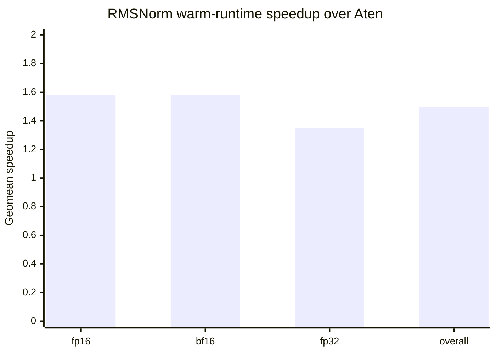
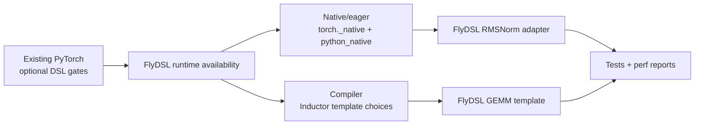
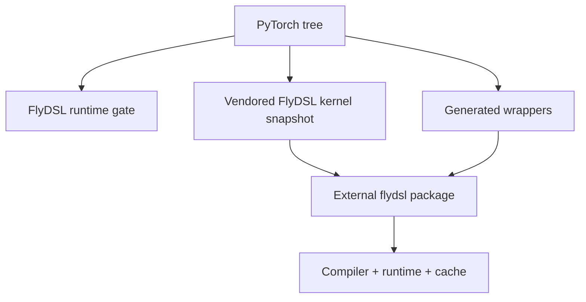

# RFC: Integrating FlyDSL with PyTorch DSL Extension Points

Status: Draft  
Authors: FlyDSL contributors  
Companion analysis: `docs/cutedsl_pytorch_integration_report.md`

## Summary

This RFC proposes integrating FlyDSL, a ROCm-oriented Python DSL with MLIR
lowering, HIP tensor ABI support, stream support, and JIT/runtime caching, as an
optional PyTorch backend for AMD GPUs. The value to PyTorch is an additional DSL
implementation path that can compete with existing Aten and compiler backends on
targeted ROCm workloads where FlyDSL kernels show clear performance benefits.

FlyDSL would be positioned as the AMD GPU counterpart to the existing CuteDSL
direction for NVIDIA GPUs: it would reuse PyTorch's optional DSL scaffolding,
but it wouldn't try to match CuteDSL's exact operator scope. FlyDSL coverage
should grow only where a FlyDSL implementation has a measurable advantage and a
maintainable support matrix.

The integration has two independent planes:

- native/eager dispatcher overrides through `torch._native`;
- TorchInductor compiler templates through Inductor lowering, template choices,
  async compile/load, and autotune.

The first native/eager target is RMSNorm. The first Inductor target is bf16 GEMM
for `aten.mm(A, B.T)`. These two targets are enough to prove the framework
pieces that matter to PyTorch: optional runtime gating, eager fallback,
`torch.compile` template selection, generated wrappers, autotune, compile cache
behavior, and performance reporting.

The core design principle is additive integration. FlyDSL should be a selectable
backend candidate with strict gates and fallback, not a required dependency and
not a default replacement for existing Aten, Triton, CK, CKTile, or vendor
backends. If later evidence shows FlyDSL is the best implementation for a
broader backend surface, that should be handled through separate backend
selection work, not through this initial PyTorch integration RFC.

## Motivation

The motivation is targeted performance gain on AMD GPUs without changing default
PyTorch behavior. FlyDSL gives PyTorch another ROCm backend candidate for cases
where a Python DSL kernel can improve on the current eager Aten path or the
current `torch.compile` choices while still preserving fallback to existing
backends.

Performance evidence should be presented separately from the design text, using
charts or benchmark reports rather than raw tables. The report should separate
warm runtime latency from cold compile cost, persistent-cache load cost, and
autotune time where applicable.

The integration should also keep PyTorch's dependency and maintenance model
simple. FlyDSL is useful only if PyTorch can adopt it as an optional backend:
missing packages, unsupported architectures, unsupported shapes, or losing
autotune candidates should all fall back without changing user-visible behavior.

## Goals

1. Add FlyDSL as an optional PyTorch backend for AMD GPUs, analogous in
   integration shape to CuteDSL on NVIDIA GPUs.
2. Enable FlyDSL only for targeted cases where benchmark evidence shows benefit
   over Aten in eager paths or existing `torch.compile` choices such as Triton.
3. Reuse PyTorch's existing optional DSL scaffolding instead of inventing a new
   dispatcher, backend-selection, or packaging model.
4. Keep native/eager controls independent from Inductor compiler controls.
5. Keep the FlyDSL compiler/runtime outside the PyTorch source tree while making
   the PyTorch-facing DSL kernels reviewable and testable in PyTorch.
6. Support framework-level requirements from the beginning: eager execution,
   `torch.compile`, compile caching, benchmark reporting, and persistent-cache
   planning.

## Non-Goals

| Non-goal | Reason |
|---|---|
| Make `flydsl` a required PyTorch dependency | PyTorch default installs must remain unchanged. |
| Match CuteDSL's exact operator scope | FlyDSL should add kernels only where AMD GPU performance, supportability, and tests justify the scope. |
| Promise full dtype, layout, or dynamic-shape coverage for an operator family | Each supported family should be enabled only for tested cases with performance benefit. |
| Replace CK, CKTile, Triton, Aten, or vendor libraries by policy | FlyDSL should win through evidence and backend selection, not through a blanket replacement rule. |

## Packaging Strategy

FlyDSL compiler/runtime packaging should follow the CuteDSL precedent: PyTorch
knows how to detect an optional external DSL package, but PyTorch does not make
the package a hard install requirement. Users or CI images install the FlyDSL
runtime explicitly when they want the backend enabled.

| Option | Pros | Cons | Recommendation |
|---|---|---|---|
| User or CI installs `flydsl` separately | Preserves default PyTorch installs; matches optional DSL precedent; lets FlyDSL release independently. | Users need an extra install step; PyTorch must report clear unavailable reasons. | Use for initial upstream integration. |
| PyTorch wheel depends on `flydsl` | Backend is immediately available after installing PyTorch. | Increases wheel size and dependency risk for users who do not use FlyDSL; couples PyTorch release cadence to FlyDSL runtime packaging. | Not recommended. |
| Vendor FlyDSL compiler/runtime into PyTorch | Fully reproducible inside the PyTorch tree. | Large maintenance burden; pulls compiler internals into PyTorch; conflicts with independent DSL evolution. | Non-goal. |

PyTorch should vendor only the PyTorch-facing kernel source snapshot needed for
reviewed integrations. The FlyDSL compiler/runtime package remains external, and
runtime availability checks must be quiet on CPU-only, CUDA-only, and ROCm
systems without FlyDSL installed.

## Initial Targets

The first FlyDSL additions should be framed as initial upstream targets, not as
throwaway experiments. They are intentionally narrow because they must prove both
infrastructure and performance before the supported surface grows.

| Target | Scope | What it proves |
|---|---|---|
| Native/eager RMSNorm | FlyDSL RMSNorm through `torch._native` and `python_native` controls | Optional runtime gate, native dispatcher override, fallback, compile-cache behavior, and eager performance evidence. |
| Inductor GEMM | FlyDSL bf16 GEMM template for `aten.mm(A, B.T)` on ROCm | Template rendering, async compile/load, runtime gate, autotune benchmarking, generated-code invocation, and compiler performance evidence. |

Performance evidence for these targets should be reported separately from the
design proposal. For each target, the report should include correctness, cold
compile cost, persistent-cache load cost, warm runtime latency, autotune time
when relevant, selected config, and backend winner versus Triton or other
available choices.

For the native/eager RMSNorm target, the relevant baseline is Aten. Local
wall-to-sync warm-runtime measurements over 60 RMSNorm cases show FlyDSL faster
than Aten across fp16, bf16, and fp32 inputs. The geometric-mean speedup is 1.50x
overall, with 1.58x for fp16, 1.58x for bf16, and 1.35x for fp32.



## Proposed Integration

FlyDSL should reuse PyTorch's existing optional DSL architecture and add only the
FlyDSL-specific pieces. The important decision is to keep native/eager routing
and Inductor template routing independent, as CuteDSL does today.

PyTorch already has the extension points needed for this shape: `torch._native`
and `torch.backends.python_native` for eager/native controls, Inductor template
and scheduling hooks for `torch.compile`, and optional-runtime gates for missing
dependencies or unsupported devices. FlyDSL should use these existing surfaces,
replacing CUDA/CUTLASS assumptions with ROCm/HIP and `gfx`-specific gates.



| Area | Existing PyTorch mechanism | FlyDSL-specific addition |
|---|---|---|
| Native control | `torch._native.dsl_registry`, `torch.backends.python_native` | Register `flydsl` and expose native/eager controls. |
| Native/eager | `torch._native.registry`, per-op `cond` / `impl` wrappers | ROCm RMSNorm adapter with lazy FlyDSL import and aten fallback. |
| Compiler/Inductor | Inductor lowering, template choices, scheduling, `async_compile.*`, autotune | `FlyDSLTemplate`, `FlyDSLScheduling`, `async_compile.flydsl`, and GEMM choices. |
| Validation | Optional package install, smoke tests, OpInfo, compiler tests | FlyDSL CI install, focused accuracy tests, and cold/warm performance reports. |

Native `python_native.flydsl` controls should not become the Inductor template
selector. Both tracks may share optional runtime availability checks, but their
routing, configuration, tests, and rollback paths should remain separate.

## Kernel Ownership Decision

For PyTorch upstream integration, concrete PyTorch-facing FlyDSL kernels should
follow the CuteDSL/QuACK precedent: PyTorch owns a reviewed, vendored kernel
snapshot for the supported integration surface, while the FlyDSL
compiler/runtime remains an optional external package.

Expected PyTorch-owned locations:

```text
torch/_vendor/flydsl/                         # or another PyTorch-owned native kernel snapshot path, if needed
torch/_inductor/kernel/vendored_templates/flydsl/
```

| Layer | Owner | Scope |
|---|---|
| PyTorch | Runtime gates, aten/Inductor eligibility, tensor/layout adaptation, generated wrappers, vendored PyTorch-facing FlyDSL kernels, autotune integration, fallback, tests. |
| FlyDSL core | DSL language, compiler, MLIR lowering, runtime ABI, stream support, artifact cache semantics, compile artifacts. |



This gives PyTorch reviewers stable kernel source for the supported surface and
keeps FlyDSL compiler evolution outside the PyTorch repository. The cost is that
kernel algorithm updates and tuning changes for PyTorch-facing kernels must go
through PyTorch PRs once those kernels are vendored.

## Reference: CuteDSL in PyTorch

CuteDSL is the closest PyTorch DSL precedent. The relevant lesson for FlyDSL is
the integration model, not CUDA-specific implementation details or the exact
operator scope.

FlyDSL should reuse three CuteDSL patterns:

- optional external compiler/runtime package;
- PyTorch-owned wrappers, runtime gates, tests, and fallback behavior;
- independent native/eager and Inductor compiler integration paths.

FlyDSL should replace CUDA/CUTLASS assumptions with ROCm/HIP and `gfx`-specific
gates, and should add operators only when AMD GPU performance and supportability
justify the PyTorch surface.

## Native / Eager Design

The first native/eager target is RMSNorm. The FlyDSL-specific pieces are the
ROCm availability gate, RMSNorm predicate, lazy kernel import, compile cache key,
and launch wrapper:


RMSNorm is a good first native target because it has an existing aten surface,
bounded support predicates, existing FlyDSL tests, and a smaller behavioral
surface than GEMM or MoE.

The native RMSNorm path is independent of the Inductor GEMM path. It validates
the dispatcher override contract, user controls, fallback behavior, and native
compile-cache policy without implying that Inductor should use the same routing
mechanism.

Native/eager invariants:

- `import torch` must not import FlyDSL or initialize ROCm runtime state.
- Unsupported dtype, shape, layout, device, or `gfx` cases return `False` and use
  aten fallback.
- Users must have a rollback path through `python_native`.
- Additional native ops should be added only when eager execution has clear value
  and benchmark evidence.

Native expansion should be opportunistic. Not every FlyDSL kernel family needs a
native/eager override; compiler-selected GEMM and attention-like kernels may
belong only in the Inductor track.

## Inductor / Compiler Design

The current Inductor target is bf16 GEMM for `aten.mm(A, B.T)`. The
FlyDSL-specific pieces are the GEMM eligibility gate, config generation through
`torch._inductor.template_heuristics.flydsl`, Jinja wrapper,
`async_compile.flydsl`, and vendored FlyDSL kernel source:

The bf16 scope follows the initial gfx950 layout GEMM path. Additional dtype
families should be treated as follow-on work with their own gates, configs, and
tests.


Current support matrix:

| Topic | Current decision |
|---|---|
| Op | `aten.mm(A, B.T)` style matmul. Inductor sees RHS as a `[K, N]` transpose view and the wrapper adapts it to FlyDSL's `[N, K]` expectation. |
| Dtype | Current target supports bf16 inputs and output. |
| Kernel / arch | Initial implementation uses the gfx950 layout GEMM launcher through the FlyDSL template path. Other `gfx` targets require their own runtime gate, config coverage, and benchmark evidence. |
| Shape/layout | Static 2D `aten.mm(A, B.T)` cases matching the current Inductor/FlyDSL layout gate. Dynamic shapes are out of scope for the first target. |
| Autotune | Configs come from `torch._inductor.template_heuristics.flydsl`: one baseline config by default, or a default/exhaustive config set when FlyDSL autotuning is enabled. |
| Fallback | If any gate fails, no FlyDSL choice is appended. Existing Inductor choices continue unchanged. |

Other dtype/layout families, including fp16 and fp8/scaled GEMM, are future work
and require separate support matrices, tests, and benchmark evidence before they
are enabled.

### Kernel and Wrapper Boundary

The first GEMM template should be treated as the seed of a GEMM family. PyTorch
and FlyDSL should keep a clear boundary:

| Layer | Responsibility |
|---|---|
| Inductor lowering | Decide whether a FlyDSL family is eligible and append choices. |
| Template heuristics | Generate/prune configs before autotune. |
| Jinja wrapper | Adapt PyTorch tensors, layouts, streams, semaphores, and compile-time constants. |
| Vendored FlyDSL kernel | Implement the DSL kernel without PyTorch tensor-specific adaptation. |
| FlyDSL runtime | Own compiler/runtime internals and artifact format. |

### Kernel Family Policy

For the first GEMM path, the answer to "same kernel or different kernels for
different cases" is:

- Use one reviewed GEMM kernel family for cases that share the same tensor ABI,
  layout contract, and compile-time parameter schema.
- Use different kernel families when dtype, scaling metadata, layout contract,
  grouping metadata, workspace behavior, or epilogue semantics change the ABI or
  correctness contract.
- Within one family, expose multiple tile/config choices to Inductor autotune;
  these are different configs of the same family, not separate high-level
  kernels.
- Avoid a single catch-all `compile_gemm_kernel(...)` API with unrelated flags
  for bf16, fp16, fp8, scaled, grouped, and epilogue variants.

This policy keeps PyTorch's selection logic reviewable and leaves room for
future codegen work, including partial template specialization, when a broader
family such as SDPA or grouped GEMM needs a structured generator.

## Future Work

Future expansion is not part of the first GEMM acceptance criteria. After the
bf16 GEMM family is stable, FlyDSL can evaluate fp16, additional dtype/layout
families, dynamic shapes, grouped/expert GEMM, epilogues, and attention-family
templates.

Each expansion should come with a separate support matrix, wrapper ABI,
correctness tests, generated-code tests, autotune evidence, and fallback
coverage. Dynamic-shape support should follow Inductor's existing guard and
specialization model: the first FlyDSL GEMM target stays static, and dynamic
support is enabled only after symbolic divisibility checks, cache keys, and
config pruning are defined.

If later evidence shows FlyDSL should replace or feed other ROCm backend flows,
such as AOTriton, that should be handled as separate backend-selection design
work rather than part of this initial RFC.

## Rollout Plan

Rollout should be reviewed as small PRs. Shared infrastructure lands first, then
native/eager RMSNorm and Inductor GEMM proceed as separate tracks.

### Shared Infrastructure

| Step | Work | Exit criteria |
|---:|---|---|
| 1 | Add FlyDSL optional-runtime detection for ROCm builds. | `import torch` does not import FlyDSL, initialize ROCm, or fail when `flydsl` is absent. |
| 2 | Add unavailable-runtime diagnostics and skip helpers. | CPU-only, CUDA-only, ROCm-without-FlyDSL, and unsupported `gfx` cases report FlyDSL unavailable without changing behavior. |
| 3 | Add ROCm CI install path for jobs that intentionally test FlyDSL. | A tiny FlyDSL smoke kernel compiles and runs only on selected ROCm jobs. |
| 4 | Define benchmark reporting format. | Reports include cold compile, persistent-cache load, warm runtime, autotune time when relevant, backend winner, selected config, and correctness status. |

### Native / Eager RMSNorm Track

| Step | Work | Exit criteria |
|---:|---|---|
| 1 | Register `flydsl` in native/eager DSL controls. | Users can enable/disable native FlyDSL independently from Inductor. |
| 2 | Add RMSNorm predicate and schema-compatible adapter. | Unsupported dtype, shape, layout, device, or arch returns `False` and uses aten fallback. |
| 3 | Add lazy FlyDSL kernel wrapper and compile-cache path. | First eligible call can compile; warm calls reuse memory or persistent cache; rollback restores aten behavior. |
| 4 | Add tests and benchmark report. | Accuracy matches aten/reference for supported cases; benchmark results report warm runtime, cold cost, cache behavior, and eager baseline comparison. |

### Inductor / Compiler GEMM Track

| Step | Work | Exit criteria |
|---:|---|---|
| 1 | Add `FlyDSLTemplate`, `FlyDSLScheduling`, and `async_compile.flydsl`. | Generated code can compile/load a FlyDSL template without affecting non-FlyDSL choices. |
| 2 | Add bf16 GEMM eligibility gate for `aten.mm(A, B.T)`. | Static-shape support matrix is explicit; unsupported cases do not append a FlyDSL choice. |
| 3 | Add GEMM config generation and optional autotune integration. | Inductor benchmarks FlyDSL choices against existing choices and picks the fastest valid backend. |
| 4 | Add tests and benchmark report. | Accuracy matches PyTorch reference; benchmark results compare against Triton or other available compiler choices, and unsupported or non-beneficial cases remain disabled. |
| 5 | Design persistent-cache behavior. | Compile keys include dtype, layout family, arch, kernel family, tile config, and guarded shape assumptions. |

## Validation and Acceptance Criteria

Validation should answer two questions for each enabled case: is it correct, and
does it improve performance for the targeted scenario?

| Test class | What to add or reuse | Acceptance goal |
|---|---|---|
| Unit tests | Optional-runtime detection, native enable/disable controls, missing-package behavior, support predicates, generated wrapper shape. | Missing or unsupported FlyDSL never changes default PyTorch behavior. |
| Native accuracy tests | OpInfo-style RMSNorm coverage plus targeted dtype, shape, layout, and `gfx` cases. | Supported RMSNorm cases match aten/reference; unsupported cases fall back. |
| Compiler accuracy tests | Focused `torch.compile` tests for GEMM generated source, `async_compile.flydsl`, runtime launch, and multi-choice autotune. | Supported GEMM cases match PyTorch reference; unsupported cases omit the FlyDSL choice. |
| Smoke tests | ROCm CI job with a tiny FlyDSL compile/run test. | Package/runtime viability is checked only where FlyDSL is intentionally installed. |
| Benchmark tests | RMSNorm eager benchmark and GEMM compiler benchmark using the shared report format. | Reports compare FlyDSL against eager and compiler baselines, separating warm runtime, cold compile cost, cache behavior, autotune time, selected config, and backend winner. |
| Regression tests | Cache key, persistent-cache load, fallback, and backend winner reporting. | Cold cost, cache behavior, selected config, and backend winner remain observable. |

## Compatibility

Default behavior should not change.

| Environment | Expected behavior |
|---|---|
| CPU-only PyTorch | FlyDSL unavailable; no import error. |
| CUDA/NVIDIA PyTorch | FlyDSL unavailable because `torch.version.hip is None`. |
| ROCm PyTorch without FlyDSL | FlyDSL unavailable; aten behavior unchanged. |
| ROCm PyTorch with supported FlyDSL | Eligible calls may use FlyDSL; unsupported calls use aten or existing Inductor choices. |
| User disables FlyDSL native overrides | Eager/native FlyDSL overrides are disabled; Inductor controls remain separate. |
| Inductor backend config excludes FlyDSL | Inductor does not append FlyDSL choices, even if `python_native.flydsl` is enabled. |
