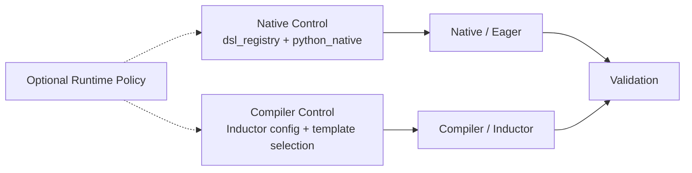
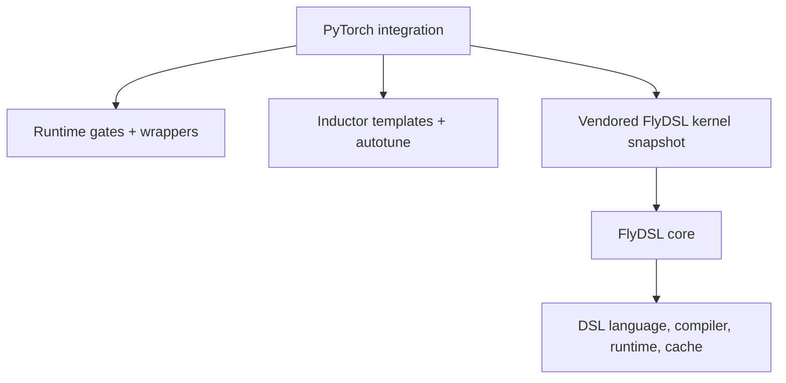
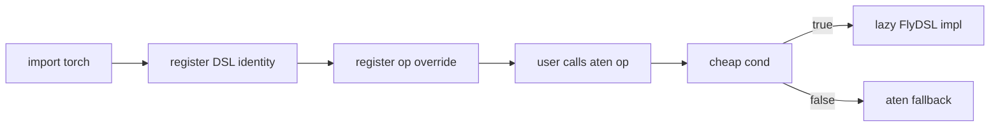
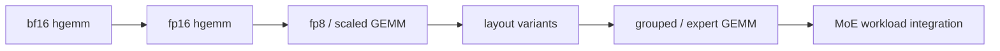

# RFC: Integrating FlyDSL with PyTorch DSL Extension Points

Status: Draft  
Authors: FlyDSL contributors  
Companion analysis: `docs/cutedsl_pytorch_integration_report.md`

## Summary

This RFC proposes integrating FlyDSL as an optional ROCm Python DSL backend in
PyTorch through two independent planes:

- native/eager dispatcher overrides through `torch._native`;
- TorchInductor compiler templates through Inductor lowering, template choices,
  async compile/load, and autotune.

The first native/eager prototype targets RMSNorm. The first Inductor prototype
targets bf16 hgemm for `aten.mm(A, B.T)`. Future work should expand from this
foundation toward broader GEMM dtype/layout coverage, grouped/expert GEMM,
fusion/epilogues, cache/AOT, and workload integrations.

The core design principle is additive integration. FlyDSL should be a selectable
backend candidate with strict gates and fallback, not a required dependency and
not a replacement for existing Aten, Triton, CK, CKTile, or vendor backends.

## Motivation

PyTorch already has several extension points for Python GPU DSLs:

- `torch._native` for eager/native dispatcher overrides with aten fallback;
- `torch.backends.python_native` for native/eager DSL enable and disable controls;
- `torch._inductor.codegen.*` for template-based compiler backends used by
  `torch.compile`;
- optional dependency and test utilities for runtime gates and skip behavior.

CuteDSL uses these extension points on CUDA. FlyDSL is a ROCm-oriented Python DSL
with an MLIR lowering pipeline, tensor ABI support, stream support, and
JIT/runtime caching. FlyDSL should plug into PyTorch through the same style of
optional DSL architecture, while preserving PyTorch default behavior on systems
without FlyDSL.

## Goals

1. Add FlyDSL as an optional ROCm DSL runtime known to PyTorch.
2. Reuse PyTorch's existing native/eager and Inductor extension points.
3. Keep native/eager controls independent from Inductor compiler controls.
4. Keep the FlyDSL compiler/runtime outside PyTorch.
5. Preserve aten behavior for unsupported platforms, package versions, dtypes,
   shapes, layouts, and architectures.
6. Use RMSNorm as the first native/eager prototype.
7. Use bf16 hgemm for `aten.mm(A, B.T)` as the first Inductor template prototype.
8. Provide a staged rollout plan that can be reviewed as small, independently
   owned PRs.

## Non-Goals

| Non-goal | Reason |
|---|---|
| Make `flydsl` a required PyTorch dependency | PyTorch default installs must remain unchanged. |
| Vendor FlyDSL's MLIR compiler into PyTorch | The compiler/runtime should remain FlyDSL-owned. |
| Replace CK, CKTile, Triton, Aten, or vendor libraries | FlyDSL is an optional accelerator/backend candidate. |
| Land native/eager and Inductor support in one PR | They are different review surfaces with different failure modes. |
| Claim full GEMM backend coverage from the first hgemm prototype | The current Inductor prototype is intentionally narrow. |

## Experimental Prototype Status

The current work includes local experimental prototypes used to validate the
architecture. These prototypes are not proposed as final upstream PR contents;
they are evidence that the two-plane design is viable.

| Prototype | Scope | What it validates |
|---|---|---|
| Native/eager experiment | FlyDSL RMSNorm through `torch._native` and `python_native` controls | Optional runtime gate, native dispatcher override, fallback, and compile-cache shape. |
| Inductor/compiler experiment | FlyDSL bf16 hgemm template for `aten.mm(A, B.T)` on ROCm | Template rendering, async compile/load, runtime gate, autotune benchmarking, and generated-code invocation. |

The Inductor experiment intentionally does not depend on
`torch._native.dsl_registry` or `torch.backends.python_native.flydsl`. It uses
Inductor GEMM autotune backend controls plus an Inductor-local runtime gate. This
keeps eager/native rollback and compiler-template selection separate.

## Architecture Decision

FlyDSL integration should use two independent control planes:



| Plane | Existing PyTorch mechanism | FlyDSL addition |
|---|---|---|
| Native control | `torch._native.dsl_registry`, `torch.backends.python_native` | Register `flydsl` and expose native/eager controls. |
| Native/eager | `torch._native.registry`, per-op `cond` / `impl` wrappers | ROCm op adapters with lazy FlyDSL imports and aten fallback. |
| Compiler/Inductor | Inductor lowering, templates, scheduling, `async_compile.*`, autotune | `FlyDSLTemplate`, `FlyDSLScheduling`, `async_compile.flydsl`, and hgemm choices. |
| Validation | Optional package install, smoke tests, OpInfo, compiler tests | FlyDSL CI install and focused native/Inductor tests. |

Decision statement:

> Native `python_native.flydsl` controls must not be used as the Inductor
> template selector. Native/eager overrides and Inductor templates may share
> optional runtime policy, but their routing and rollback mechanisms must remain
> separate.

## Kernel Ownership Decision

For PyTorch upstream integration, the concrete FlyDSL kernel implementation used
by PyTorch should follow the CuteDSL/QuACK precedent: PyTorch owns a reviewed,
vendored kernel snapshot for the supported PyTorch integration surface.

For Inductor templates, the expected location is:

```text
torch/_inductor/kernel/vendored_templates/flydsl/
```

This does not mean PyTorch vendors the FlyDSL compiler/runtime. The FlyDSL core
package still owns the DSL language, compiler, MLIR lowering, runtime ABI,
streams, and artifact cache semantics. PyTorch owns the PyTorch-facing kernel
source snapshot, wrappers, gates, autotune integration, fallback behavior, and
tests.

This is the same ownership style used by existing CuteDSL integrations:

| CuteDSL precedent | Meaning |
|---|---|
| `torch/_vendor/quack` | PyTorch carries a reviewed subset of a CuteDSL kernel library. |
| `torch/_inductor/kernel/vendored_templates/cutedsl` | PyTorch carries template/kernel source needed by Inductor integration. |
| `nvidia-cutlass-dsl` | The compiler/runtime remains an optional external DSL dependency. |

Recommended policy:

- PyTorch should own the FlyDSL kernel source that is part of a PyTorch
  integration PR, under `torch/_inductor/kernel/vendored_templates/flydsl` or an
  equivalent PyTorch-owned vendored path.
- FlyDSL core should remain an optional compiler/runtime dependency and should
  not be vendored into PyTorch.
- The vendored kernel set should stay scoped to kernels that PyTorch actually
  integrates, tests, and supports.
- Kernel algorithm updates, tuning changes, and bug fixes for PyTorch-facing
  kernels should go through PyTorch PRs once those kernels are vendored.

Pros and cons of this decision:

| Pros | Cons |
|---|---|
| Kernel source is visible to PyTorch reviewers. | PyTorch owns synchronization with any external FlyDSL source of truth. |
| CI and release behavior are stable because the kernel snapshot is pinned in the PyTorch tree. | Kernel algorithm updates, tuning changes, and bug fixes require PyTorch PRs. |
| No extra kernel-library package is needed beyond the FlyDSL compiler/runtime dependency. | Scaling to many dtype/layout/workload families can increase PyTorch maintenance burden. |
| The integration is reproducible and reviewable like CuteDSL/QuACK. | Kernel iteration follows PyTorch review and release cadence. |

The intended split is:



| Layer | Owns | Should not own |
|---|---|---|
| PyTorch integration | Runtime gates, aten/Inductor eligibility, tensor/layout adaptation, generated wrappers, vendored PyTorch-facing FlyDSL kernels, autotune integration, fallback, tests. | FlyDSL compiler internals or unsupported external kernel collections. |
| FlyDSL core | DSL language, compiler, MLIR lowering, runtime ABI, stream support, artifact cache semantics. | PyTorch dispatcher semantics or Inductor lowering policy. |

This mirrors the distinction in the CuteDSL ecosystem: CuteDSL provides
language/compiler/runtime capabilities, while QuACK or vendored template sources
provide concrete kernels maintained in the PyTorch tree for the supported
integration surface.

## Reference: CuteDSL in PyTorch

CuteDSL is the closest PyTorch precedent, but it is not a single mechanism. It
currently appears across multiple surfaces:

| Surface | CuteDSL examples | Lesson for FlyDSL |
|---|---|---|
| Native/eager | TopK, ScatterAdd, fused RMSNorm through QuACK | Optional runtime, cheap predicates, lazy imports, aten fallback. |
| Inductor templates | grouped GEMM, FlexAttention forward/backward, FlexGEMM epilogue | Template choices, generated wrappers, async compile/load, scheduling. |
| Universal GEMM | NVGEMM through `cutlass_api` for GEMM/scaled GEMM/grouped GEMM candidates | Registry-style kernel discovery and heuristic ranking can be a later maturity goal. |
| Runtime/cache policy | optional package installs, runtime gates, compile/cache helpers | Missing runtime must not change PyTorch default behavior. |

The reusable pattern is the optional DSL architecture, not CUDA-specific details.
FlyDSL should replace CUDA/CUTLASS assumptions with ROCm/HIP and `gfx`-specific
gates.

CuteDSL also illustrates that kernel implementations can come from more than one
source. Some concrete kernels are carried as PyTorch-vendored source, such as
`torch/_vendor/quack` or `torch/_inductor/kernel/vendored_templates/cutedsl`,
while other GEMM candidates are discovered through `cutlass_api`. For the FlyDSL
PyTorch integration proposed here, the PyTorch-facing kernel implementation
should follow the vendored-source model, while FlyDSL core owns the compiler and
runtime behavior.

## Native / Eager Design

### Technical Principle

Native/eager integration is a dispatcher override with fallback:



The key invariants are:

- `import torch` must not import FlyDSL or initialize ROCm runtime state.
- The predicate must be cheap, schema-compatible, and side-effect free.
- Unsupported cases return `False` and use aten fallback.
- The implementation may lazily import FlyDSL and use compile/cache helpers.
- Users must have a rollback path through `python_native`.

### FlyDSL Native Prototype

The first native prototype is RMSNorm:


RMSNorm is a good first native target because it has an existing aten surface,
bounded support predicates, existing FlyDSL tests, and a smaller behavioral
surface than GEMM or MoE.

The native RMSNorm path is independent of the Inductor hgemm path. It validates
the dispatcher override contract, user controls, fallback behavior, and native
compile-cache policy without implying that Inductor should use the same routing
mechanism.

Native follow-up work should include:

- stabilizing runtime and version gates;
- adding ROCm CI smoke coverage;
- adding OpInfo and user-control tests;
- measuring native cold compile, warm cache, and fallback behavior;
- evaluating additional native ops only when eager execution has clear value.

Native expansion should be opportunistic. Not every FlyDSL kernel family needs a
native/eager override; compiler-selected GEMM and attention-like kernels may
belong only in the Inductor track.

## Inductor / Compiler Design

### Technical Principle

Inductor integration is compile-time backend selection:


A backend candidate needs:

| Object | Role |
|---|---|
| Lowering hook | Decides whether to append backend choices for an op. |
| ChoiceCaller | Represents one candidate implementation. |
| BenchmarkRequest | Runs the candidate during autotune. |
| TemplateBuffer | Stores the selected template output in Inductor IR. |
| Scheduling backend | Emits compile/load/runtime code for the selected template. |
| Async compile entry | Loads generated source and returns a runtime wrapper. |

### Current FlyDSL bf16 hgemm Prototype

The current Inductor prototype targets bf16 hgemm for `aten.mm(A, B.T)`:


Current support matrix:

| Topic | Current decision |
|---|---|
| Op | `aten.mm(A, B.T)` style matmul. Inductor sees RHS as a `[K, N]` transpose view and the wrapper adapts it to FlyDSL's `[N, K]` expectation. |
| Dtype | Current report/prototype focus is bf16 hgemm. |
| Shape | Static 2D inputs. `N` must be divisible by `TILE_N`, `K` by `TILE_K`, and `K // SPLIT_K // TILE_K >= STAGES`. |
| Layout | `mat1` and output are row-major along K/N; RHS must match the transpose-view pattern. |
| Autotune | Multiple FlyDSL hgemm configs are emitted and benchmarked. |
| Fallback | If any gate fails, no FlyDSL choice is appended. Existing Inductor choices continue unchanged. |

This prototype should be evaluated as **bf16 hgemm only**. Even if the wrapper
shape can be extended to fp16 or lower-precision kernels, those should not be
claimed as supported until they have dedicated kernel support, config coverage,
correctness tests, and autotune evidence.

### Kernel and Wrapper Boundary

The first hgemm template should be treated as the seed of a GEMM family. PyTorch
and FlyDSL should keep a clear boundary:

| Layer | Responsibility |
|---|---|
| Inductor lowering | Decide whether a FlyDSL family is eligible and append choices. |
| Template heuristics | Generate/prune configs before autotune. |
| Jinja wrapper | Adapt PyTorch tensors, layouts, streams, semaphores, and compile-time constants. |
| Vendored FlyDSL kernel | Implement the DSL kernel without PyTorch tensor-specific adaptation. |
| FlyDSL runtime | Own compiler/runtime internals and artifact format. |

## GEMM Family Expansion Design

Future GEMM expansion guidance is not part of the first hgemm acceptance
criteria. It describes how the backend should grow after the bf16 hgemm
prototype is stable. Expansion should be organized by kernel family and support
matrix instead of accumulating unrelated flags in one template.



| Area | Direction | Boundary |
|---|---|---|
| Dtype families | Add fp16, fp8, scaled GEMM, and mixed precision as separate families when tensor metadata or compile-time parameters differ. | PyTorch selects the family through dtype/layout gates; PyTorch owns the vendored kernel snapshot for supported families; FlyDSL core owns compiler/runtime behavior. |
| Layout families | Start with row-major A plus transpose-view B. Add contiguous B, prepacked B, and other stride forms only after wrapper ABI is explicit. | Jinja wrapper adapts PyTorch layouts; kernel code remains DSL-centric. |
| Shape regimes | Separate small-M decode, medium GEMM, and large prefill-like shapes in config heuristics. | Inductor prunes configs before autotune. |
| Config search | Move from a small manual config set to structured search over tile shape, stages, split-K, warp partitioning, and LDS policy. | PyTorch owns search/pruning policy; FlyDSL owns legal parameter space. |
| Grouped/expert GEMM | Add after single GEMM stabilizes. Define metadata for group offsets, per-group shapes, strides, and workspace. | Inductor wrapper owns metadata construction; the vendored FlyDSL kernel snapshot owns the PyTorch-facing execution path. |
| Fusion/epilogue | Add bias, activation, scale, and store epilogues after unfused GEMM is stable. | Inductor decides fusion profitability; FlyDSL exposes epilogue-capable APIs. |
| Cache/AOT | Define stable compile keys by dtype, layout family, tile config, arch, and kernel family. | FlyDSL owns artifact format; Inductor owns selection/generation cache. |

Implementation guidance:

- Keep PyTorch tensor adaptation in generated wrappers.
- Avoid one monolithic `compile_gemm_kernel(...)` with unrelated flags for bf16,
  fp8, scaled, and grouped kernels.
- Prefer a small family dispatcher in the wrapper that calls separate stable
  compile helpers.
- Add each dtype/layout family with focused correctness, generated-code, and
  autotune tests before broadening the lowering gate.

## Beyond GEMM: FlexGEMM and FlexAttention-style Work

After unfused GEMM and grouped/expert GEMM are stable, FlyDSL can evaluate more
complex Inductor template families. These should be treated as follow-on design
work, not as requirements for the first hgemm prototype.

| Area | PyTorch/CuteDSL precedent | FlyDSL future work |
|---|---|---|
| FlexGEMM-style epilogues | PyTorch captures a GEMM plus an epilogue graph, materializes the epilogue, and routes the generated wrapper to a CuteDSL/QuACK GEMM runtime. | Add FlyDSL GEMM epilogue wrappers for bias, activation, residual, scale, aux outputs, and captured tensors after the base GEMM families are stable. |
| FlexAttention-style kernels | PyTorch handles `score_mod` / `mask_mod` graph capture, block-sparse metadata, and generated wrappers that call flash-attn CuteDSL kernels. | Add FlyDSL attention-family templates only after FlyDSL has a stable attention kernel API and metadata contract for masks, score modifiers, block metadata, and fallback. |

Recommended ordering:


## Rollout Plan

Native/eager and Inductor/compiler work should be reviewed as separate tracks
while sharing runtime policy and CI setup.

| Stage | Native / eager track | Inductor / compiler track | Exit criteria |
|---:|---|---|---|
| 1 | Register FlyDSL as an optional DSL; add unavailable-runtime tests. | None. | Import safety and no default behavior change. |
| 2 | Add ROCm CI install helper and smoke test. | Reuse CI install path for compiler tests. | Package/runtime viability. |
| 3 | Add RMSNorm native adapter and kernel wrapper. | None. | Correctness, fallback, cache behavior. |
| 4 | Add OpInfo, user-control tests, and cold/warm cache reporting. | None. | Native test coverage and observable runtime behavior. |
| 5 | Keep native track stable and independent. | Land bf16 hgemm template prototype. | Template rendering, async compile/load, autotune, narrow support matrix. |
| 6 | Evaluate next native op only with benchmark evidence. | Expand GEMM dtype/layout support: fp16, fp8/scaled GEMM, more shapes/gfx targets. | Separate support matrices and config pruning. |
| 7 | Continue fallback and OpInfo coverage for any new native op. | Add grouped/expert GEMM template and metadata ABI. | Group offsets, per-group shapes, workspace, benchmarks. |
| 8 | Keep native wrappers focused on eager semantics. | Add fusion/epilogue, persistent cache, and AOT exploration. | Predictable compile/runtime behavior. |
| 9 | Revisit native expansion only for ops with real eager value. | Design exploration for FlexAttention-style kernels, attention-adjacent matmul APIs, and MoE through grouped GEMM. | Maintainable workload-level path. |

## Validation and Acceptance Criteria

Validation should match existing optional DSL patterns:

| Gate | Minimum proof | Failure behavior |
|---|---|---|
| Native registry | Missing FlyDSL is silent; native controls behave correctly; no runtime import. | FlyDSL remains unavailable. |
| Smoke | A tiny FlyDSL kernel compiles and runs on selected ROCm CI jobs. | Skip outside supported jobs. |
| Runtime dependency gate | FlyDSL runtime shared libraries and their ROCm dependencies are resolvable before enabling choices. | Treat FlyDSL as unavailable; do not abort the process. |
| Native op | Supported cases match aten/reference; unsupported cases fall back. | Predicate returns `False`. |
| Compiler | Generated source, async compile/load, runtime launch, autotune, fallback by omission. | No FlyDSL choice is appended. |
| Autotune result | FlyDSL choices may lose to Aten, Triton, CK, or another backend. | The faster existing backend is selected; this is correct behavior. |
| GEMM expansion | Each dtype/layout family has support matrix, config search space, selected configs, correctness, and fallback coverage. | Family remains disabled in lowering. |
| Grouped GEMM | Grouped/expert GEMM correctness, metadata ABI, workspace behavior, and serving-shape benchmarks. | No MoE-level performance claims. |

Performance reporting should separate:

- cold compile cost;
- persistent-cache load cost;
- warm runtime latency;
- autotune benchmarking time;
- selected config and backend winner.

## Compatibility

Default behavior should not change.

| Environment | Expected behavior |
|---|---|
| CPU-only PyTorch | FlyDSL unavailable; no import error. |
| CUDA/NVIDIA PyTorch | FlyDSL unavailable because `torch.version.hip is None`. |
| ROCm PyTorch without FlyDSL | FlyDSL unavailable; aten behavior unchanged. |
| ROCm PyTorch with supported FlyDSL | Eligible calls may use FlyDSL; unsupported calls use aten or existing Inductor choices. |
| User disables FlyDSL native overrides | Eager/native FlyDSL overrides are disabled; Inductor controls remain separate. |
| Inductor backend config excludes FlyDSL | Inductor does not append FlyDSL choices, even if `python_native.flydsl` is enabled. |

## Implementation Checklist

Before opening PyTorch PRs, each stage should be able to answer:

| Check | Expected answer |
|---|---|
| Import safety | `import torch` does not import FlyDSL, initialize ROCm, or query device properties. |
| Optional dependency | Missing or unsupported FlyDSL leaves PyTorch behavior unchanged. |
| Native rollback | `torch.backends.python_native.flydsl.enabled = False` restores eager/native aten behavior. |
| First op schema | The native adapter names the exact aten op, overload, outputs, and autograd behavior. |
| Native support matrix | dtype, shape, layout, and `gfx` targets match tested coverage. |
| Native compile cache | Compile keys exclude runtime tensors and streams where possible. |
| Inductor hgemm | Focused `torch.compile` test covers generated source, `async_compile.flydsl`, runtime correctness, and multi-choice autotune. |
| GEMM family boundaries | bf16/fp16/fp8/scaled/grouped kernels have documented wrapper ABI, compile-time parameters, and tests before enabling in lowering. |
| Roadmap split | Native/eager and Inductor/compiler work are tracked independently with shared optional-runtime policy. |

## Resolution / Next Steps

If accepted, implementation should proceed through the rollout plan above. The
native/eager track should prove optional-runtime import safety, user controls,
schema-compatible adapters, and fallback. The Inductor/compiler track should
keep the hgemm support matrix narrow, host thin integration glue in PyTorch, and
carry the reviewed FlyDSL kernel snapshot needed by the PyTorch-facing
integration. FlyDSL core remains the optional compiler/runtime dependency, while
PyTorch owns eligibility, wrappers, vendored kernel source for supported
templates, autotune integration, fallback, and tests.

The next major design work after the current prototypes is GEMM family expansion:
fp16, fp8/scaled GEMM, layout variants, structured config search, and
grouped/expert GEMM as the foundation for future workload integration.
